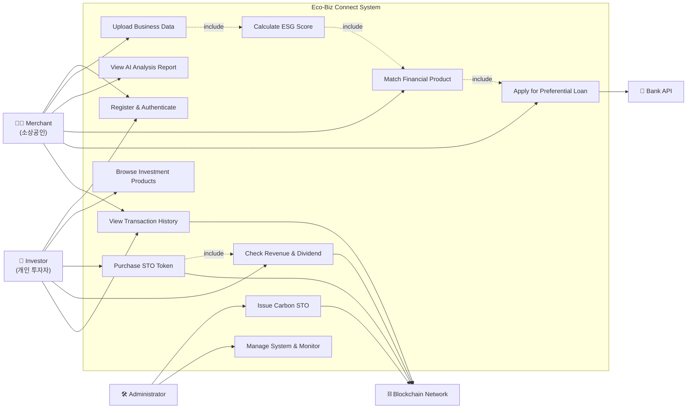
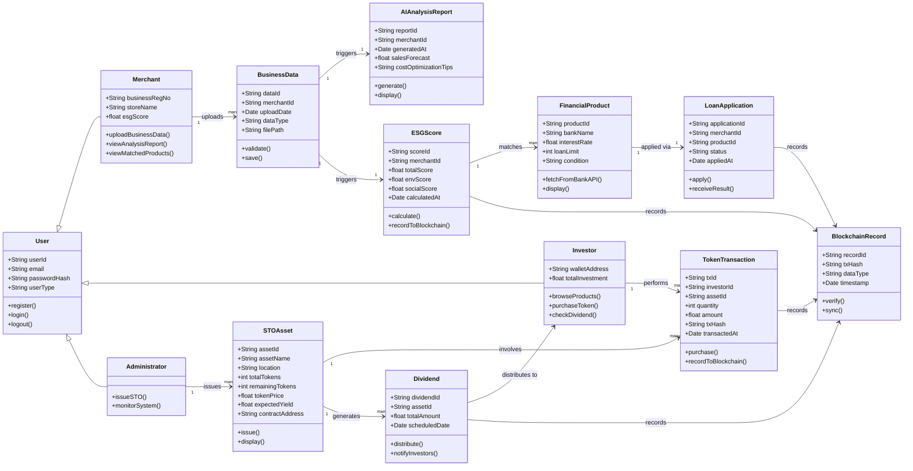

# 2. Analysis

## **Eco-Biz Connect (EBC): AI 및 블록체인 기반 ESG 통합 금융 플랫폼**

### **[ Project Logo ]**
> 
> *AI 경영 분석과 블록체인 탄소 투자의 결합*

<br>

### **[ Author Information ]**
<p align="left">
  
</p>

| 구분 (Category) | 상세 정보 (Details) |
| :--- | :--- |
| **Student No** | 22311898 |
| **Name** | 김주형 (Ju) |
| **E-mail** | curie01@yu.ac.kr |

---

### **[ Revision history ]**

| Revision date | Version # | Description | Author |
| :--- | :--- | :--- | :--- |
| 2026/03/27 | 1.0.0 | 초안 작성 (Eco-Biz Connect 통합 기획) | 김주형 |
| 2026/05/08 | 2.0.0 | Analysis 문서 작성 | 김주형 |

---

### **= Contents =**

| Section | Page |
| :--- | ---: |
| 1. **Introduction** | 1 |
| 2. **Use case analysis** | 2 |
| 3. **Domain analysis** | 3 |
| 4. **User Interface prototype** | 4 |
| 5. **Glossary** | 5 |
| 6. **References** | 6 |

---

## **1. Introduction**

### **1.1 Executive Summary**

현대 사회에서 소상공인은 지역 경제의 핵심 주체임에도 불구하고, 대기업에 비해 고도화된 경영 분석 도구와 ESG 기반 금융 서비스에 대한 접근이 극히 제한되어 있다. 또한 탄소중립에 관심 있는 개인 투자자들은 환경 자산에 직접 투자할 수 있는 채널이 마땅히 존재하지 않는다.

'**Eco-Biz Connect (EBC)**'는 이러한 문제를 해결하기 위해 설계된 **AI 및 블록체인 기반 ESG 통합 금융 플랫폼**이다. 소상공인에게는 AI 경영 분석 리포트와 우대 금융 상품을 제공하고, 개인 투자자에게는 블록체인 기반의 탄소중립 자산 조각 투자(STO) 채널을 제공함으로써, 경제적 가치와 환경적 가치를 동시에 실현하는 선순환 생태계를 구축한다.

### **1.2 Business Goals**

EBC 시스템은 세 가지 핵심 비즈니스 목표를 추구한다.

첫째, 소상공인의 디지털 자생력을 강화한다. POS 데이터와 상권 공공 데이터를 융합하여 AI가 매출 예측 및 비용 최적화 리포트를 자동으로 생성하고, 각 소상공인의 ESG 상생 지수를 산출하여 맞춤형 우대 금융 상품에 연결한다.

둘째, 탄소중립 자산의 투자 접근성을 높인다. 신재생 에너지 설비 등 환경 자산을 블록체인 기반 토큰증권(STO)으로 발행하여 개인 투자자가 소액으로 조각 투자하고, 스마트 컨트랙트를 통해 수익을 자동 정산받을 수 있도록 한다.

셋째, 차세대 ESG 금융 평가 표준을 제시한다. 소상공인의 상생 지수와 환경 기여도를 실시간으로 통합 관리하는 대시보드를 통해 금융권의 새로운 비재무적 신용 평가 모델을 제안한다.

### **1.3 Technical Goals**

시스템은 크게 **AI 분석 엔진**, **블록체인 스마트 컨트랙트 모듈**, **모바일 클라이언트 앱**으로 구성된다.

- **AI 분석 엔진:** LSTM 기반 시계열 예측 모델로 소상공인의 매출 데이터와 외부 공공 데이터를 실시간 결합하여 3초 이내에 분석 리포트를 생성한다.
- **블록체인 모듈:** Layer 2 또는 하이브리드 구조로 트랜잭션 비용을 절감하고, 영지식 증명(ZKP) 기술로 민감한 경영 정보를 보호하면서도 데이터 무결성을 보장한다.
- **외부 연동:** 금융 기관 Bank API와 연계하여 대출 심사 및 상품 추천을 비대면으로 처리하며, 모든 STO 거래 기록은 분산 원장에 투명하게 저장된다.
- **클라이언트 앱:** Android (API 21 이상) 및 iOS (14.0 이상)를 지원하며, 직관적인 대시보드 UI로 모든 사용자가 편리하게 이용할 수 있도록 설계한다.

---

## **2. Use Case Analysis**

### **2.1 Use Case Diagram**

아래는 EBC 시스템의 Use Case Diagram이다. Actor는 **Merchant(소상공인)**, **Investor(개인 투자자)**, **Administrator(관리자)**, 그리고 외부 시스템인 **Bank API**, **Blockchain Network**로 구성된다.



### **2.2 Use Case List**

Conceptualization 단계에서 정의한 Use Case List를 바탕으로 아래와 같이 정리하였다. Use Case 명칭은 동사로 시작하도록 네이밍하였다.

| Use Case Name | Use Case ID | Korean Name | Actor |
| :--- | :---: | :--- | :--- |
| **Register & Authenticate** | #1 | 회원가입 및 인증 | Merchant, Investor |
| **Upload Business Data** | #2 | 경영 데이터 업로드 | Merchant |
| **View AI Analysis Report** | #3 | AI 경영 분석 리포트 조회 | Merchant |
| **Calculate ESG Score** | #4 | ESG 상생 지수 산출 | System |
| **Match Financial Product** | #5 | 맞춤형 금융 상품 매칭 | Merchant |
| **Apply for Preferential Loan** | #6 | 우대 대출 신청 | Merchant, Bank API |
| **Issue Carbon STO** | #7 | 탄소중립 자산 STO 발행 | Administrator |
| **Browse Investment Products** | #8 | 투자 상품 탐색 | Investor |
| **Purchase STO Token** | #9 | 조각 투자 및 청약 | Investor |
| **Check Revenue & Dividend** | #10 | 수익 및 배당 관리 | Investor, Blockchain |
| **View Transaction History** | #11 | 거래 내역 및 증명 조회 | Merchant, Investor |
| **Manage System & Monitor** | #12 | 시스템 관리 및 모니터링 | Administrator |

---

### **2.3 Use Case Description**

#### **2.3.1 Register & Authenticate**

| Use Case #1 : Register & Authenticate | |
| :--- | :--- |
| **GENERAL CHARACTERISTICS** | |
| Summary | 소상공인 또는 투자자가 EBC 플랫폼을 처음 이용하기 위해 회원가입을 하고 금융 기관 수준의 본인 인증을 완료한다. |
| Scope | Eco-Biz Connect |
| Level | User Level |
| Author | 김주형 |
| Last Update | 2026-05-08 |
| Status | Analysis |
| Primary Actor | Merchant, Investor |
| Secondary Actors | Bank API (본인 인증 연동) |
| Preconditions | 시스템이 실행된 상태이어야 한다. |
| Trigger | 메인 화면에서 '회원가입' 버튼을 선택한다. |
| Success Post Condition | 회원 정보가 시스템에 저장되고 로그인이 가능한 상태가 된다. |
| Failed Post Condition | 회원 정보가 저장되지 않고 회원가입 화면으로 복귀한다. |

| **MAIN SUCCESS SCENARIO** | |
| :--- | :--- |
| Step | Action |
| 1 | 사용자가 메인 화면에서 '회원가입' 버튼을 선택한다. |
| 2 | 시스템이 사용자 유형(소상공인/투자자) 선택 화면을 보여준다. |
| 3 | 사용자가 유형을 선택하고 이름, 이메일, 비밀번호 등 기본 정보를 입력한다. |
| 4 | 소상공인의 경우 사업자 등록번호를, 투자자의 경우 주민등록 기반의 본인 인증을 추가로 진행한다. |
| 5 | 시스템이 입력 정보를 검증하고 계정을 생성하여 회원가입을 완료한다. |

| **EXTENSION SCENARIOS** | |
| :--- | :--- |
| Step | Branching Action |
| 3 | 3a. 이미 등록된 이메일로 가입 시도 시: 중복 이메일임을 안내하고 다른 이메일 입력을 요청한다. |
| 3 | 3b. 비밀번호가 보안 규칙(8자 이상, 특수문자 포함 등)에 맞지 않을 경우: 규칙에 맞게 재입력하도록 안내한다. |
| 4 | 4a. 사업자 등록번호가 유효하지 않을 경우: 유효하지 않은 번호임을 안내하고 재입력을 요청한다. |

| **RELATED INFORMATION** | |
| :--- | :--- |
| Performance | ≦ 3 Seconds (인증 완료 후 메인 화면 이동까지) |
| Frequency | Variable |
| Concurrency | None |
| Due Date | 2026-06-01 |

---

#### **2.3.2 Upload Business Data**

| Use Case #2 : Upload Business Data | |
| :--- | :--- |
| **GENERAL CHARACTERISTICS** | |
| Summary | 소상공인이 AI 경영 분석을 위한 매출 데이터, 지출 내역, 상권 정보를 시스템에 업로드한다. |
| Scope | Eco-Biz Connect |
| Level | User Level |
| Author | 김주형 |
| Last Update | 2026-05-08 |
| Status | Analysis |
| Primary Actor | Merchant |
| Secondary Actors | AI 분석 엔진 (System) |
| Preconditions | Merchant로 로그인한 상태이어야 한다. |
| Trigger | 앱 내 '경영 데이터 업로드' 메뉴를 실행한다. |
| Success Post Condition | 데이터가 시스템 서버에 저장되고 AI 분석이 자동으로 트리거된다. |
| Failed Post Condition | 데이터가 저장되지 않고 업로드 화면으로 복귀한다. |

| **MAIN SUCCESS SCENARIO** | |
| :--- | :--- |
| Step | Action |
| 1 | Merchant가 '경영 데이터 업로드' 메뉴를 선택한다. |
| 2 | 시스템이 데이터 유형(POS 매출 데이터 / 지출 내역 / 수동 입력) 선택 화면을 표시한다. |
| 3 | 사용자가 CSV, Excel 형식의 파일을 첨부하거나 수동으로 데이터를 입력한다. |
| 4 | 시스템이 데이터 형식을 자동 검증하고 서버에 저장한다. |
| 5 | 저장 완료 후 AI 분석 엔진이 자동으로 분석을 시작하며 사용자에게 완료 알림을 발송한다. |

| **EXTENSION SCENARIOS** | |
| :--- | :--- |
| Step | Branching Action |
| 3 | 3a. 업로드 파일 형식이 지원되지 않는 경우(PDF, 이미지 등): 지원 형식 안내 메시지를 표시하고 재업로드를 요청한다. |
| 4 | 4a. 데이터 형식이 올바르지 않아 파싱에 실패한 경우: 오류 항목을 표시하고 수정 후 재업로드를 요청한다. |
| 5 | 5a. 서버 연결 오류로 저장이 실패한 경우: 오류 메시지를 표시하고 재시도 버튼을 제공한다. |

| **RELATED INFORMATION** | |
| :--- | :--- |
| Performance | ≦ 3 Seconds (파일 업로드 완료까지) |
| Frequency | Variable |
| Concurrency | None |
| Due Date | 2026-06-01 |

---

#### **2.3.3 View AI Analysis Report**

| Use Case #3 : View AI Analysis Report | |
| :--- | :--- |
| **GENERAL CHARACTERISTICS** | |
| Summary | 소상공인이 업로드된 경영 데이터를 기반으로 AI 엔진이 생성한 매출 예측 및 경영 개선 리포트를 조회한다. |
| Scope | Eco-Biz Connect |
| Level | User Level |
| Author | 김주형 |
| Last Update | 2026-05-08 |
| Status | Analysis |
| Primary Actor | Merchant |
| Secondary Actors | AI 분석 엔진 (System) |
| Preconditions | Merchant로 로그인한 상태이며, 분석에 필요한 경영 데이터가 1회 이상 업로드된 상태이어야 한다. |
| Trigger | 앱 내 '경영 분석 리포트' 탭을 선택한다. |
| Success Post Condition | 매출 예측 그래프, 비용 최적화 제안, 상권 비교 분석 결과가 화면에 출력된다. |
| Failed Post Condition | 분석 데이터가 없거나 AI 서버 오류 시 리포트가 표시되지 않는다. |

| **MAIN SUCCESS SCENARIO** | |
| :--- | :--- |
| Step | Action |
| 1 | Merchant가 '경영 분석 리포트' 탭을 선택한다. |
| 2 | 시스템이 최신 분석 결과(매출 예측, 비용 절감 포인트, 상권 비교)를 서버에서 불러온다. |
| 3 | 화면에 매출 예측 추이 그래프, ESG 상생 지수, 금융 상품 추천 요약이 대시보드 형태로 표시된다. |
| 4 | 사용자는 원하는 항목을 선택하여 상세 분석 내용을 열람할 수 있다. |

| **EXTENSION SCENARIOS** | |
| :--- | :--- |
| Step | Branching Action |
| 1 | 1a. 업로드된 데이터가 없어 분석을 수행할 수 없는 경우: 데이터 업로드를 먼저 진행하도록 안내한다. |
| 2 | 2a. AI 분석 서버와의 연결이 실패한 경우: 서버 오류 메시지를 표시하고 최근 캐시 데이터를 임시 제공한다. |
| 2 | 2b. 분석이 아직 진행 중인 경우: 분석 진행 상태 프로그레스 바를 표시하고 완료 시 푸시 알림을 발송한다. |

| **RELATED INFORMATION** | |
| :--- | :--- |
| Performance | ≦ 3 Seconds (서버에서 분석 결과를 가져와 화면에 출력하는 시간까지) |
| Frequency | Variable |
| Concurrency | None |
| Due Date | 2026-06-01 |

---

#### **2.3.4 Calculate ESG Score**

| Use Case #4 : Calculate ESG Score | |
| :--- | :--- |
| **GENERAL CHARACTERISTICS** | |
| Summary | 소상공인의 친환경 경영 활동 및 지역 기여도를 종합하여 시스템이 자동으로 'EBC 상생 지수(ESG 점수)'를 산출하고 블록체인에 기록한다. |
| Scope | Eco-Biz Connect |
| Level | System Level |
| Author | 김주형 |
| Last Update | 2026-05-08 |
| Status | Analysis |
| Primary Actor | System |
| Secondary Actors | Merchant, Blockchain Network |
| Preconditions | 경영 데이터 업로드(UC#2)가 완료된 상태이어야 한다. |
| Trigger | 경영 데이터가 갱신될 때마다 자동으로 실행되거나, 수동으로 '지수 갱신' 버튼을 누를 때 실행된다. |
| Success Post Condition | 산출된 ESG 점수가 사용자 대시보드에 업데이트되고, 해당 기록이 블록체인에 저장된다. |
| Failed Post Condition | 점수 산출에 실패하고 이전 점수가 유지된다. |

| **MAIN SUCCESS SCENARIO** | |
| :--- | :--- |
| Step | Action |
| 1 | 경영 데이터 업로드 완료 이벤트가 발생하여 ESG 점수 산출 모듈이 자동 실행된다. |
| 2 | 시스템이 친환경 제품 비율, 탄소 배출 저감 노력, 지역 상생 기여도 등 항목별 점수를 계산한다. |
| 3 | 항목별 가중 평균을 적용하여 최종 'EBC 상생 지수'를 산정한다. |
| 4 | 산정된 점수를 사용자 대시보드에 반영하고, 위변조 방지를 위해 블록체인 원장에 해시값으로 기록한다. |
| 5 | 점수 등급이 상승했을 경우 사용자에게 푸시 알림을 발송한다. |

| **EXTENSION SCENARIOS** | |
| :--- | :--- |
| Step | Branching Action |
| 3 | 3a. 점수 산정에 필요한 일부 데이터가 부족한 경우: 부족 항목을 안내하고 기존 평균값으로 해당 항목을 대체 처리한다. |
| 4 | 4a. 블록체인 네트워크 오류로 기록이 실패한 경우: 로컬 DB에 임시 저장하고 네트워크 복구 후 자동으로 블록체인에 재기록한다. |

| **RELATED INFORMATION** | |
| :--- | :--- |
| Performance | ≦ 3 Seconds (점수 산출 및 대시보드 반영까지) |
| Frequency | 경영 데이터 업로드 시마다 자동 실행 |
| Concurrency | None |
| Due Date | 2026-06-01 |

---

#### **2.3.5 Match Financial Product**

| Use Case #5 : Match Financial Product | |
| :--- | :--- |
| **GENERAL CHARACTERISTICS** | |
| Summary | 산출된 ESG 지수와 AI 경영 리포트의 신용 지표를 기반으로 소상공인에게 최적의 우대 금리 금융 상품을 자동 추천한다. |
| Scope | Eco-Biz Connect |
| Level | User Level |
| Author | 김주형 |
| Last Update | 2026-05-08 |
| Status | Analysis |
| Primary Actor | Merchant |
| Secondary Actors | Bank API, System (AI 매칭 엔진) |
| Preconditions | Merchant로 로그인한 상태이며, ESG 점수 산출(UC#4)이 1회 이상 완료되어야 한다. |
| Trigger | '금융 상품 매칭' 메뉴를 선택하거나, ESG 등급 변경 이벤트 발생 시 자동으로 실행된다. |
| Success Post Condition | 사용자 맞춤형 우대 금융 상품 목록이 화면에 표시된다. |
| Failed Post Condition | 매칭 가능한 상품이 없거나 Bank API 연동 실패 시 상품 목록이 표시되지 않는다. |

| **MAIN SUCCESS SCENARIO** | |
| :--- | :--- |
| Step | Action |
| 1 | Merchant가 '금융 상품 매칭' 메뉴를 선택한다. |
| 2 | 시스템이 해당 Merchant의 ESG 점수 및 AI 경영 리포트 지표를 Bank API로 전달하여 적합 상품을 조회한다. |
| 3 | Bank API로부터 수신한 상품 목록을 금리, 한도, 기간 기준으로 정렬하여 화면에 표시한다. |
| 4 | 사용자가 특정 상품을 선택하면 상세 조건 및 신청 버튼이 표시된다. |

| **EXTENSION SCENARIOS** | |
| :--- | :--- |
| Step | Branching Action |
| 2 | 2a. Bank API 서버 연결 오류 시: 오류 메시지를 표시하고 캐시된 마지막 조회 상품 목록을 임시 표시한다. |
| 3 | 3a. ESG 점수가 낮아 매칭 가능한 우대 상품이 없는 경우: 점수 향상을 위한 행동 가이드(친환경 활동 추천)를 함께 표시한다. |

| **RELATED INFORMATION** | |
| :--- | :--- |
| Performance | ≦ 3 Seconds (Bank API 응답 수신 및 화면 출력까지) |
| Frequency | Variable |
| Concurrency | None |
| Due Date | 2026-06-01 |

---

#### **2.3.6 Apply for Preferential Loan**

| Use Case #6 : Apply for Preferential Loan | |
| :--- | :--- |
| **GENERAL CHARACTERISTICS** | |
| Summary | 매칭된 우대 금융 상품을 앱 내에서 비대면으로 신청하고 Bank API를 통해 심사 결과를 수신한다. |
| Scope | Eco-Biz Connect |
| Level | User Level |
| Author | 김주형 |
| Last Update | 2026-05-08 |
| Status | Analysis |
| Primary Actor | Merchant |
| Secondary Actors | Bank API |
| Preconditions | 매칭된 금융 상품 목록에서 특정 상품을 선택한 상태이어야 한다. |
| Trigger | 금융 상품 상세 화면에서 '신청하기' 버튼을 누른다. |
| Success Post Condition | 대출 신청이 Bank API로 전달되고 심사 결과 알림을 수신한다. |
| Failed Post Condition | 신청이 실패하거나 심사 결과 수신에 실패한다. |

| **MAIN SUCCESS SCENARIO** | |
| :--- | :--- |
| Step | Action |
| 1 | Merchant가 금융 상품 상세 화면에서 '신청하기'를 선택한다. |
| 2 | 시스템이 신청에 필요한 서류(사업자 등록증, 최근 매출 내역 등) 제출 화면을 표시한다. |
| 3 | 사용자가 필요 정보를 확인하고 전자 서명으로 동의 후 신청을 확정한다. |
| 4 | 시스템이 신청 데이터를 Bank API로 전송하고 접수 완료 알림을 발송한다. |
| 5 | Bank API로부터 심사 결과를 수신하여 사용자에게 푸시 알림으로 전달한다. |

| **EXTENSION SCENARIOS** | |
| :--- | :--- |
| Step | Branching Action |
| 3 | 3a. 필수 제출 서류가 누락된 경우: 누락 항목을 명시하고 보완 업로드를 요청한다. |
| 4 | 4a. Bank API 전송 실패 시: 오류 메시지를 표시하고 재전송을 안내한다. |
| 5 | 5a. 심사에서 거절된 경우: 거절 사유를 안내하고 ESG 점수 향상 후 재신청 경로를 안내한다. |

| **RELATED INFORMATION** | |
| :--- | :--- |
| Performance | ≦ 3 Seconds (신청 데이터 Bank API 전송까지); 심사 결과는 비동기 알림으로 수신 |
| Frequency | Variable |
| Concurrency | None |
| Due Date | 2026-06-01 |

---

#### **2.3.7 Issue Carbon STO**

| Use Case #7 : Issue Carbon STO | |
| :--- | :--- |
| **GENERAL CHARACTERISTICS** | |
| Summary | 관리자가 신재생 에너지 설비 등 환경 자산을 검증하고 블록체인 기반의 토큰증권(STO)으로 발행하여 투자 상품으로 등록한다. |
| Scope | Eco-Biz Connect |
| Level | Admin Level |
| Author | 김주형 |
| Last Update | 2026-05-08 |
| Status | Analysis |
| Primary Actor | Administrator |
| Secondary Actors | Blockchain Network |
| Preconditions | Administrator 권한으로 로그인한 상태이어야 한다. |
| Trigger | 관리자 콘솔에서 '신규 STO 발행' 메뉴를 실행한다. |
| Success Post Condition | 새로운 STO 상품이 블록체인에 등록되고 투자자들이 탐색할 수 있는 상태가 된다. |
| Failed Post Condition | STO 발행이 실패하고 블록체인에 등록되지 않는다. |

| **MAIN SUCCESS SCENARIO** | |
| :--- | :--- |
| Step | Action |
| 1 | Administrator가 '신규 STO 발행' 메뉴를 선택한다. |
| 2 | 자산 정보(설비명, 위치, 예상 발전 용량, 탄소 저감량, 총 발행 토큰 수, 토큰 단가)를 입력한다. |
| 3 | 시스템이 입력 정보를 검토하고 스마트 컨트랙트 코드를 자동 생성한다. |
| 4 | 관리자가 최종 확인 후 발행을 승인하면 시스템이 Blockchain Network에 STO 발행 트랜잭션을 전송한다. |
| 5 | 블록체인 원장에 기록이 완료되면 시스템에 신규 투자 상품으로 등록되고 투자자들에게 알림이 발송된다. |

| **EXTENSION SCENARIOS** | |
| :--- | :--- |
| Step | Branching Action |
| 2 | 2a. 필수 항목이 누락된 경우: 누락 항목을 표시하고 보완 입력을 요청한다. |
| 4 | 4a. 블록체인 네트워크 오류로 발행 실패 시: 오류 내용을 기록하고 관리자에게 재시도를 요청한다. |

| **RELATED INFORMATION** | |
| :--- | :--- |
| Performance | ≦ 10 Seconds (블록체인 트랜잭션 확정까지) |
| Frequency | Variable (새로운 자산 등록 시) |
| Concurrency | None |
| Due Date | 2026-06-01 |

---

#### **2.3.8 Browse Investment Products**

| Use Case #8 : Browse Investment Products | |
| :--- | :--- |
| **GENERAL CHARACTERISTICS** | |
| Summary | 개인 투자자가 현재 발행된 탄소중립 STO 상품의 목록과 상세 정보(예상 수익률, 잔여 토큰 수 등)를 탐색한다. |
| Scope | Eco-Biz Connect |
| Level | User Level |
| Author | 김주형 |
| Last Update | 2026-05-08 |
| Status | Analysis |
| Primary Actor | Investor |
| Secondary Actors | Blockchain Network |
| Preconditions | Investor로 로그인한 상태이어야 한다. |
| Trigger | 앱 내 '투자 마켓' 탭을 선택한다. |
| Success Post Condition | 발행된 STO 상품 목록과 각 상품의 상세 정보가 화면에 표시된다. |
| Failed Post Condition | 상품 목록 조회에 실패하여 화면이 표시되지 않는다. |

| **MAIN SUCCESS SCENARIO** | |
| :--- | :--- |
| Step | Action |
| 1 | Investor가 '투자 마켓' 탭을 선택한다. |
| 2 | 시스템이 블록체인 원장에서 현재 투자 가능한 STO 상품 목록을 조회한다. |
| 3 | 화면에 상품 목록(자산명, 예상 수익률, 잔여 토큰, 마감일)이 표시된다. |
| 4 | 사용자가 특정 상품을 선택하면 상세 정보(자산 위치, 탄소 저감 효과, 스마트 컨트랙트 조건 등)가 표시된다. |

| **EXTENSION SCENARIOS** | |
| :--- | :--- |
| Step | Branching Action |
| 2 | 2a. 현재 발행된 투자 상품이 없는 경우: 등록된 상품이 없음을 안내하고 신규 상품 알림 등록을 권유한다. |
| 2 | 2b. 블록체인 조회 오류 시: 오류 메시지 표시 후 재시도 버튼을 제공한다. |

| **RELATED INFORMATION** | |
| :--- | :--- |
| Performance | ≦ 3 Seconds (블록체인에서 상품 목록을 가져와 화면에 출력하는 시간까지) |
| Frequency | Variable |
| Concurrency | None |
| Due Date | 2026-06-01 |

---

#### **2.3.9 Purchase STO Token**

| Use Case #9 : Purchase STO Token | |
| :--- | :--- |
| **GENERAL CHARACTERISTICS** | |
| Summary | 투자자가 원하는 탄소중립 STO 상품을 소액 단위의 토큰으로 구매하여 소유권을 확보하고 블록체인 원장에 기록한다. |
| Scope | Eco-Biz Connect |
| Level | User Level |
| Author | 김주형 |
| Last Update | 2026-05-08 |
| Status | Analysis |
| Primary Actor | Investor |
| Secondary Actors | Blockchain Network, Bank API (결제 처리) |
| Preconditions | Investor로 로그인하고, 구매할 STO 상품의 상세 화면에 진입한 상태이어야 한다. |
| Trigger | STO 상품 상세 화면에서 '구매하기' 버튼을 선택한다. |
| Success Post Condition | 결제가 완료되고 구매한 토큰의 소유권이 블록체인 원장에 기록되며 포트폴리오에 반영된다. |
| Failed Post Condition | 결제 또는 블록체인 기록이 실패하고 토큰이 지급되지 않는다. |

| **MAIN SUCCESS SCENARIO** | |
| :--- | :--- |
| Step | Action |
| 1 | Investor가 STO 상품 상세 화면에서 구매 수량을 입력하고 '구매하기'를 선택한다. |
| 2 | 시스템이 구매 금액(수량 × 토큰 단가)과 보유 잔액을 확인하고 결제 확인 화면을 표시한다. |
| 3 | 사용자가 전자 서명으로 동의하고 결제를 확정한다. |
| 4 | 시스템이 Bank API를 통해 결제를 처리한다. |
| 5 | 결제 성공 후 블록체인 스마트 컨트랙트가 실행되어 해당 토큰 소유권이 투자자 지갑 주소로 이전 기록된다. |
| 6 | 투자자 포트폴리오에 구매 내역이 반영되고 구매 완료 알림이 발송된다. |

| **EXTENSION SCENARIOS** | |
| :--- | :--- |
| Step | Branching Action |
| 2 | 2a. 잔여 토큰 수량이 요청 수량보다 적은 경우: 현재 구매 가능한 최대 수량을 안내한다. |
| 4 | 4a. 결제 실패 시: 실패 사유를 안내하고 결제 화면으로 복귀한다. |
| 5 | 5a. 블록체인 기록 실패 시: 결제를 즉시 취소하고 사용자에게 오류를 안내하며 고객 센터 연결을 제공한다. |

| **RELATED INFORMATION** | |
| :--- | :--- |
| Performance | ≦ 10 Seconds (결제 처리 및 블록체인 기록 완료까지) |
| Frequency | Variable |
| Concurrency | None |
| Due Date | 2026-06-01 |

---

#### **2.3.10 Check Revenue & Dividend**

| Use Case #10 : Check Revenue & Dividend | |
| :--- | :--- |
| **GENERAL CHARACTERISTICS** | |
| Summary | 투자자가 보유 토큰에서 발생한 수익 및 스마트 컨트랙트에 의해 자동 정산된 배당 현황을 실시간으로 확인한다. |
| Scope | Eco-Biz Connect |
| Level | User Level |
| Author | 김주형 |
| Last Update | 2026-05-08 |
| Status | Analysis |
| Primary Actor | Investor |
| Secondary Actors | Blockchain Network |
| Preconditions | Investor로 로그인하고, 1개 이상의 STO 토큰을 보유한 상태이어야 한다. |
| Trigger | '포트폴리오 & 수익' 탭을 선택한다. |
| Success Post Condition | 보유 토큰별 수익률, 누적 배당금, 다음 배당 예정 일시가 화면에 표시된다. |
| Failed Post Condition | 블록체인 데이터 조회 실패 시 수익 정보가 표시되지 않는다. |

| **MAIN SUCCESS SCENARIO** | |
| :--- | :--- |
| Step | Action |
| 1 | Investor가 '포트폴리오 & 수익' 탭을 선택한다. |
| 2 | 시스템이 블록체인 원장에서 사용자 지갑 주소에 연결된 보유 토큰 목록과 배당 기록을 조회한다. |
| 3 | 화면에 총 투자 금액, 현재 평가액, 보유 토큰별 수익률, 수령한 누적 배당금이 표시된다. |
| 4 | 사용자가 특정 자산을 선택하면 해당 자산의 배당 이력 및 다음 예정 배당일을 확인할 수 있다. |

| **EXTENSION SCENARIOS** | |
| :--- | :--- |
| Step | Branching Action |
| 2 | 2a. 블록체인 조회 오류 시: 오류 메시지 표시 후 마지막으로 동기화된 캐시 데이터를 임시 표시한다. |

| **RELATED INFORMATION** | |
| :--- | :--- |
| Performance | ≦ 3 Seconds (블록체인에서 포트폴리오 데이터를 가져와 화면에 출력하는 시간까지) |
| Frequency | Variable |
| Concurrency | None |
| Due Date | 2026-06-01 |

---

#### **2.3.11 View Transaction History**

| Use Case #11 : View Transaction History | |
| :--- | :--- |
| **GENERAL CHARACTERISTICS** | |
| Summary | Merchant와 Investor가 대출 이력, 투자 소유권 증명, 배당 수령 내역 등 자신의 모든 거래 기록을 블록체인 원장을 통해 조회 및 증명한다. |
| Scope | Eco-Biz Connect |
| Level | User Level |
| Author | 김주형 |
| Last Update | 2026-05-08 |
| Status | Analysis |
| Primary Actor | Merchant, Investor |
| Secondary Actors | Blockchain Network |
| Preconditions | 로그인한 상태이어야 하며, 조회할 거래 내역이 1건 이상 존재해야 한다. |
| Trigger | '거래 내역' 메뉴를 선택한다. |
| Success Post Condition | 사용자의 모든 거래 내역이 시간순으로 화면에 표시된다. |
| Failed Post Condition | 블록체인 조회 실패 시 거래 내역이 표시되지 않는다. |

| **MAIN SUCCESS SCENARIO** | |
| :--- | :--- |
| Step | Action |
| 1 | 사용자가 '거래 내역' 메뉴를 선택한다. |
| 2 | 시스템이 블록체인 원장에서 해당 사용자와 관련된 모든 트랜잭션 기록을 조회한다. |
| 3 | 내역이 날짜, 거래 유형(투자 / 대출 신청 / 배당 수령 등)에 따라 분류되어 목록으로 표시된다. |
| 4 | 사용자가 특정 내역을 선택하면 블록체인 트랜잭션 해시값과 타임스탬프 등 증명 정보가 표시된다. |

| **EXTENSION SCENARIOS** | |
| :--- | :--- |
| Step | Branching Action |
| 2 | 2a. 블록체인 조회 오류 시: 오류 메시지를 표시하고 재시도 버튼을 제공한다. |
| 3 | 3a. 거래 내역이 없는 경우: 아직 거래 내역이 없음을 안내한다. |

| **RELATED INFORMATION** | |
| :--- | :--- |
| Performance | ≦ 3 Seconds (블록체인에서 거래 내역을 가져와 화면에 출력하는 시간까지) |
| Frequency | Variable |
| Concurrency | None |
| Due Date | 2026-06-01 |

---

#### **2.3.12 Manage System & Monitor**

| Use Case #12 : Manage System & Monitor | |
| :--- | :--- |
| **GENERAL CHARACTERISTICS** | |
| Summary | 관리자가 전체 플랫폼의 AI 모델 성능, 블록체인 트랜잭션 상태, 자산 건전성, 사용자 현황 등을 통합 모니터링하고 관리한다. |
| Scope | Eco-Biz Connect |
| Level | Admin Level |
| Author | 김주형 |
| Last Update | 2026-05-08 |
| Status | Analysis |
| Primary Actor | Administrator |
| Secondary Actors | Blockchain Network, AI 분석 엔진 |
| Preconditions | Administrator 권한으로 로그인한 상태이어야 한다. |
| Trigger | 관리자 대시보드에 접속한다. |
| Success Post Condition | 시스템 전반의 상태 지표들이 실시간으로 대시보드에 표시된다. |
| Failed Post Condition | 모니터링 데이터 수집에 실패하여 일부 지표가 표시되지 않는다. |

| **MAIN SUCCESS SCENARIO** | |
| :--- | :--- |
| Step | Action |
| 1 | Administrator가 관리자 대시보드에 접속한다. |
| 2 | 시스템이 AI 엔진 상태, 블록체인 트랜잭션 처리 현황, 전체 사용자 수, 발행된 STO 자산 현황 등을 수집하여 표시한다. |
| 3 | 관리자가 이상 징후 알림을 확인하고 필요 시 특정 사용자 계정 또는 STO 자산의 상태를 수동으로 조정한다. |
| 4 | 모든 관리 작업 내역이 감사 로그에 기록된다. |

| **EXTENSION SCENARIOS** | |
| :--- | :--- |
| Step | Branching Action |
| 2 | 2a. 특정 서비스(AI 엔진 또는 블록체인 노드)에 이상이 감지된 경우: 해당 서비스에 경고 표시를 하고 담당 엔지니어에게 알림을 발송한다. |

| **RELATED INFORMATION** | |
| :--- | :--- |
| Performance | ≦ 5 Seconds (전체 모니터링 데이터 수집 및 대시보드 렌더링까지) |
| Frequency | 상시 (실시간 모니터링) |
| Concurrency | None |
| Due Date | 2026-06-01 |

---

## **3. Domain Analysis**

아래는 EBC 시스템의 Domain Analysis에서 도출된 핵심 클래스들과 상호 관계를 나타낸 다이어그램이다.



### **3.1 클래스 설명**

1) **User** : Merchant, Investor, Administrator가 공통으로 갖는 인증 및 계정 관련 Attribute와 Operation을 정의하는 기반 클래스이다.

2) **Merchant** : 소상공인 Actor를 표현하는 클래스이다. 사업자 등록번호, 상점명, ESG 점수를 보유하며 데이터 업로드, 분석 리포트 조회, 금융 상품 조회 기능을 수행한다.

3) **Investor** : 개인 투자자 Actor를 표현하는 클래스이다. 블록체인 지갑 주소와 총 투자 금액을 관리하며 STO 상품 탐색, 토큰 구매, 배당 조회 기능을 수행한다.

4) **Administrator** : 시스템 전반을 관리하는 관리자 클래스이다. STO 자산 발행 및 전체 모니터링 기능을 담당한다.

5) **BusinessData** : 소상공인이 업로드한 매출 데이터, 지출 내역 등 원데이터를 저장하고 검증하는 클래스이다. 저장 완료 시 AI 분석 및 ESG 점수 산출을 자동으로 트리거한다.

6) **AIAnalysisReport** : BusinessData를 기반으로 AI 엔진이 생성한 매출 예측 및 비용 최적화 분석 결과를 담는 클래스이다.

7) **ESGScore** : 소상공인의 친환경 경영 활동 및 지역 기여도를 수치화한 EBC 상생 지수를 저장하고 관리하는 클래스이다. 산정된 점수는 블록체인에 해시값으로 기록되어 위변조를 방지한다.

8) **FinancialProduct** : 협약 금융 기관(Bank API)으로부터 조회된 우대 금융 상품 정보를 저장하는 클래스이다. ESGScore 등급에 따라 적합 상품이 필터링되어 Merchant에게 추천된다.

9) **LoanApplication** : Merchant가 특정 FinancialProduct에 대해 제출한 우대 대출 신청 정보를 관리하는 클래스이다. 신청 상태 및 심사 결과를 추적한다.

10) **STOAsset** : Administrator가 등록한 탄소중립 환경 자산의 메타데이터(위치, 총 토큰 수, 토큰 단가, 예상 수익률, 스마트 컨트랙트 주소 등)를 저장하는 클래스이다.

11) **TokenTransaction** : Investor의 STO 토큰 구매 거래를 기록하는 클래스이다. 거래 완료 후 블록체인에 트랜잭션 해시가 기록되어 소유권을 증명한다.

12) **Dividend** : STOAsset에서 발생하는 수익을 보유 지분에 따라 Investor에게 자동 배분하는 스마트 컨트랙트 로직을 표현하는 클래스이다.

13) **BlockchainRecord** : ESG 점수 기록, STO 거래, 배당 내역 등 블록체인 원장에 저장된 모든 기록의 해시값, 타임스탬프, 데이터 유형을 관리하는 클래스이다. 모든 주요 트랜잭션의 최종 무결성을 보장한다.

---

## **4. User Interface Prototype**

### **4.1 Merchant Interface**

#### **4.1.1 로그인 및 메인 대시보드**

Merchant가 앱을 실행하면 이메일과 비밀번호를 입력하는 로그인 화면이 표시된다. 최초 이용 시에는 하단의 '회원가입' 버튼을 통해 소상공인 유형으로 가입한다. 로그인 성공 후 메인 대시보드에서 ESG 상생 지수, 최신 AI 분석 요약, 추천 금융 상품 배너를 한눈에 확인할 수 있다.

```
+----------------------------------+
|   Eco-Biz Connect                |
|   AI & ESG Financial Platform   |
|                                  |
|  [EBC LOGO]                      |
|                                  |
|  E-mail: [________________]      |
|  Password: [_______________]     |
|                                  |
|       [  Log in  ]               |
|   회원가입 | 비밀번호 찾기           |
+----------------------------------+

< Merchant 메인 대시보드 >
+----------------------------------+
| EBC  🏪 김주형 소상공인             |
+----------------------------------+
| 📊 EBC 상생 지수          72 / 100 |
| ████████████░░░░  등급: B+        |
| ESG 등급 상승 시 우대 금리 혜택!     |
+----------------------------------+
| 🤖 AI 경영 분석 요약               |
| 이번 달 예상 매출: 4,850,000원      |
| 비용 절감 포인트: 식자재 발주 최적화  |
| [전체 리포트 보기 →]               |
+----------------------------------+
| 💳 추천 금융 상품                  |
| 기업은행 ESG 우대 대출 연 2.8%      |
| [상세 보기 →]                      |
+----------------------------------+
| 🏠홈  📈분석  💰금융  📋내역  ⚙설정  |
+----------------------------------+
```

#### **4.1.2 AI 경영 분석 리포트**

'분석' 탭을 선택하면 매출 예측 추이 그래프, 항목별 비용 분석, 상권 비교 데이터가 시각화되어 표시된다.

```
< AI 경영 분석 리포트 >
+----------------------------------+
| 📈 향후 30일 매출 예측              |
|  5M |          /\                |
|  4M |    /\   /  \               |
|  3M |   /  \_/    \__/\          |
|  2M |__/               \__       |
|     +----+----+----+----+-->     |
|      1주  2주  3주  4주  예측      |
+----------------------------------+
| 💡 비용 최적화 제안                |
| • 식자재 발주: 화요일이 최적 요일    |
| • 인건비: 월요일 유동 인구 낮음      |
| • 에너지: 오후 2-4시 절약 가능      |
+----------------------------------+
| 🏪 상권 비교 분석                  |
| 내 상점 월 매출: 4.5M              |
| 주변 동종 업종 평균: 3.8M  ▲ 18%   |
+----------------------------------+
| [데이터 업로드 →]  [리포트 공유 →]   |
+----------------------------------+
```

#### **4.1.3 경영 데이터 업로드**

```
< 경영 데이터 업로드 >
+----------------------------------+
| 데이터 유형 선택                    |
|  ◉ POS 매출 데이터 (CSV/Excel)    |
|  ○ 지출 내역                       |
|  ○ 수동 입력                       |
+----------------------------------+
| 파일 첨부                          |
| [📂 파일 선택 또는 드래그 앤 드롭]    |
| *.csv, *.xlsx 형식 지원            |
+----------------------------------+
| 분석 기간 설정                      |
| 시작: [2026-04-01]                 |
| 종료: [2026-04-30]                 |
+----------------------------------+
|       [  업로드 및 분석 시작  ]      |
+----------------------------------+
```

---

### **4.2 Investor Interface**

#### **4.2.1 투자 마켓 (STO 상품 탐색)**

```
< 투자 마켓 >
+----------------------------------+
| 🔍 [상품 검색...]    필터▼         |
+----------------------------------+
| ☀️ 경주 태양광 발전소 3호기         |
| 예상 수익률: 연 6.2%               |
| 잔여 토큰: 1,250개 / 5,000개       |
| 토큰 단가: 10,000원                |
| 탄소 저감: 연 42ton CO₂            |
| [상세 보기 →]                      |
+----------------------------------+
| 💨 포항 해상 풍력 단지 1구역         |
| 예상 수익률: 연 7.5%               |
| 잔여 토큰: 380개 / 2,000개         |
| 토큰 단가: 50,000원                |
| 탄소 저감: 연 120ton CO₂           |
| [상세 보기 →]                      |
+----------------------------------+
| 🌿 대구 도심 탄소 흡수 숲 프로젝트   |
| 예상 수익률: 연 4.8%               |
| 잔여 토큰: 3,100개 / 4,000개       |
| 토큰 단가: 5,000원                 |
| [상세 보기 →]                      |
+----------------------------------+
```

#### **4.2.2 STO 토큰 구매**

```
< STO 토큰 구매 >
+----------------------------------+
| ☀️ 경주 태양광 발전소 3호기         |
+----------------------------------+
| 토큰 단가: 10,000원                |
| 구매 수량: [____] 개               |
|                                  |
| 결제 금액: 100,000원               |
| 예상 연 수익(6.2%): 6,200원        |
+----------------------------------+
| 결제 수단                          |
|  ◉ EBC 연동 계좌 (잔액: 500,000원)|
|  ○ 기타 결제 수단                  |
+----------------------------------+
| ⚠️ 투자 원금 손실 가능성 인지 확인   |
| [□] 투자 위험 고지 내용에 동의합니다  |
|                                  |
| [전자 서명 후 구매 확정]             |
+----------------------------------+
```

#### **4.2.3 포트폴리오 & 수익 조회**

```
< 포트폴리오 & 수익 >
+----------------------------------+
| 총 투자 금액:      1,500,000원     |
| 현재 평가액:       1,582,300원     |
| 총 수익률:              +5.49%     |
+----------------------------------+
| 보유 자산                          |
| ☀️ 경주 태양광 3호기   100개        |
|   평가액: 1,020,000원  +2.0%      |
|   누적 배당 수령: 62,000원         |
|   다음 배당 예정: 2026-07-01       |
+----------------------------------+
| 💨 포항 해상 풍력     10개          |
|   평가액: 562,300원   +12.46%     |
|   누적 배당 수령: 38,000원         |
+----------------------------------+
| [거래 내역 보기 →]                  |
+----------------------------------+
```

---

### **4.3 Administrator Interface**

#### **4.3.1 STO 자산 발행**

```
< 신규 STO 자산 발행 >
+----------------------------------+
| 자산 기본 정보                      |
| 자산명: [_____________________]   |
| 유형: [태양광 ▼]  위치: [_______] |
+----------------------------------+
| 자산 운영 정보                      |
| 총 발행 토큰 수:  [________] 개    |
| 토큰 단가:        [________] 원    |
| 예상 연 수익률:   [________] %     |
| 탄소 저감 효과:   [________] ton/년|
+----------------------------------+
| 스마트 컨트랙트 설정                 |
| 배당 주기:  [분기 ▼]               |
| 스마트 컨트랙트 자동 생성 [✓]        |
+----------------------------------+
| [블록체인 발행 미리보기]              |
|       [발행 확정 및 등록]            |
+----------------------------------+
```

#### **4.3.2 시스템 모니터링 대시보드**

```
< 시스템 모니터링 >
+----------------------------------+
| 🟢 AI 엔진 상태:  정상 (응답 0.8s) |
| 🟢 Blockchain:    정상 (TPS: 120) |
| 🟡 Bank API:      지연 (2.8s)     |
+----------------------------------+
| 📊 플랫폼 현황                      |
| 전체 가입 사용자:       3,412명     |
|  - 소상공인:           1,203명     |
|  - 투자자:             2,205명     |
| 발행된 STO 자산:           18개     |
| 총 STO 거래 금액:   2.4억원         |
+----------------------------------+
| ⚠️ 최근 알림                       |
| [15:32] Bank API 응답 지연 감지    |
| [14:10] 신규 STO 발행 완료 (태양광) |
+----------------------------------+
```

---

## **5. Glossary**

| 용어 (Terms) | 설명 (Description) |
| :--- | :--- |
| **Eco-Biz Connect (EBC)** | 본 프로젝트의 공식 명칭. AI 경영 분석과 블록체인 탄소 투자를 결합한 통합 ESG 금융 플랫폼. |
| **Merchant (소상공인)** | EBC 플랫폼을 통해 AI 경영 분석 및 우대 금융 상품을 이용하는 소상공인·자영업자 사용자. |
| **Investor (개인 투자자)** | EBC 플랫폼을 통해 탄소중립 STO 자산에 소액 조각 투자하는 일반 개인 사용자. |
| **Administrator (관리자)** | 플랫폼 전반을 운영하며 STO 자산을 발행하고 시스템을 모니터링하는 관리자. |
| **STO (Security Token Offering)** | 실물 환경 자산(신재생 에너지 설비 등)을 블록체인 기술로 디지털 토큰화하여 발행한 증권형 투자 자산. |
| **Smart Contract** | 블록체인 네트워크상에서 사전 설정된 조건이 충족 시 제3자 개입 없이 자동으로 이행되는 프로그램 코드. 수익 배분 자동화에 활용됨. |
| **ESG 상생 지수 (EBC Score)** | 소상공인의 친환경 경영 활동, 사회적 기여도 등을 수치화한 EBC 플랫폼 고유의 비재무적 신용 평가 지표. |
| **AI 분석 엔진** | 소상공인의 매출 데이터와 공공 상권 데이터를 LSTM 기반으로 학습하여 매출 예측 및 비용 최적화 리포트를 생성하는 서버 모듈. |
| **Blockchain Network** | STO 발행 및 거래 기록, ESG 점수 등 주요 데이터를 위변조 불가능하게 저장하는 분산 원장 네트워크. |
| **Bank API** | EBC 시스템과 연동하여 소상공인 대출 심사, 우대 상품 조회, 결제 처리를 수행하는 외부 금융 기관의 API. |
| **POS (Point of Sale)** | 상점에서 결제가 발생하는 시점에 매출 데이터를 실시간으로 수집·관리하는 정보 시스템. AI 분석의 핵심 입력 데이터 소스. |
| **Layer 2 솔루션** | 블록체인 메인넷의 처리 속도를 높이고 트랜잭션 수수료(Gas Fee)를 절감하기 위해 메인넷 위에 구축된 보조 네트워크 기술. |
| **영지식 증명 (ZKP)** | 비밀 정보(소상공인 매출 상세 내역 등)를 공개하지 않으면서도 그 정보의 유효성을 증명할 수 있는 암호학 기술. |
| **오토스케일링 (Auto-scaling)** | 클라우드 환경에서 실시간 접속자 수 증가에 따라 서버 자원을 자동으로 확장·축소하는 기술. |

---

## **6. References**

* 영남대학교 컴퓨터공학부, "소프트웨어 공학 - Analysis 표준 템플릿"
* 영남대학교 컴퓨터공학부, "소프트웨어 공학 - Conceptualization 표준 템플릿"
* 금융위원회, "토큰 증권(STO) 발행 및 유통 규율 체계 정비 방안" (2025)
* 하나금융그룹, "제1회 하나 청년 금융인재 양성 프로젝트" 참가 가이드라인 (2026)
* Yeungnam University, Analysis Example 1 (Always Be There - 모임 관리 시스템)
* Yeungnam University, Analysis Example 2 (있고 없고 - 재고 관리 및 상품 구매·판매 시스템)
