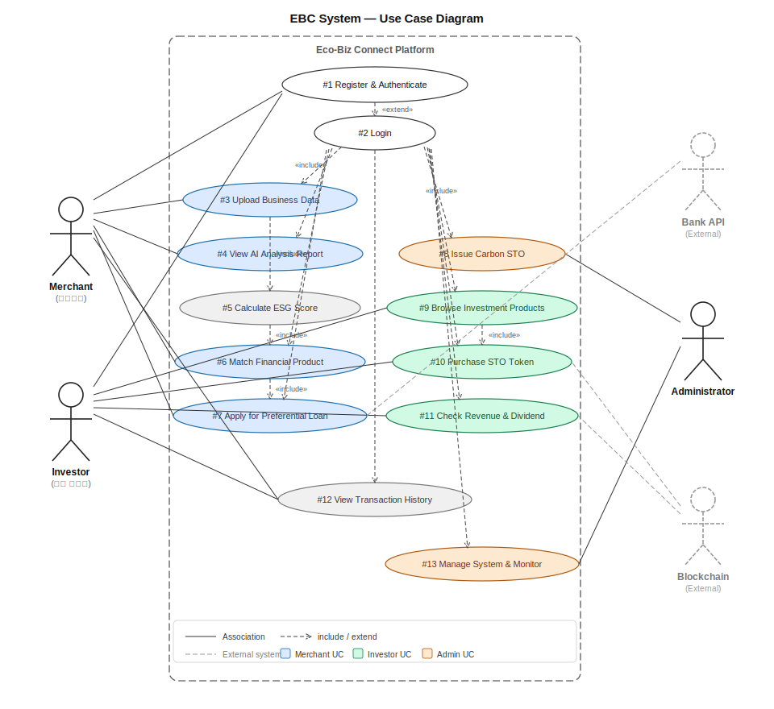
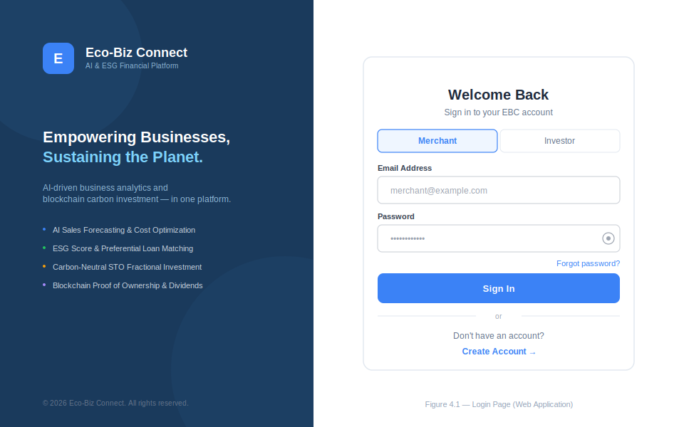
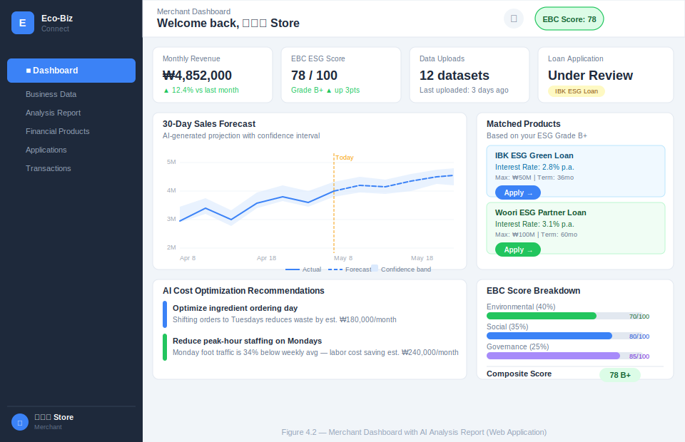
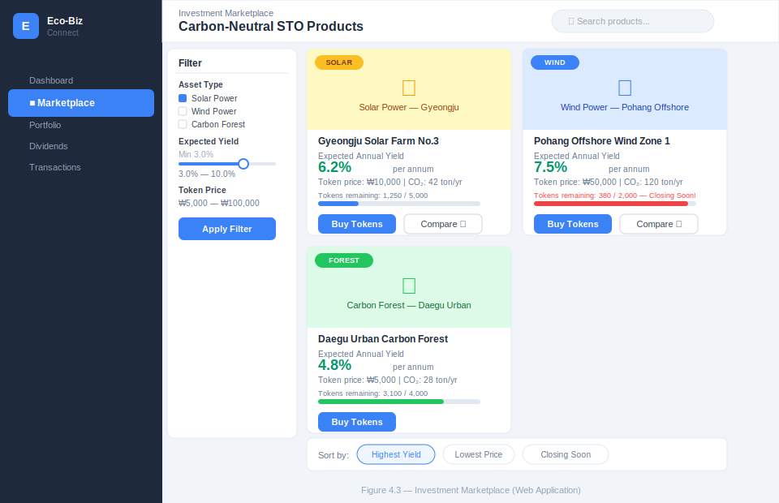
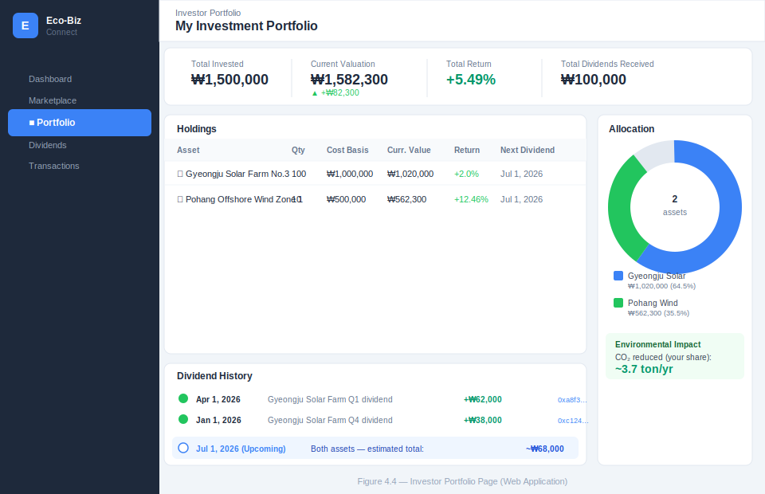
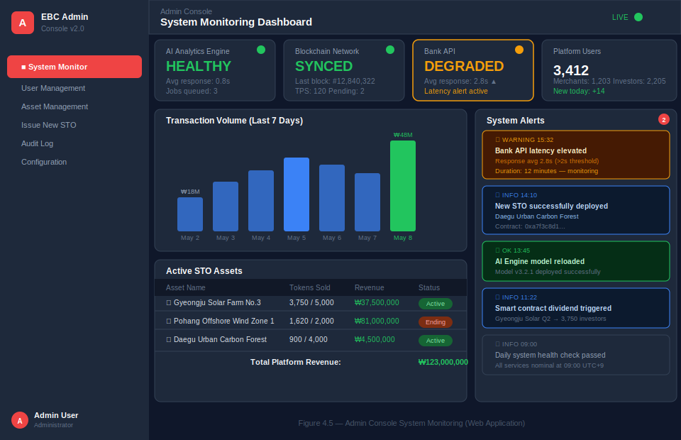

# 2. Analysis

## **Eco-Biz Connect (EBC): AI 및 블록체인 기반 ESG 통합 금융 플랫폼**

### **[ Project Logo ]**
> 
> *AI 경영 분석과 블록체인 탄소 투자의 결합*

 

### **[ Author Information ]**

  

| 구분 (Category) | 상세 정보 (Details) |
| :--- | :--- |
| **Student No** | 22311898 |
| **Name** | 김주형 |
| **E-mail** | curie01@yu.ac.kr |

---

### **[ Revision history ]**

| Revision date | Version # | Description | Author |
| :--- | :--- | :--- | :--- |
| 2026/03/27 | 1.0.0 | 초안 작성 (Eco-Biz Connect 통합 기획) | 김주형 |
| 2026/05/08 | 2.0.0 | Analysis 문서 작성 | 김주형 |

---

### **= Contents =**

| Section | Page |
| :--- | ---: |
| 1. **Introduction** | 1 |
| 2. **Use case analysis** | 2 |
| 3. **Domain analysis** | 3 |
| 4. **User Interface prototype** | 4 |
| 5. **Glossary** | 5 |
| 6. **References** | 6 |

---

## **1. Introduction**

### **1.1 Executive Summary**

현대 금융 시장은 단순한 자금 중개와 수익 창출 모델을 넘어, ESG(환경·사회·지배구조) 가치를 내재화하는 방향으로 빠르게 진화하고 있다. 그러나 지역 경제의 핵심 주체인 소상공인은 여전히 대기업 수준의 경영 분석 도구와 ESG 기반 금융 서비스에 대한 접근이 극히 제한되어 있으며, 탄소중립에 관심 있는 개인 투자자들도 환경 자산에 직접 투자할 수 있는 채널이 마땅히 존재하지 않는다는 문제가 있다.

**'Eco-Biz Connect (EBC)'** 는 이러한 두 가지 문제를 동시에 해결하기 위해 설계된 **AI 및 블록체인 기반 ESG 통합 금융 웹 플랫폼**이다. 소상공인에게는 POS 매출 데이터와 공공 상권 데이터를 AI 엔진으로 분석한 경영 리포트와 ESG 점수 연동 우대 금융 상품을 제공하고, 개인 투자자에게는 검증된 환경 자산(태양광·풍력·탄소 숲 등)을 블록체인 기반 토큰증권(STO)으로 소액 조각 투자하고 스마트 컨트랙트로 수익을 자동 정산받을 수 있는 채널을 제공한다.

### **1.2 Business Goals**

EBC 시스템은 다음 세 가지 핵심 비즈니스 목표를 추구한다.

**목표 1 — 소상공인의 디지털 자생력 강화**
개별 상점의 POS 매출 데이터와 주변 상권 공공 데이터를 융합하여 AI가 매출 예측 및 비용 최적화 리포트를 자동 생성한다. 분석된 지표와 ESG 상생 지수를 바탕으로 협약 금융기관의 우대 대출 상품을 자동 추천하여, 소상공인이 낮은 비용으로 자금을 조달하고 정보 비대칭성을 해소할 수 있도록 지원한다.

**목표 2 — 탄소중립 자산 투자 접근성 민주화**
신재생 에너지 설비 등 환경 자산을 블록체인 기반 토큰증권(STO)으로 발행하여 개인 투자자가 소액 단위로 조각 투자할 수 있게 한다. 모든 소유권은 분산 원장에 기록되며, 스마트 컨트랙트가 수익을 분기별로 자동 정산하여 중간 관리자 없이도 투명한 투자 환경을 제공한다.

**목표 3 — 차세대 ESG 금융 평가 표준 제시**
소상공인의 친환경 경영 활동, 사회적 기여도, 지배구조 투명성을 실시간으로 수치화한 'EBC 상생 지수'를 산출하고 블록체인에 기록한다. 이 점수를 금융기관에 API로 제공하여 비재무적 신용 평가 모델의 새로운 표준을 제안한다.

### **1.3 Technical Goals**

EBC 시스템은 크게 네 가지 기술 서브시스템으로 구성된다.

**AI 분석 엔진:**
LSTM(Long Short-Term Memory) 기반 시계열 예측 모델이 소상공인의 POS 데이터와 외부 공공 상권 통계를 실시간으로 결합하여 3초 이내에 분석 리포트를 생성한다. 계절성·이벤트 등 비정형 변동 요인에 대한 예측 오차를 최소화하기 위해 다중 모델 앙상블 기법을 적용한다.

**블록체인 및 스마트 컨트랙트 모듈:**
STO 발행, 토큰 구매 거래, ESG 점수 앵커링 작업은 모두 블록체인 네트워크에 기록된다. 트랜잭션 비용(가스비)과 처리 지연을 관리하기 위해 Layer 2 하이브리드 구조를 채택한다. 소상공인의 민감한 경영 데이터를 보호하면서도 데이터 무결성을 수학적으로 증명하기 위해 영지식 증명(ZKP) 기술을 활용한다.

**외부 시스템 연동:**
RESTful API 게이트웨이를 통해 협약 금융기관(Bank API)과 연동하여 실시간 대출 상품 조회 및 심사 신청을 비대면으로 처리한다. 블록체인 네트워크 동기화는 전용 노드 커넥터로 관리하며, 장애 시 보조 노드로 자동 전환된다.

**웹 애플리케이션 클라이언트:**
SPA(Single-Page Application) 형태의 웹 애플리케이션으로, Chrome·Edge·Firefox 최신 2개 버전을 지원한다. 최소 뷰포트 너비 1024px의 반응형 레이아웃을 제공하며, WCAG 2.1 AA 접근성 기준을 준수한다.

---

## **2. Use case analysis**

### **2.1 Use Case Diagram**

아래는 EBC 시스템의 Use Case Diagram이다. Actor는 인간 Actor인 **Merchant(소상공인)**, **Investor(개인 투자자)**, **Administrator(관리자)**와 외부 시스템 Actor인 **Bank API**, **Blockchain Network**로 구성된다. Conceptualization 단계에서 정의했던 Use Case List를 바탕으로 아래 Diagram을 도출하였다. Use Case는 동사로 시작하도록 Naming을 하였다. 각 기능별로 연관성에 따라 include 관계나 extend 관계가 적용되었다.

> **그림 2.1** — EBC 시스템 Use Case Diagram

---

### **2.2 Use Case List**

아래는 각 Use Case의 ID와 Korean Name, Actor를 나타낸 표이다.

| Use Case Name | Use Case ID | Korean Name | Actor |
| :--- | :---: | :--- | :--- |
| **Register & Authenticate** | #1 | 회원가입 및 인증 | Merchant, Investor |
| **Login** | #2 | 로그인 | Merchant, Investor, Administrator |
| **Upload Business Data** | #3 | 경영 데이터 업로드 | Merchant |
| **View AI Analysis Report** | #4 | AI 경영 분석 리포트 조회 | Merchant |
| **Calculate ESG Score** | #5 | ESG 상생 지수 산출 | System |
| **Match Financial Product** | #6 | 맞춤형 금융 상품 매칭 | Merchant |
| **Apply for Preferential Loan** | #7 | 우대 대출 신청 | Merchant, Bank API |
| **Issue Carbon STO** | #8 | 탄소중립 자산 STO 발행 | Administrator |
| **Browse Investment Products** | #9 | 투자 상품 탐색 | Investor |
| **Purchase STO Token** | #10 | 조각 투자 및 청약 | Investor |
| **Check Revenue & Dividend** | #11 | 수익 및 배당 관리 | Investor, Blockchain |
| **View Transaction History** | #12 | 거래 내역 및 증명 조회 | Merchant, Investor |
| **Manage System & Monitor** | #13 | 시스템 관리 및 모니터링 | Administrator |

Use Case Description에서는 위에서부터 차례대로 각 Use Case에 대해 표로 Description을 보여줄 것이다.

---

### **2.3 Use Case Description**

#### **2.3.1 Register & Authenticate**

| Use Case #1 : Register & Authenticate | |
| :--- | :--- |
| **GENERAL CHARACTERISTICS** | |
| Summary | 신규 사용자(소상공인 또는 투자자)가 EBC 웹 플랫폼에 회원가입을 하고 금융 기관 수준의 본인 인증(KYC)을 완료한다. 소상공인은 사업자 등록번호를 정부 사업자 등록부와 대조하여 추가 검증한다. |
| Scope | Eco-Biz Connect 웹 애플리케이션 |
| Level | User level |
| Author | 김주형 |
| Last Update | 2026-05-08 |
| Status | Analysis |
| Primary Actor | Merchant, Investor |
| Secondary Actors | Bank API (본인 인증 게이트웨이) |
| Preconditions | EBC 웹 애플리케이션이 실행 중이어야 한다. 동일한 이메일로 이전에 가입한 이력이 없어야 한다. |
| Trigger | 사용자가 회원가입 페이지로 이동하여 '회원가입' 버튼을 클릭한다. |
| Success Post Condition | 새로운 사용자 계정이 시스템 데이터베이스에 생성된다. 사용자 역할(소상공인/투자자)이 부여된다. 인증 이메일이 발송된다. 사용자는 로그인 페이지로 리다이렉트된다. |
| Failed Post Condition | 계정이 생성되지 않는다. 실패 사유(중복 이메일, 유효하지 않은 사업자 번호, KYC 실패)가 화면에 표시된다. |

| **MAIN SUCCESS SCENARIO** | |
| :--- | :--- |
| Step | Action |
| 1 | 사용자가 회원가입 페이지에서 계정 유형(소상공인/투자자)을 선택한다. |
| 2 | 시스템이 역할별 회원가입 양식을 표시한다. 소상공인 양식: 이름, 이메일, 비밀번호, 전화번호, 상점명, 사업자 등록번호. 투자자 양식: 이름, 이메일, 비밀번호, 전화번호. |
| 3 | 사용자가 모든 필수 항목을 입력하고 '제출' 버튼을 클릭한다. |
| 4 | 시스템이 프론트엔드 유효성 검사를 수행한다(이메일 형식, 비밀번호 강도: 8자 이상, 대문자·숫자·특수문자 각 1개 이상). |
| 5 | 소상공인의 경우, 시스템이 정부 사업자 등록 API로 검증 요청을 보내어 사업자 등록번호의 유효성 및 대표자명 일치 여부를 확인한다. |
| 6 | 시스템이 데이터베이스에서 이메일 중복 여부를 확인한다. |
| 7 | 새로운 사용자 레코드가 생성되고, 비밀번호는 bcrypt(salt rounds=12)로 해시 처리되어 저장된다. |
| 8 | 24시간 유효한 일회성 보안 링크가 포함된 인증 이메일이 발송된다. |
| 9 | 사용자에게 이메일 인증 안내 화면이 표시된다. |

| **EXTENSION SCENARIOS** | |
| :--- | :--- |
| Step | Branching Action |
| 4 | 4a. 프론트엔드 유효성 검사 실패 시(예: 비밀번호 강도 부족): 해당 필드에 인라인 오류 메시지가 표시되고 폼은 제출되지 않는다. |
| 5 | 5a. 사업자 등록번호가 등록부에서 조회되지 않는 경우: "사업자 등록번호를 찾을 수 없습니다. 확인 후 다시 입력해 주세요." |
| 5 | 5b. 사업자 등록번호는 존재하나 대표자명이 일치하지 않는 경우: "대표자명이 일치하지 않습니다." 메시지를 표시하고 가입을 차단한다. |
| 6 | 6a. 이미 등록된 이메일인 경우: "이미 사용 중인 이메일입니다. 로그인하거나 다른 이메일을 사용해 주세요." |
| 8 | 8a. 이메일 발송 실패 시: 시스템이 오류를 로깅하고 '인증 이메일 재발송' 버튼을 제공한다. |

| **RELATED INFORMATION** | |
| :--- | :--- |
| Performance | ≦ 3 Seconds (폼 제출부터 리다이렉트까지; 정부 API 포함 시 최대 ≦ 5 Seconds) |
| Frequency | 낮음 (사용자 당 최초 1회) |
| Concurrency | 동시 가입 지원; 이메일 유니크 제약은 DB 레벨에서 처리 |
| Due Date | 2026-06-01 |
| Etc | 비밀번호는 절대 평문으로 저장되지 않는다. |

---

#### **2.3.2 Login**

| Use Case #2 : Login | |
| :--- | :--- |
| **GENERAL CHARACTERISTICS** | |
| Summary | 등록된 사용자가 이메일과 비밀번호로 EBC 플랫폼에 인증하여 JWT 액세스 토큰과 리프레시 토큰을 발급받는다. 시스템은 사용자의 역할을 식별하고 해당 역할에 맞는 대시보드로 리다이렉트한다. |
| Scope | Eco-Biz Connect 웹 애플리케이션 |
| Level | User level |
| Author | 김주형 |
| Last Update | 2026-05-08 |
| Status | Analysis |
| Primary Actor | Merchant, Investor, Administrator |
| Secondary Actors | System (JWT 인증 서버) |
| Preconditions | 사용자가 회원가입을 완료하고 이메일 인증을 마친 상태여야 한다. |
| Trigger | 사용자가 로그인 페이지에서 이메일과 비밀번호를 입력하고 제출한다. |
| Success Post Condition | JWT 액세스 토큰(유효기간 1시간)과 리프레시 토큰(유효기간 7일)이 발급된다. 역할에 따라 해당 대시보드로 리다이렉트된다. |
| Failed Post Condition | 토큰이 발급되지 않는다. 사용자는 로그인 페이지에 머물며 오류 메시지가 표시된다. |

| **MAIN SUCCESS SCENARIO** | |
| :--- | :--- |
| Step | Action |
| 1 | 사용자가 로그인 페이지에서 등록된 이메일과 비밀번호를 입력한다. |
| 2 | 사용자가 '로그인' 버튼을 클릭한다. |
| 3 | 시스템이 이메일로 사용자 레코드를 조회하고 입력된 비밀번호를 저장된 bcrypt 해시와 비교한다. |
| 4 | 일치할 경우, 사용자 ID·역할·만료 시간을 포함한 서명된 JWT가 생성된다. 리프레시 토큰은 httpOnly 보안 쿠키에 저장된다. |
| 5 | 사용자의 `role` 필드를 읽어 리다이렉트한다. Merchant: `/dashboard/merchant`, Investor: `/dashboard/investor`, Administrator: `/admin/console` |

| **EXTENSION SCENARIOS** | |
| :--- | :--- |
| Step | Branching Action |
| 3 | 3a. 이메일이 존재하지 않는 경우: "이메일 또는 비밀번호가 올바르지 않습니다." (사용자 열거 방지를 위한 일반 메시지) |
| 3 | 3b. 비밀번호가 일치하지 않는 경우: 동일한 일반 메시지 표시. 5회 연속 실패 시 계정이 15분간 잠기고 잠금 해제 알림 이메일이 발송된다. |
| 3 | 3c. 이메일은 등록되어 있으나 아직 인증되지 않은 경우: "로그인 전 이메일 인증을 완료해 주세요. [인증 이메일 재발송]" |

| **RELATED INFORMATION** | |
| :--- | :--- |
| Performance | ≦ 2 Seconds (제출부터 리다이렉트까지) |
| Frequency | 높음 (사용자당 하루 여러 번) |
| Concurrency | Stateless JWT; 무제한 동시 세션 지원 |
| Due Date | 2026-06-01 |
| Etc | 무차별 대입 공격 방지: IP당 10분에 5회 요청 제한 |

---

#### **2.3.3 Upload Business Data**

| Use Case #3 : Upload Business Data | |
| :--- | :--- |
| **GENERAL CHARACTERISTICS** | |
| Summary | 로그인한 소상공인이 AI 경영 분석을 위한 매출 데이터, 지출 내역 등을 CSV 또는 Excel 형식으로 시스템 서버에 업로드한다. 업로드 성공 시 AI 분석 파이프라인과 ESG 점수 재산출이 자동으로 트리거된다. |
| Scope | Eco-Biz Connect 웹 애플리케이션 |
| Level | User level |
| Author | 김주형 |
| Last Update | 2026-05-08 |
| Status | Analysis |
| Primary Actor | Merchant |
| Secondary Actors | AI 분석 엔진(System), ESG 점수 산출 모듈(System) |
| Preconditions | 소상공인으로 로그인한 상태이며, 대시보드의 '경영 데이터' 섹션에 진입한 상태여야 한다. |
| Trigger | 소상공인이 파일 업로드 위젯을 사용하여 파일을 선택하거나 드래그 앤 드롭 영역에 파일을 드롭한다. |
| Success Post Condition | 파일이 서버의 보안 오브젝트 스토리지에 저장된다. AI 분석 파이프라인을 위한 백그라운드 작업이 큐에 등록된다. 대시보드에 성공 알림이 표시된다. |
| Failed Post Condition | 파일이 저장되지 않는다. 실패 사유(지원하지 않는 형식, 파일 크기 초과, 파싱 오류)가 화면에 표시된다. |

| **MAIN SUCCESS SCENARIO** | |
| :--- | :--- |
| Step | Action |
| 1 | 소상공인이 웹 대시보드에서 '데이터 업로드' 버튼을 클릭한다. |
| 2 | 시스템이 드래그 앤 드롭 영역과 파일 유형 선택기(POS 매출 데이터/지출 내역/수동 입력)가 포함된 모달을 표시한다. |
| 3 | 소상공인이 `.csv` 또는 `.xlsx` 파일을 선택하거나 드롭하고 데이터 기간(시작일~종료일)을 설정한다. |
| 4 | 브라우저가 파일 확장자와 크기(파일당 최대 50MB)를 사전 검증한다. |
| 5 | 파일이 멀티파트 HTTP POST로 서버에 전송된다. |
| 6 | 서버가 파일 인코딩(UTF-8 또는 EUC-KR)을 검증하고 컬럼 헤더를 예상 스키마와 대조한 후 오브젝트 스토리지에 저장한다. |
| 7 | 파일 참조 및 메타데이터와 함께 AI 분석 파이프라인으로 백그라운드 작업이 큐에 등록된다. |
| 8 | 대시보드에 "업로드 완료. 분석 중…" 메시지와 함께 진행 상태 표시기가 나타난다. |
| 9 | AI 작업이 완료되면 푸시 알림이 표시된다: "새 분석 리포트가 준비되었습니다." |

| **EXTENSION SCENARIOS** | |
| :--- | :--- |
| Step | Branching Action |
| 4 | 4a. 파일 확장자가 `.csv` 또는 `.xlsx`가 아닌 경우: "지원하지 않는 파일 형식입니다. CSV 또는 Excel 파일만 업로드할 수 있습니다." |
| 4 | 4b. 파일이 50MB를 초과하는 경우: "파일 크기가 50MB 제한을 초과합니다. 파일을 분할하여 재업로드해 주세요." |
| 6 | 6a. 컬럼 헤더가 예상 스키마와 일치하지 않는 경우: 미일치 컬럼을 미리보기 테이블에 강조 표시하고 수동 매핑 UI를 제공한다. |
| 7 | 7a. AI 분석 파이프라인 서버가 다운된 경우: 작업이 재시도 큐에 등록되고 "분석이 지연되고 있습니다. 완료되면 알림을 드리겠습니다." 메시지가 표시된다. |

| **RELATED INFORMATION** | |
| :--- | :--- |
| Performance | 파일 업로드: 50MB 기준 ≦ 10 Seconds. 서버 파싱 및 큐 등록: ≦ 3 Seconds. AI 분석 완료: ≦ 30 Seconds (백그라운드 비동기) |
| Frequency | 보통 (소상공인당 주간 또는 월간 업로드) |
| Concurrency | 다수의 소상공인이 동시에 업로드 가능; 작업은 독립적으로 큐에 등록 |
| Due Date | 2026-06-01 |

---

#### **2.3.4 View AI Analysis Report**

| Use Case #4 : View AI Analysis Report | |
| :--- | :--- |
| **GENERAL CHARACTERISTICS** | |
| Summary | 로그인한 소상공인이 웹 대시보드에서 AI 엔진이 생성한 최신 경영 분석 리포트를 조회한다. 리포트에는 30일 매출 예측 차트, 비용 최적화 제안, 상권 비교 지표, EBC 상생 지수 요약이 포함된다. |
| Scope | Eco-Biz Connect 웹 애플리케이션 |
| Level | User level |
| Author | 김주형 |
| Last Update | 2026-05-08 |
| Status | Analysis |
| Primary Actor | Merchant |
| Secondary Actors | AI 분석 엔진(System) |
| Preconditions | 소상공인으로 로그인한 상태이며, 분석에 필요한 경영 데이터가 1회 이상 성공적으로 처리된 상태여야 한다. |
| Trigger | 소상공인이 대시보드의 '분석 리포트' 탭을 클릭한다. |
| Success Post Condition | 리포트가 서버에서 조회되어 모든 차트와 지표가 대시보드에 렌더링된다. |
| Failed Post Condition | 리포트가 렌더링되지 않는다. 적절한 오류 상태와 다음 행동 안내가 표시된다. |

| **MAIN SUCCESS SCENARIO** | |
| :--- | :--- |
| Step | Action |
| 1 | 소상공인이 '분석 리포트' 탭을 클릭한다. |
| 2 | 웹 앱이 Authorization 헤더에 JWT를 포함하여 서버로 최신 리포트 조회 요청을 보낸다. |
| 3 | 서버가 인증된 소상공인의 가장 최근 처리된 리포트 레코드를 데이터베이스에서 조회한다. |
| 4 | 응답 데이터가 (a) 향후 30일 일별 매출 예측 대 실적 비교 라인 차트, (b) 이상 징후 플래그가 표시된 지출 항목별 막대 차트, (c) 소상공인 KPI와 상권 평균을 비교한 레이더 차트, (d) 트렌드 화살표가 표시된 EBC 점수 카드로 렌더링된다. |
| 5 | 소상공인이 차트 섹션을 클릭하여 상세 내역을 드릴다운할 수 있다. EBC 점수 카드를 클릭하면 점수 구성 방식을 설명하는 모달이 열린다. |
| 6 | 소상공인이 '리포트 내보내기'를 클릭하여 리포트를 PDF로 다운로드할 수 있다. |

| **EXTENSION SCENARIOS** | |
| :--- | :--- |
| Step | Branching Action |
| 2 | 2a. 아직 리포트가 생성된 적 없는 경우: "분석 데이터가 없습니다. 첫 번째 데이터셋을 업로드해 시작하세요." 메시지 및 업로드 페이지 직접 링크가 표시된다. |
| 3 | 3a. 서버 오류 시: 이전 리포트의 캐시 버전이 표시되고 "캐시된 데이터를 표시하고 있습니다." 배너가 나타난다. |
| 3 | 3b. 분석이 아직 진행 중인 경우: 진행 상태 바가 포함된 스켈레톤 로딩 화면이 표시되고 5초마다 폴링하여 자동 업데이트된다. |

| **RELATED INFORMATION** | |
| :--- | :--- |
| Performance | 리포트 페이지 로드: ≦ 2 Seconds (캐시). ≦ 5 Seconds (DB에서 신규 조회). |
| Frequency | 높음 (매일 또는 하루 여러 번) |
| Concurrency | 읽기 전용; CDN 엣지에서 5분간 캐시 가능 |
| Due Date | 2026-06-01 |

---

#### **2.3.5 Calculate ESG Score**

| Use Case #5 : Calculate ESG Score | |
| :--- | :--- |
| **GENERAL CHARACTERISTICS** | |
| Summary | 새로운 경영 데이터가 업로드될 때마다 시스템이 소상공인의 'EBC 상생 지수(ESG 점수)'를 자동으로 산출하거나 재산출한다. 점수는 환경(친환경 제품 사용, 에너지 효율), 사회(지역 고용, 커뮤니티 기여), 지배구조(데이터 투명성, 규제 준수) 세 가지 차원의 가중 평균으로 구성된다. 최종 점수(0~100)는 데이터베이스에 저장되고 위변조 방지를 위해 해시값이 블록체인에 앵커링된다. |
| Scope | Eco-Biz Connect 웹 애플리케이션 |
| Level | Sub-function level |
| Author | 김주형 |
| Last Update | 2026-05-08 |
| Status | Analysis |
| Primary Actor | System (ESG 점수 산출 엔진) |
| Secondary Actors | Merchant (데이터 제공자), Blockchain Network (기록 앵커링) |
| Preconditions | 새로운 경영 데이터 업로드(UC #3)가 AI 파이프라인에 의해 성공적으로 처리된 상태여야 한다. |
| Trigger | AI 분석 파이프라인이 작업 완료 시 DataProcessed 이벤트를 발행한다. ESG 점수 산출 엔진이 이 이벤트를 구독하여 활성화된다. |
| Success Post Condition | 새로운 ESG 점수 레코드가 데이터베이스에 기록된다. 점수가 소상공인 대시보드에 실시간으로 반영된다. 점수 레코드의 SHA-256 해시가 블록체인 네트워크에 앵커링된다. |
| Failed Post Condition | 점수 산출 작업이 실패하고 지수 백오프로 최대 3회 재시도된다. 모든 재시도가 실패하면 이전 점수가 유지되고 시스템 경고가 발생한다. |

| **MAIN SUCCESS SCENARIO** | |
| :--- | :--- |
| Step | Action |
| 1 | DataProcessed 이벤트가 소상공인 ID와 처리된 데이터셋 참조와 함께 ESG 점수 산출 엔진에 수신된다. |
| 2 | 엔진이 소상공인의 최신 처리된 데이터셋을 조회하고 점수 산출 입력값을 추출한다: 친환경 인증 제품 비율, 월별 에너지 소비 추이, 지역 직원 수, CSR 활동 로그 항목. |
| 3 | 각 차원(E, S, G)이 0~100 점 척도로 점수가 매겨지고 가중치가 적용된다: 환경 × 0.40 + 사회 × 0.35 + 지배구조 × 0.25. |
| 4 | 종합 점수가 타임스탬프 및 데이터셋 참조 ID와 함께 데이터베이스에 저장된다. |
| 5 | 점수 레코드의 SHA-256 해시가 스마트 컨트랙트를 통해 블록체인 네트워크에 앵커링된다. |
| 6 | 온체인 트랜잭션 해시가 상호 참조를 위해 데이터베이스에 다시 저장된다. |
| 7 | 소상공인 대시보드의 EBC 점수 위젯이 WebSocket 푸시를 통해 실시간으로 업데이트된다. |
| 8 | 점수가 등급 임계값을 넘으면 소상공인에게 이메일 알림이 발송된다. |

| **EXTENSION SCENARIOS** | |
| :--- | :--- |
| Step | Branching Action |
| 2 | 2a. 데이터셋에 일부 점수 산출 입력값이 누락된 경우: 엔진이 해당 차원을 소상공인의 이력 평균값으로 대체하고 점수 레코드에 [부분 데이터] 플래그를 추가한다. |
| 5 | 5a. 블록체인 네트워크가 사용 불가능한 경우: 해시가 대기 큐에 저장되고 10분마다 재시도된다. 점수는 온체인 확인을 기다리지 않고 대시보드에 즉시 표시된다. |

| **RELATED INFORMATION** | |
| :--- | :--- |
| Performance | 점수 산출: ≦ 2 Seconds. 블록체인 앵커링: 비동기, 통상 ≦ 30 Seconds |
| Frequency | 매 데이터 업로드 시 자동 실행 |
| Concurrency | 소상공인별로 독립적으로 처리; 교차 잠금 없음 |
| Due Date | 2026-06-01 |

---

#### **2.3.6 Match Financial Product**

| Use Case #6 : Match Financial Product | |
| :--- | :--- |
| **GENERAL CHARACTERISTICS** | |
| Summary | 소상공인의 현재 EBC 상생 지수와 AI 평가 신용 지표를 기반으로 Bank API에 쿼리하여 신청 가능한 우대 금리 대출 상품 목록을 조회한다. 목록은 실효 이자율 순으로 정렬되어 원클릭 신청 기능과 함께 대시보드에 표시된다. |
| Scope | Eco-Biz Connect 웹 애플리케이션 |
| Level | User level |
| Author | 김주형 |
| Last Update | 2026-05-08 |
| Status | Analysis |
| Primary Actor | Merchant |
| Secondary Actors | Bank API, AI 분석 엔진(신용도 데이터 제공) |
| Preconditions | 소상공인으로 로그인한 상태이며, 유효한 ESG 점수가 산출된 상태(UC #5)여야 한다. |
| Trigger | 소상공인이 내비게이션 메뉴에서 '금융 상품'을 클릭하거나, ESG 점수가 새로운 등급으로 변경될 때 시스템이 자동으로 실행한다. |
| Success Post Condition | 신청 가능한 대출 상품 목록이 은행명, 상품명, 이자율, 최대 대출 한도, 대출 기간, 필요 ESG 등급과 함께 표시된다. |
| Failed Post Condition | Bank API를 사용할 수 없는 경우 최대 24시간 전 캐시 결과가 경고와 함께 표시된다. 일치하는 상품이 없는 경우 점수 향상 안내 화면이 표시된다. |

| **MAIN SUCCESS SCENARIO** | |
| :--- | :--- |
| Step | Action |
| 1 | 소상공인이 '금융 상품'을 클릭한다. |
| 2 | 시스템이 데이터베이스에서 소상공인의 현재 ESG 점수, 신용 등급, 업종을 읽어온다. |
| 3 | 시스템이 소상공인의 익명화된 점수 프로필(ESG 등급, 매출 범위, 업종 — 개인정보 미전송)을 Bank API로 전송하여 적합 상품을 조회한다. |
| 4 | Bank API가 JSON 형식으로 적합 상품 목록을 반환한다. |
| 5 | 시스템이 상품을 필터링·중복 제거하고 실효 연이자율 기준 오름차순으로 정렬한다. |
| 6 | 정렬된 상품 목록이 카드 형태로 웹 페이지에 렌더링된다. 각 카드에는 은행 로고, 상품명, 이자율 배지, 대출 한도, 신청 조건, '지금 신청' 버튼이 표시된다. |
| 7 | 소상공인이 '비교하기'를 클릭하여 최대 3개 상품의 나란히 비교 모달을 열 수 있다. |

| **EXTENSION SCENARIOS** | |
| :--- | :--- |
| Step | Branching Action |
| 3 | 3a. Bank API 응답 시간이 5초를 초과하는 경우: 캐시된 상품 데이터가 "(최종 업데이트: X시간 전)" 안내와 함께 표시된다. |
| 5 | 5a. 소상공인 점수와 일치하는 상품이 없는 경우: "점수 향상 방법" 카드가 표시되어 실행 가능한 권장 사항과 향상 후 예상 대출 적격 상품이 제시된다. |

| **RELATED INFORMATION** | |
| :--- | :--- |
| Performance | ≦ 3 Seconds (Bank API 포함). 데이터 수신 후 페이지 렌더링: ≦ 1 Second |
| Frequency | 보통 (소상공인 의도 또는 시스템 능동 제안에 의해 실행) |
| Concurrency | 읽기 전용 Bank API 조회; 잠금 불필요 |
| Due Date | 2026-06-01 |

---

#### **2.3.7 Apply for Preferential Loan**

| Use Case #7 : Apply for Preferential Loan | |
| :--- | :--- |
| **GENERAL CHARACTERISTICS** | |
| Summary | 소상공인이 매칭된 금융 상품 목록에서 특정 상품을 선택하고 EBC 웹 인터페이스를 통해 완전 디지털 방식으로 대출을 신청한다. EBC 상생 지수 증명서를 포함한 신청 데이터가 Bank API로 전달되며, 소상공인은 신청 참조 번호를 받고 심사 결과를 푸시 알림과 이메일로 수신한다. |
| Scope | Eco-Biz Connect 웹 애플리케이션 |
| Level | User level |
| Author | 김주형 |
| Last Update | 2026-05-08 |
| Status | Analysis |
| Primary Actor | Merchant |
| Secondary Actors | Bank API |
| Preconditions | 소상공인이 매칭된 목록(UC #6)에서 특정 상품을 선택한 상태이어야 한다. 최근 30일 이내에 동일 상품에 이미 신청한 이력이 없어야 한다. |
| Trigger | 소상공인이 특정 상품 카드의 '지금 신청' 버튼을 클릭한다. |
| Success Post Condition | 신청이 Bank API로 전달되고 참조 번호와 함께 접수가 확인된다. 대시보드의 신청 현황 위젯이 '심사 중'으로 업데이트된다. |
| Failed Post Condition | 신청이 제출되지 않는다. 소상공인에게 구체적인 실패 사유가 안내된다. |

| **MAIN SUCCESS SCENARIO** | |
| :--- | :--- |
| Step | Action |
| 1 | 소상공인이 선택한 상품 카드의 '지금 신청'을 클릭한다. |
| 2 | 시스템이 파일에 이미 저장된 데이터로 신청서를 자동 완성한다. |
| 3 | 소상공인이 자동 완성된 데이터를 검토하고 추가 정보(대출 목적, 요청 금액)를 입력하며 지원 서류를 첨부한다. |
| 4 | 소상공인이 동의 체크박스를 체크하고 '신청 제출'을 클릭한다. |
| 5 | 시스템이 EBC 상생 지수 증명서를 포함한 신청 페이로드를 패키징하여 Bank API 엔드포인트에 제출한다. |
| 6 | Bank API가 HTTP 200 응답과 applicationReferenceId로 접수를 확인한다. |
| 7 | 시스템이 신청 레코드를 저장하고 소상공인 대시보드를 업데이트한다. |
| 8 | Bank API가 비동기적으로 심사 결정 웹훅을 EBC 서버로 전송하고, EBC가 결과를 소상공인에게 브라우저 푸시 알림 및 이메일로 전달한다. |

| **EXTENSION SCENARIOS** | |
| :--- | :--- |
| Step | Branching Action |
| 3 | 3a. 필수 서류가 누락된 경우: '제출' 버튼이 비활성화되고 체크리스트에서 누락된 항목이 빨간색으로 강조 표시된다. |
| 5 | 5a. Bank API 유효성 검사 오류 시: 특정 필드 오류가 폼에 인라인으로 표시된다. |
| 5 | 5b. Bank API에 연결할 수 없는 경우: 신청 페이로드가 재시도 큐에 저장된다. "은행 시스템이 복구되면 신청서를 제출하겠습니다." |
| 6 | 6a. Bank API에서 중복 신청이 감지된 경우: "이 상품에 이미 신청서를 제출했습니다." 안내 메시지를 표시한다. |

| **RELATED INFORMATION** | |
| :--- | :--- |
| Performance | 폼 렌더링: ≦ 1 Second. 제출 + Bank API 접수 확인: ≦ 5 Seconds |
| Frequency | 낮음 (소상공인당 일반적으로 활성 신청 1건) |
| Concurrency | 각 API 호출에 멱등성 키 전송으로 중복 제출 방지 |
| Due Date | 2026-06-01 |

---

#### **2.3.8 Issue Carbon STO**

| Use Case #8 : Issue Carbon STO | |
| :--- | :--- |
| **GENERAL CHARACTERISTICS** | |
| Summary | 관리자가 검증된 환경 자산(태양광 발전소, 풍력 발전 단지, 탄소 흡수 숲 등)을 블록체인 기반 토큰증권(STO)으로 등록하고 토큰화한다. 발행 완료 후 모든 인증된 투자자가 상품을 탐색하고 구매할 수 있는 상태가 된다. |
| Scope | Eco-Biz Connect 웹 애플리케이션 (관리자 콘솔) |
| Level | User level |
| Author | 김주형 |
| Last Update | 2026-05-08 |
| Status | Analysis |
| Primary Actor | Administrator |
| Secondary Actors | Blockchain Network |
| Preconditions | 관리자로 인증된 상태여야 한다. 환경 자산이 법적으로 검증되고 관련 문서가 파일에 존재해야 한다. |
| Trigger | 관리자가 관리자 콘솔에서 '새 STO 발행' 메뉴로 이동하여 발행 양식을 작성한다. |
| Success Post Condition | 스마트 컨트랙트가 블록체인에 배포된다. 새 STO 상품이 투자 마켓플레이스에서 공개된다. 인증된 투자자들에게 신규 상품 알림이 발송된다. |
| Failed Post Condition | 스마트 컨트랙트 배포가 실패한다. 어떤 상품도 공개되지 않는다. 관리자에게 상세 오류 로그가 제공된다. |

| **MAIN SUCCESS SCENARIO** | |
| :--- | :--- |
| Step | Action |
| 1 | 관리자가 관리자 콘솔에서 '새 STO 발행'으로 이동한다. |
| 2 | 관리자가 자산 세부 정보를 입력한다: 자산명, 자산 유형, 위치, 설비 용량(MW), 연간 탄소 저감량(ton CO₂), 총 토큰 발행 수량, 토큰 단가(원), 예상 연 수익률(%), 배당 주기. |
| 3 | 관리자가 법적 문서(소유권 증명서, 환경 영향 평가 보고서, 수익 예측서)를 업로드한다. |
| 4 | 관리자가 '스마트 컨트랙트 미리보기'를 클릭하면 시스템이 제출된 파라미터로 Solidity 기반 ERC-1400 보안 토큰 컨트랙트를 생성하고 사람이 읽을 수 있는 요약을 표시한다. |
| 5 | 관리자가 최종 검토 후 '배포 및 발행'을 클릭한다. |
| 6 | 시스템이 스마트 컨트랙트를 컴파일하고 블록체인 네트워크에 배포한 후 배포된 컨트랙트 주소를 수신한다. |
| 7 | 시스템이 컨트랙트 주소, ABI, 자산 메타데이터를 데이터베이스에 저장하고 마켓플레이스에 상품을 공개한다. |
| 8 | 모든 활성 투자자 계정에 푸시 알림이 발송된다. |

| **EXTENSION SCENARIOS** | |
| :--- | :--- |
| Step | Branching Action |
| 2 | 2a. 필수 필드가 비어 있거나 유효 범위를 벗어난 경우: 인라인 유효성 검사 오류가 표시되고 제출이 차단된다. |
| 6 | 6a. 스마트 컨트랙트 컴파일 오류 발생 시: 오류 메시지를 표시하고 관리자에게 파라미터 조정을 요청한다. |
| 6 | 6b. 블록체인 네트워크 연결 오류 시: 배포가 재시도 큐에 등록된다. 관리자에게 "배포 대기 중입니다. 완료되면 알림을 드리겠습니다." |

| **RELATED INFORMATION** | |
| :--- | :--- |
| Performance | 스마트 컨트랙트 컴파일: ≦ 5 Seconds. 블록체인 배포: 네트워크 혼잡도에 따라 15~60 Seconds |
| Frequency | 매우 낮음 (신규 자산 등록은 드문 빈도) |
| Concurrency | 논스 충돌 방지를 위해 관리자당 순차적 배포 |
| Due Date | 2026-06-01 |

---

#### **2.3.9 Browse Investment Products**

| Use Case #9 : Browse Investment Products | |
| :--- | :--- |
| **GENERAL CHARACTERISTICS** | |
| Summary | 인증된 투자자가 EBC 투자 마켓플레이스를 탐색하여 이용 가능한 탄소중립 STO 상품을 발견한다. 핵심 지표가 포함된 상품 카드가 표시되며, 필터링·정렬 및 상품 상세 페이지로의 진입이 지원된다. |
| Scope | Eco-Biz Connect 웹 애플리케이션 |
| Level | User level |
| Author | 김주형 |
| Last Update | 2026-05-08 |
| Status | Analysis |
| Primary Actor | Investor |
| Secondary Actors | Blockchain Network (토큰 가용성 조회) |
| Preconditions | 투자자로 인증된 상태여야 한다. |
| Trigger | 투자자가 메인 내비게이션에서 '투자 마켓플레이스'를 클릭한다. |
| Success Post Condition | 이용 가능한 모든 STO 상품이 카드 형태로 표시된다. 투자자가 필터링, 정렬, 상품 상세 보기를 할 수 있다. |
| Failed Post Condition | 마켓플레이스 데이터를 불러올 수 없다. 캐시된 버전 또는 적절한 오류 상태가 표시된다. |

| **MAIN SUCCESS SCENARIO** | |
| :--- | :--- |
| Step | Action |
| 1 | 투자자가 내비게이션에서 '투자 마켓플레이스'를 클릭한다. |
| 2 | 시스템이 데이터베이스에서 상품 카탈로그(메타데이터)를 가져오고 배포된 스마트 컨트랙트에서 실시간 잔여 토큰 수를 조회한다. |
| 3 | 페이지에 상품 카드가 렌더링된다. 각 카드에는 자산명, 자산 유형 아이콘, 예상 연 수익률(%), 잔여 토큰 진행 상태 바, 토큰 단가, 탄소 저감 수치, 투자 마감일이 표시된다. |
| 4 | 투자자가 필터(자산 유형, 수익률 범위, 가격 범위, 잔여 수량)를 적용할 수 있다. 최고 수익률, 최저 가격, 최신 등록, 마감 임박 기준으로 정렬할 수 있다. |
| 5 | 투자자가 상품 카드를 클릭하면 전체 자산 설명, 위치 지도, 법적 문서 다운로드, 성과 이력이 포함된 상품 상세 페이지가 열린다. |

| **EXTENSION SCENARIOS** | |
| :--- | :--- |
| Step | Branching Action |
| 2 | 2a. 특정 상품의 스마트 컨트랙트 조회가 타임아웃되는 경우: 해당 상품의 토큰 수량에 "가용 데이터 로딩 중…"이 표시되는 동안 나머지 페이지는 정상적으로 렌더링된다. |
| 2 | 2b. 현재 이용 가능한 상품이 없는 경우: "등록된 상품이 없습니다" 상태와 함께 신규 상품 출시 알림 신청 옵션이 표시된다. |

| **RELATED INFORMATION** | |
| :--- | :--- |
| Performance | 페이지 초기 로드: ≦ 2 Seconds (DB의 메타데이터). 실시간 토큰 수량: ≦ 3 Seconds |
| Frequency | 높음 (투자자가 투자 결정 전 자주 탐색) |
| Concurrency | 읽기 전용; 60초간 CDN 캐시 가능 |
| Due Date | 2026-06-01 |

---

#### **2.3.10 Purchase STO Token**

| Use Case #10 : Purchase STO Token | |
| :--- | :--- |
| **GENERAL CHARACTERISTICS** | |
| Summary | 인증된 투자자가 선택한 STO 상품의 토큰을 지정 수량만큼 구매한다. 연동 결제 게이트웨이를 통한 결제가 트리거되고, 이어서 투자자의 온체인 지갑 주소로 토큰 소유권을 이전하는 스마트 컨트랙트 호출이 실행된다. 트랜잭션 해시가 불변 소유권 증명으로 저장된다. |
| Scope | Eco-Biz Connect 웹 애플리케이션 |
| Level | User level |
| Author | 김주형 |
| Last Update | 2026-05-08 |
| Status | Analysis |
| Primary Actor | Investor |
| Secondary Actors | Blockchain Network, Bank API (결제 처리) |
| Preconditions | 투자자가 상품 상세 페이지에 있고 해당 상품의 잔여 토큰이 있어야 한다. KYC를 완료하고 등록된 결제 수단이 있어야 한다. |
| Trigger | 투자자가 수량을 입력하고 '토큰 구매' 버튼을 클릭한다. |
| Success Post Condition | 결제가 완료된다. 스마트 컨트랙트가 투자자 지갑 주소와 토큰 수량을 기록하는 TokenTransfer 이벤트를 발생시킨다. 투자자 포트폴리오가 업데이트된다. |
| Failed Post Condition | 결제가 실패하거나 스마트 컨트랙트 호출이 되돌려지면 토큰이 이전되지 않고 수집된 자금은 즉시 환불된다. |

| **MAIN SUCCESS SCENARIO** | |
| :--- | :--- |
| Step | Action |
| 1 | 상품 상세 페이지에서 투자자가 수량 입력 필드에 원하는 수량을 입력한다. |
| 2 | 페이지가 총 금액(수량 × 단가), 예상 연간 수익, 탄소 저감 환경 영향 환산을 동적으로 계산하여 표시한다. |
| 3 | 투자자가 '구매 확인'을 클릭한다. 모든 주문 세부 정보와 투자 위험 고지 사항이 포함된 확인 모달이 나타난다. |
| 4 | 투자자가 위험 고지를 읽고 확인 체크박스를 체크한 후 '결제 및 투자'를 클릭한다. |
| 5 | Bank API 결제 게이트웨이를 통해 결제가 처리된다. |
| 6 | 결제 확인을 받으면 시스템이 스마트 컨트랙트의 purchase 함수를 호출한다. |
| 7 | 스마트 컨트랙트가 잔여 공급량을 검증하고 차감하며 투자자 보유 수량을 기록한 후 TokenTransfer 이벤트를 발생시킨다. |
| 8 | 트랜잭션 해시가 데이터베이스에 저장되고 투자자 구매 레코드와 연결된다. |
| 9 | 투자자 포트폴리오가 업데이트된다. 상품명, 수량, 총 결제 금액, 트랜잭션 해시가 포함된 확인 이메일이 발송된다. |

| **EXTENSION SCENARIOS** | |
| :--- | :--- |
| Step | Branching Action |
| 1 | 1a. 요청 수량이 잔여 토큰을 초과하는 경우: 입력 필드의 최대값이 자동으로 제한된다. "[N]개의 토큰만 남아 있습니다." 안내가 표시된다. |
| 5 | 5a. 결제 실패 시: "결제 실패: [사유]. 토큰이 구매되지 않았습니다. 결제 수단을 업데이트해 주세요." |
| 6 | 6a. 경쟁 조건으로 스마트 컨트랙트 호출이 되돌려지는 경우: 결제 게이트웨이를 통해 즉시 환불이 진행된다. 전액이 1~3 영업일 내에 환불됨을 안내한다. |

| **RELATED INFORMATION** | |
| :--- | :--- |
| Performance | 결제 처리: ≦ 5 Seconds. 스마트 컨트랙트 실행: ≦ 30 Seconds |
| Frequency | 변동; 신규 상품 출시 시 집중 |
| Concurrency | 토큰 공급에 낙관적 동시성 적용; 스마트 컨트랙트가 정보 원천(Source of Truth) |
| Due Date | 2026-06-01 |

---

#### **2.3.11 Check Revenue & Dividend**

| Use Case #11 : Check Revenue & Dividend | |
| :--- | :--- |
| **GENERAL CHARACTERISTICS** | |
| Summary | 인증된 투자자가 현재 보유 현황, 총 투자 원금, 현재 평가액, 누적 수령 배당금, 예정된 배당 분배 일정 등 포트폴리오 성과 대시보드를 조회한다. 스마트 컨트랙트에 의해 자동화된 배당 지급이 온체인에 추적되어 실시간으로 반영된다. |
| Scope | Eco-Biz Connect 웹 애플리케이션 |
| Level | User level |
| Author | 김주형 |
| Last Update | 2026-05-08 |
| Status | Analysis |
| Primary Actor | Investor |
| Secondary Actors | Blockchain Network |
| Preconditions | 투자자로 인증된 상태이며, STO 토큰을 1개 이상 보유한 상태여야 한다. |
| Trigger | 투자자가 내비게이션에서 '포트폴리오'를 클릭하거나 대시보드의 포트폴리오 위젯을 클릭한다. |
| Success Post Condition | 포트폴리오 페이지에 모든 보유 현황, ROI 지표, 배당 이력 타임라인, 다음 배당 예측이 렌더링된다. |
| Failed Post Condition | 블록체인 데이터를 가져올 수 없는 경우 만료 경고와 함께 캐시된 포트폴리오 데이터가 표시된다. |

| **MAIN SUCCESS SCENARIO** | |
| :--- | :--- |
| Step | Action |
| 1 | 투자자가 '포트폴리오'로 이동한다. |
| 2 | 시스템이 투자자 보유 현황을 데이터베이스에서 조회하고 온체인 배당 지급 이벤트를 블록체인에서 조회한다. |
| 3 | 페이지에 (a) 총 투자 금액, 현재 평가액, 총 수익률 %, 총 수령 배당금을 보여주는 요약 카드, (b) 상품별 보유 수량·취득가·현재 토큰가·미실현 손익·최종 수령 배당금을 보여주는 보유 현황 테이블, (c) 수령한 모든 배당금의 시간순 목록과 트랜잭션 해시를 보여주는 배당 타임라인, (d) 다음 예정 분배 일자 및 상품별 예상 금액을 보여주는 예정 배당 섹션이 렌더링된다. |
| 4 | 투자자가 특정 보유 행을 클릭하여 해당 상품 상세 페이지로 이동할 수 있다. |
| 5 | 투자자가 배당 항목을 클릭하여 트랜잭션 해시에 대한 블록체인 익스플로러를 열 수 있다. |

| **EXTENSION SCENARIOS** | |
| :--- | :--- |
| Step | Branching Action |
| 2 | 2a. 블록체인 RPC 노드에 접근할 수 없는 경우: 마지막 동기화된 포트폴리오 상태(타임스탬프 표시)가 노란색 배너와 함께 표시된다. |

| **RELATED INFORMATION** | |
| :--- | :--- |
| Performance | 전체 포트폴리오 페이지 로드: ≦ 3 Seconds |
| Frequency | 높음 (매일 또는 그 이상) |
| Concurrency | 읽기 전용; 개인 범위 |
| Due Date | 2026-06-01 |

---

#### **2.3.12 View Transaction History**

| Use Case #12 : View Transaction History | |
| :--- | :--- |
| **GENERAL CHARACTERISTICS** | |
| Summary | 인증된 모든 사용자(소상공인 또는 투자자)가 자신의 계정과 관련된 모든 거래의 완전한 페이지네이션 로그를 조회한다. 각 항목에는 거래 유형, 금액, 타임스탬프, 상태, 해당되는 경우 블록체인 검증 링크가 표시된다. 세금 또는 회계 목적으로 이력을 CSV 파일로 내보낼 수 있다. |
| Scope | Eco-Biz Connect 웹 애플리케이션 |
| Level | User level |
| Author | 김주형 |
| Last Update | 2026-05-08 |
| Status | Analysis |
| Primary Actor | Merchant, Investor |
| Secondary Actors | Blockchain Network |
| Preconditions | 사용자가 인증된 상태여야 한다. 계정에 거래 레코드가 최소 1건 이상 존재해야 한다. |
| Trigger | 사용자가 계정 메뉴에서 '거래 내역'을 클릭한다. |
| Success Post Condition | 필터 및 검색 기능과 함께 모든 거래의 페이지네이션 목록이 표시된다. |
| Failed Post Condition | 데이터베이스 조회가 실패한 경우 재시도 버튼과 함께 오류 상태가 표시된다. |

| **MAIN SUCCESS SCENARIO** | |
| :--- | :--- |
| Step | Action |
| 1 | 사용자가 '거래 내역'을 클릭한다. |
| 2 | 시스템이 사용자 ID로 필터링된 거래 테이블을 타임스탬프 내림차순, 페이지당 20건으로 조회한다. |
| 3 | 각 행에는 일시, 거래 유형(토큰 구매/배당 수령/대출 신청/데이터 업로드), 금액(원), 상태(완료/처리 중/실패), 블록체인 Tx 해시(해당 시 링크 아이콘)가 표시된다. |
| 4 | 사용자가 거래 유형, 날짜 범위, 상태로 필터링할 수 있다. 검색창에서 금액 또는 참조 번호로 검색할 수 있다. |
| 5 | 행을 클릭하면 전체 세부 정보가 펼쳐지며, 영수증 데이터와 온체인 거래의 경우 컨트랙트 주소 및 블록 번호가 표시된다. |
| 6 | 'CSV 내보내기'를 클릭하면 현재 필터에 해당하는 모든 레코드가 UTF-8 CSV 파일로 다운로드된다. |

| **EXTENSION SCENARIOS** | |
| :--- | :--- |
| Step | Branching Action |
| 2 | 2a. 거래 레코드가 존재하지 않는 경우: "아직 거래 내역이 없습니다. 첫 번째 데이터셋을 업로드하거나 투자 마켓플레이스를 탐색해 보세요." |
| 6 | 6a. 내보내기 파일이 10,000행을 초과하는 경우: 시스템이 파일을 비동기적으로 생성하고 이메일로 다운로드 링크를 발송한다. |

| **RELATED INFORMATION** | |
| :--- | :--- |
| Performance | 페이지 로드: ≦ 2 Seconds. CSV 내보내기(최대 10,000행): ≦ 5 Seconds |
| Frequency | 보통 |
| Concurrency | 읽기 전용; 동시성 문제 없음 |
| Due Date | 2026-06-01 |

---

#### **2.3.13 Manage System & Monitor**

| Use Case #13 : Manage System & Monitor | |
| :--- | :--- |
| **GENERAL CHARACTERISTICS** | |
| Summary | 관리자가 EBC 관리자 콘솔 웹 인터페이스를 사용하여 모든 시스템 컴포넌트의 운영 상태를 실시간으로 모니터링한다. AI 분석 엔진 처리량, 블록체인 노드 동기화 상태, Bank API 응답 지연, 활성 사용자 세션, 플랫폼 전체 거래량을 확인할 수 있으며, 사용자 계정 관리와 컴플라이언스 감사 로그 검토도 수행한다. |
| Scope | Eco-Biz Connect 웹 애플리케이션 (관리자 콘솔) |
| Level | User level |
| Author | 김주형 |
| Last Update | 2026-05-08 |
| Status | Analysis |
| Primary Actor | Administrator |
| Secondary Actors | Blockchain Network, AI 분석 엔진, Bank API |
| Preconditions | 관리자로 인증된 상태이며 관리자 콘솔에 진입한 상태여야 한다. |
| Trigger | 관리자 계정으로 로그인하면 관리자 콘솔이 자동으로 로드된다. |
| Success Post Condition | 실시간 모니터링 대시보드에 모든 서브시스템의 라이브 지표가 표시된다. |
| Failed Post Condition | 특정 서브시스템의 텔레메트리 피드를 사용할 수 없는 경우 해당 컴포넌트 패널에 '연결 불가' 상태가 표시된다. |

| **MAIN SUCCESS SCENARIO** | |
| :--- | :--- |
| Step | Action |
| 1 | 관리자가 로그인하면 관리자 콘솔로 자동 리다이렉트된다. |
| 2 | 콘솔이 다중 패널 대시보드를 표시한다: (a) AI 엔진 패널: 대기/완료/실패 작업 수, 평균 처리 시간. (b) 블록체인 패널: 마지막 동기화 블록, 대기 중인 트랜잭션, 노드 상태(녹색/황색/적색). (c) Bank API 패널: 응답 시간(5분 롤링 평균), 오류율. (d) 사용자 관리 패널: 총 사용자, 신규 가입(오늘), 활성 세션. |
| 3 | 알림 패널에 타임스탬프가 찍힌 경고 및 위험 이벤트가 표시된다. |
| 4 | 관리자가 특정 사용자의 계정을 정지, 복원하거나 역할을 변경할 수 있다. 모든 관리 작업은 불변 감사 로그에 기록된다. |
| 5 | 관리자가 '감사 로그'를 클릭하여 모든 관리자 작업의 전체 시간순 로그를 조회할 수 있다. |

| **EXTENSION SCENARIOS** | |
| :--- | :--- |
| Step | Branching Action |
| 2 | 2a. 특정 서브시스템 텔레메트리 피드를 사용할 수 없는 경우: 해당 패널에 "서비스 연결 불가 — 마지막 데이터: [타임스탬프]"가 황색으로 표시된다. 담당 엔지니어의 이메일과 Slack으로 자동 알림이 발송된다. |

| **RELATED INFORMATION** | |
| :--- | :--- |
| Performance | 대시보드 초기 로드: ≦ 3 Seconds. 라이브 지표 갱신: WebSocket으로 10초마다 |
| Frequency | 상시 (관리자가 근무 시간 동안 콘솔을 열어 둠) |
| Concurrency | 여러 관리자가 동시에 조회 가능; 관리자 쓰기 작업은 직렬화 |
| Due Date | 2026-06-01 |

---

## **3. Domain analysis**

아래는 EBC 시스템의 Domain Analysis에서 나오는 핵심 클래스들의 관계를 나타낸 것이다. Login 클래스는 모든 사용자 시작 기능 클래스에 도달하는 중심 허브 역할을 한다. Blockchain 클래스는 ESGScore, TokenTransaction, Dividend 클래스로부터 앵커링 레코드를 수신하는 불변 원장 역할을 한다.

**1) User**
시스템 내 모든 인간 Actor의 기반 클래스이다. 공통 신원 속성(userId, email, passwordHash, role, verificationStatus)과 공통 인증 동작(register(), login(), logout(), refreshToken())을 보유한다. `role` 속성이 인증 후 접근 가능한 서브클래스별 동작을 결정한다. 모든 비밀번호는 bcrypt 해시로 저장된다.

**2) Merchant**
User를 확장한다. 플랫폼에 등록된 소상공인을 나타낸다. 비즈니스 특화 속성으로 businessRegNo(회원가입 시 정부 등록부 대조 검증), storeName, storeAddress, businessCategory를 보유한다. `esgScore` 속성은 대시보드에서 빠른 조회를 위해 가장 최근 산출된 EBC 상생 지수를 캐시한다. 주요 동작: uploadData(), viewAnalysisReport(), viewMatchedProducts(), applyForLoan().

**3) Investor**
User를 확장한다. 개인 투자자를 나타낸다. walletAddress(토큰 소유권이 기록되는 블록체인 지갑), kycStatus(구매 전 VERIFIED 상태여야 함), totalInvested를 보유한다. 주요 동작: browseProducts(), purchaseToken(), viewPortfolio(), checkDividends().

**4) Administrator**
User를 확장한다. 상승된 권한을 가진 플랫폼 운영자를 나타낸다. 주요 동작: issueSTO(), manageUsers(), monitorSystem(), viewAuditLog(). 모든 관리자 작업은 불변 감사 추적 테이블에 기록된다.

**5) BusinessData**
소상공인의 단일 데이터 업로드 이벤트를 캡슐화한다. 업로드된 파일의 S3 오브젝트 키, 커버된 데이터 기간, 감지된 파일 인코딩, 사용된 파싱 스키마를 저장한다. `processingStatus` 필드가 파이프라인 상태를 추적한다: `업로드됨 → 파싱 중 → 파싱됨 → AI 큐 등록 → AI 완료 → ESG 완료`. `파싱됨` 상태에 도달하면 AIAnalysisReport 생성과 ESGScore 산출을 동시에 트리거한다.

**6) AIAnalysisReport**
주어진 BusinessData 업로드에 대한 AI 분석 엔진의 출력을 저장한다. 주요 필드: salesForecastJson(일별 예측값), costOptimizationTips(순위가 매겨진 권장 사항), districtComparisonJson(KPI 대 상권 평균), reportGeneratedAt. `generatePDF()` 동작이 서버 사이드 템플릿 엔진을 사용하여 리포트를 PDF로 렌더링한다.

**7) ESGScore**
단일 EBC 상생 지수 레코드를 나타낸다. 세 가지 차원 점수(envScore, socialScore, governanceScore)와 종합 점수(0~100)를 저장한다. `scoreGrade`는 고정된 등급 임계값을 기반으로 도출된다(A / B+ / B / C+ / C / D). `onChainTxHash` 필드는 이 점수 레코드의 SHA-256 해시가 앵커링된 블록체인 레코드로 연결되어 소급 수정을 방지한다.

**8) FinancialProduct**
Bank API에서 조회된 대출 상품을 나타낸다. 임시 캐시 클래스로, 모든 상품 목록 요청마다 Bank API에서 레코드를 갱신하고 최대 24시간 로컬에 캐시한다. 주요 속성: productId, bankName, productName, annualInterestRate, maxLoanAmount, termMonths, minEsgGrade.

**9) LoanApplication**
소상공인의 대출 신청 전체 생명주기를 추적한다. 주요 속성: applicationId, merchantId, productId, requestedAmount, status(제출됨 → 심사 중 → 승인됨/거절됨), bankReferenceId, decisionReceivedAt.

**10) STOAsset**
토큰화된 환경 자산을 나타낸다. 핵심 속성: assetId, assetName, assetType(태양광/풍력/숲/수력), locationGps, installedCapacityMW, annualCarbonReductionTon, totalTokenSupply, remainingTokens(스마트 컨트랙트와 동기화 유지), tokenUnitPriceKRW, expectedAnnualYieldPct, contractAddress, contractABI.

**11) TokenTransaction**
모든 개별 STO 토큰 구매 거래를 기록한다. 속성: txId(내부), investorId, assetId, quantityPurchased, totalAmountPaid, paymentGatewayRef, onChainTxHash, blockNumber, purchasedAt.

**12) Dividend**
특정 STOAsset에 대한 스마트 컨트랙트 트리거 배당 분배 이벤트를 나타낸다. 관리자(또는 자동화된 오라클)가 각 배당 기간에 스마트 컨트랙트의 distributeDividend 함수를 호출한다. 속성: dividendId, assetId, totalDistributedAmount, perTokenAmount, distributionDate, onChainTxHash.

**13) BlockchainRecord**
모든 아웃바운드 블록체인 상호작용의 내부 원장이다. 속성: recordId, recordType(ESG_앵커/토큰_구매/배당/STO_배포), associatedEntityId, txHash, blockNumber, networkId, confirmedAt. `verify()` 동작이 저장된 해시를 라이브 블록체인 상태와 교차 확인하여 불일치를 감지한다.

---

## **4. User Interface prototype**

EBC 플랫폼은 데스크톱 브라우저에 최적화된 웹 애플리케이션으로 설계되었다(최소 뷰포트: 1024px). 모든 인터페이스는 상단 내비게이션 바와 일관된 다크 사이드바 레이아웃을 따른다. 디자인 시스템은 신뢰성(금융)과 환경에 대한 헌신(ESG)을 전달하기 위해 파란색과 초록색 색상 팔레트를 사용한다.

---

### **4.1 로그인 페이지**

> **그림 4.1** — 로그인 페이지 (웹 애플리케이션)

로그인 페이지는 분할 패널 레이아웃으로 구성된다. 왼쪽 패널은 EBC 브랜드 아이덴티티와 핵심 가치 제안을 표시하고, 오른쪽 패널은 인증 폼을 제공한다. 소상공인/투자자 탭 전환으로 역할별 로그인이 가능하며, 최초 사용자는 '계정 만들기' 링크를 통해 회원가입 페이지로 이동할 수 있다.

---

### **4.2 소상공인 대시보드 — AI 분석 리포트**

> **그림 4.2** — 소상공인 대시보드 (웹 애플리케이션)

로그인 후 소상공인은 개인 대시보드로 이동한다. 상단 바에 EBC 점수 배지와 트렌드 지표가 표시된다. 메인 콘텐츠 영역은 신뢰 구간이 포함된 30일 매출 예측 차트, AI 생성 비용 최적화 플래그가 표시된 비용 내역 테이블, 상위 2개 매칭 대출 상품 카드, ESG 점수 차원별 분석 바 차트로 구성된다.

---

### **4.3 투자 마켓플레이스**

> **그림 4.3** — 투자 마켓플레이스 (웹 애플리케이션)

투자자는 왼쪽 내비게이션으로 마켓플레이스에 접근한다. 페이지는 왼쪽의 필터 사이드바와 오른쪽의 반응형 카드 그리드로 구성된다. 각 상품 카드에는 예상 수익률, 잔여 토큰 가용성 진행 바, 단가, '토큰 구매' 버튼이 두드러지게 표시된다. '비교' 체크박스로 최대 3개 상품을 나란히 비교할 수 있다.

---

### **4.4 투자자 포트폴리오 페이지**

> **그림 4.4** — 투자자 포트폴리오 페이지 (웹 애플리케이션)

포트폴리오 페이지는 투자자에게 보유 현황의 종합 개요를 제공한다. 상단 요약 바에 총 투자 금액, 현재 평가액, 총 수익률(%), 총 수령 배당금이 표시된다. 보유 현황 테이블에는 각 자산의 수량, 취득가, 현재 가치, 다음 배당 예정일이 나열된다. 배당 타임라인은 과거 및 예측 미래 현금 흐름을 시각화한다.

---

### **4.5 관리자 콘솔 — 시스템 모니터링**

> **그림 4.5** — 관리자 콘솔 시스템 모니터링 (웹 애플리케이션)

관리자 콘솔은 Administrator 계정만 접근할 수 있다. 실시간 다중 패널 모니터링 대시보드가 특징이다. 상태 지표(녹색/황색/적색)가 모든 서브시스템의 즉각적인 시각적 상태 확인을 제공한다. 오른쪽의 알림 피드는 타임스탬프가 찍힌 시스템 이벤트를 실시간으로 스트리밍한다.

---

## **5. Glossary**

| 용어 (Terms) | 설명 (Description) |
| :--- | :--- |
| **Eco-Biz Connect (EBC)** | 본 프로젝트의 공식 명칭. AI 경영 분석과 블록체인 탄소 투자를 결합한 통합 ESG 금융 웹 플랫폼. |
| **Merchant (소상공인)** | EBC 플랫폼을 통해 AI 경영 분석 및 우대 금융 상품을 이용하는 소상공인·자영업자 사용자. |
| **Investor (개인 투자자)** | EBC 플랫폼을 통해 탄소중립 STO 자산에 소액 조각 투자하는 일반 개인 사용자. |
| **Administrator (관리자)** | 플랫폼 전반을 운영하며 STO 자산을 발행하고 시스템을 모니터링하는 관리자. |
| **STO (토큰증권)** | 실물 환경 자산(신재생 에너지 설비 등)을 블록체인 기술로 디지털 토큰화하여 발행한 증권형 투자 자산. |
| **스마트 컨트랙트** | 블록체인 네트워크상에서 사전 설정된 조건이 충족 시 제3자 개입 없이 자동으로 이행되는 프로그램 코드. 수익 배분 자동화에 활용됨. |
| **EBC 상생 지수** | 소상공인의 친환경 경영 활동, 사회적 기여도, 지배구조 투명성을 수치화한 EBC 플랫폼 고유의 비재무적 신용 평가 지표(0~100점). |
| **AI 분석 엔진** | 소상공인의 매출 데이터와 공공 상권 데이터를 LSTM 기반으로 학습하여 매출 예측 및 비용 최적화 리포트를 생성하는 서버 모듈. |
| **블록체인 네트워크** | STO 발행 및 거래 기록, ESG 점수 등 주요 데이터를 위변조 불가능하게 저장하는 분산 원장 네트워크. |
| **Bank API** | EBC 시스템과 연동하여 소상공인 대출 심사, 우대 상품 조회, 결제 처리를 수행하는 외부 금융기관 API. |
| **POS (Point of Sale)** | 상점에서 결제가 발생하는 시점에 매출 데이터를 실시간으로 수집·관리하는 정보 시스템. AI 분석의 핵심 입력 데이터 소스. |
| **Layer 2 솔루션** | 블록체인 메인넷의 처리 속도를 높이고 트랜잭션 수수료(가스비)를 절감하기 위해 메인넷 위에 구축된 보조 네트워크 기술. |
| **영지식 증명 (ZKP)** | 비밀 정보를 공개하지 않으면서도 그 정보의 유효성을 증명할 수 있는 암호학 기술. |
| **KYC (고객 신원 확인)** | 금융 규제에 따라 사용자가 플랫폼에서 투자 활동을 하기 전에 반드시 거쳐야 하는 필수 신원 확인 프로세스. |
| **JWT (JSON Web Token)** | 상태 비저장 인증에 사용되는 디지털 서명된 토큰 형식. 사용자 ID, 역할, 만료 시간을 포함한다. |
| **오토스케일링** | 클라우드 환경에서 실시간 접속자 수 증가에 따라 서버 자원을 자동으로 확장·축소하는 기술. |
| **비기능 요구사항 (NFR)** | 특정 기능 외에 성능, 보안, 가용성, 확장성, 호환성 등 시스템 아키텍처와 설계를 제약하는 품질 속성. |

---

## **6. References**

* 영남대학교 컴퓨터공학부, "오픈소스SW설계 — Analysis 표준 템플릿(과제 예시)"
* 영남대학교 컴퓨터공학부, "오픈소스SW설계 — Conceptualization 표준 템플릿(과제 예시)"
* 영남대학교 컴퓨터공학부, Analysis Example 1 — Always Be There (모임 관리 시스템, 2017)
* 영남대학교 컴퓨터공학부, Analysis Example 2 — 있고 없고 (재고 관리 및 상품 구매·판매 시스템, 2018)
* 금융위원회, "토큰 증권(STO) 발행 및 유통 규율 체계 정비 방안" (2025)
* 하나금융그룹, "제1회 하나 청년 금융인재 양성 프로젝트" 참가 가이드라인 (2026)
* Ethereum Foundation — ERC-1400: Security Token Standard, https://eips.ethereum.org/EIPS/eip-1400
* OpenZeppelin — Smart Contract Security Auditing Guidelines, https://docs.openzeppelin.com
