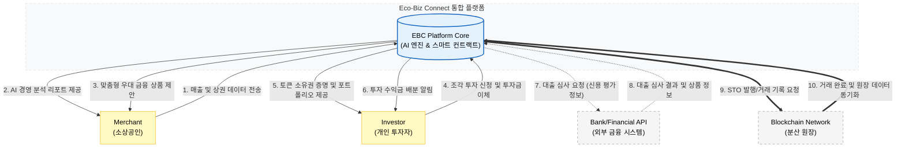

# 1. Conceptualization

## **Eco-Biz Connect (EBC): AI 및 블록체인 기반 ESG 통합 금융 플랫폼**

### **[ Project Logo ]**
> 
> *AI 경영 분석과 블록체인 탄소 투자의 결합*

**Student No:** 22311898  
**Name:** 김주형  
**E-mail:** curie01@yu.ac.kr

---

### **[ Revision history ]**

| Revision date | Version # | Description | Author |
| :--- | :--- | :--- | :--- |
| 2026/03/27 | 1.0.0 | 초안 작성 (Eco-Biz Connect 통합 기획) | 김주형 |

---

### **= Contents =**

| Section | Page |
| :--- | ---: |
| 1. **Business purpose** | 1 |
| 2. **System context diagram** | 2 |
| 3. **Use case list** | 3 |
| 4. **Concept of operation** | 4 |
| 5. **Problem statement** | 5 |
| 6. **Glossary** | 6 |
| 7. **References** | 7 |
---

### **1. Business purpose**

**1.1 Project background**
* **금융 패러다임의 변화와 ESG 경영의 대두:** 현대 금융 시장은 과거의 단순한 자금 중개와 이익 창출 모델을 넘어, 사회적 책임(Social)과 환경적 가치(Environmental)를 금융 시스템 내에 내재화하는 ESG 금융으로 진화하고 있습니다. 이에 따라 선도적인 금융 기관들은 소상공인과의 상생 모델 구축과 친환경 투자 인프라 조성을 기업의 핵심 전략으로 채택하고 있습니다.
* **소상공인의 데이터 소외 및 디지털 격차 현상:** 지역 경제의 실질적 주체인 소상공인들은 대기업이나 프랜차이즈에 비해 매출 예측, 상권 분석, 소비자 행동 패턴 예측 등 고도화된 IT 기술 기반의 경영 도구를 활용할 기회가 매우 제한적입니다. 이러한 정보의 비대칭성은 경영상의 리스크를 키우고, 결과적으로 지역 경제 전반의 자생력을 약화시키는 주요 원인이 되고 있습니다.
* **개인 투자자의 탄소중립 실천 경로 부재:** 기후 위기 대응을 위한 탄소중립 및 환경 보호에 대한 일반 시민들의 관심은 어느 때보다 높지만, 개인이 신재생 에너지 발전소나 대규모 탄소 저감 프로젝트에 직접 투자하여 수익을 공유할 수 있는 채널은 여전히 높은 진입장벽과 복잡한 규제에 가로막혀 있는 실정입니다.

**1.2 Motivation**
* **데이터 민주화를 통한 소상공인 '디지털 자생력' 강화:** 소상공인에게 대기업 수준의 정교한 AI 경영 분석 리포트를 제공함으로써 정보 격차를 해소하고, 데이터에 기반한 효율적인 상점 운영을 돕고자 합니다. 이는 소상공인의 폐업률을 낮추고 지역 상권의 안정성을 확보하는 실질적인 디지털 상생 환경을 구축하는 동기가 되었습니다.
* **블록체인 기술을 통한 환경 가치의 자산화 및 공유:** 소상공인의 친환경 경영 활동(탄소 배출 절감, 에너지 효율화 등)에서 발생하는 무형의 가치를 정량화하고, 이를 블록체인 기반의 토큰증권(STO)으로 발행하여 지역 공동체 구성원들이 소액으로 조각 투자할 수 있는 혁신적인 모델을 구현하고자 합니다. '환경 보호'가 단순한 구호를 넘어 시민들의 '수익 창출'로 이어지는 선순환 구조를 만드는 것이 본 프로젝트의 핵심 목표입니다.

**1.3 Goal**
* **AI 기반 초개인화 경영 지원 엔진 구축:** 개별 상점의 매출 데이터와 주변 상권의 실시간 공공 데이터를 융합 분석하여 최적의 발주 시점, 매출 예측, 경영 개선 포인트를 제안하고, 분석된 지표를 바탕으로 각 사용자에게 최적화된 맞춤형 금융 상품을 자동으로 매칭해주는 통합 지능형 플랫폼을 완성합니다.
* **투명한 탄소중립 STO 투자 프로세스 구현:** 신재생 에너지 설비나 지역 단위의 탄소 배출권 자산을 디지털 토큰화(Tokenization)하고, 투자자들에게 위변조가 불가능한 소유권 증명과 스마트 컨트랙트 기반의 자동 수익 배분 로직을 제공하는 신뢰성 있는 시스템을 개발합니다.
* **차세대 ESG 금융 평가 표준 제시:** 지역 소상공인의 상생 지수와 환경 기여도를 통합 관리하는 실시간 대시보드를 구축하여, 금융권이 기업이나 개인을 평가할 때 활용할 수 있는 새로운 비재무적 성과 측정 지표의 표준 모델을 제시하고자 합니다.

**1.4 Target market**
* **B2B (Small Business Owners):** 데이터 기반의 정교한 경영 진단과 합리적인 정책 자금 지원이 절실한 지역 소상공인, 자영업자 및 예비 창업자.
* **B2C (Individual Investors):** 임팩트 투자(Impact Investing)에 관심이 높으며, 기존의 주식이나 부동산 외에 블록체인 기술을 활용한 새로운 가치 중심의 대체 투자 자산을 찾는 MZ세대 및 일반 개인 투자자.
* **B2G (Public Institutions):** 지역 상생 경제 활성화와 국가적 탄소중립 실천 목표 달성을 위해 민관 협력 방식의 ESG 비즈니스 모델을 도입하고자 하는 지방자치단체 및 관련 공공기관.

---

### **2. System context diagram**

*(이 섹션에서는 Mermaid 문법을 이용한 시스템 컨텍스트 다이어그램과 각 Actor와의 상세한 데이터 흐름을 기술합니다.)*

#### **2.1 Diagram (Mermaid)**

#### **2.2 Description of terms and interactions**

**EBC 플랫폼**과 외부 환경(Actors) 간의 경계를 정의하고, 시스템을 중심으로 오가는 핵심 데이터 및 상호작용을 상세히 기술합니다.

**1) System**
* **EBC Platform (Eco-Biz Connect):** 시스템의 최상위 경계입니다. 소상공인의 데이터를 수집/분석하는 **AI 비즈니스 엔진**과 환경 자산의 토큰화 및 수익 분배를 담당하는 **블록체인 스마트 컨트랙트(Smart Contract) 로직**을 통합 관리하는 핵심 엔진입니다.

**2) Input Actors (데이터 제공 및 행위 주체)**
* **Merchant (소상공인):** 본 플랫폼의 핵심 사용자 그룹입니다.
    * **주요 상호작용:** POS(매출) 데이터, 지출 데이터, 상권 정보를 시스템에 입력합니다. 시스템으로부터 AI가 분석한 경영 개선 리포트와 최적화된 금융 상품 추천 정보를 수신합니다.
* **Investor (개인 투자자):** 탄소중립 자산 조각 투자에 참여하는 사용자 그룹입니다.
    * **주요 상호작용:** 앱을 통해 조각 투자 신청을 하고 투자금을 이체합니다. 시스템으로부터 투자한 토큰의 소유권(Proof of Ownership) 증명과 포트폴리오, 수익금 배분 현황을 실시간으로 확인합니다.

**3) Supporting/External Actors (외부 연동 시스템)**
* **Bank/Financial API (외부 금융 시스템):** 실질적인 금융 서비스를 제공하는 은행 인프라입니다.
    * **주요 상호작용:** EBC 시스템으로부터 대출 심사에 필요한 소상공인의 경영 성과 정보를 수신합니다. 심사 결과에 따른 우대 금리 대출 상품 정보를 제공하고 결제 처리 API를 지원합니다.
* **Blockchain Network (분산 원장):** STO 자산의 신뢰성을 담보하는 외부 블록체인 네트워크입니다.
    * **주요 상호작용:** EBC 시스템의 요청에 따라 탄소중립 자산의 토큰(STO) 발행 및 거래 기록을 영구적으로 저장하고 시스템 간 데이터를 동기화하여 투명성을 확보합니다.
---

### **3. Use case list**

EBC 플랫폼의 핵심 기능을 사용자(Actor)별 역할과 시스템 상호작용에 따라 다음과 같이 정의합니다.

| ID | Use Case | Actor | Description |
| :--- | :--- | :--- | :--- |
| **1** | **회원가입 및 인증** | Merchant, Investor | 소상공인 또는 투자자로서 시스템 이용 권한을 획득하고 금융 기관 인증을 진행함. |
| **2** | **경영 데이터 업로드** | Merchant | 분석을 위해 매출 내역(POS), 지출 영수증, 상권 관련 원데이터를 시스템에 전송함. |
| **3** | **AI 기반 경영 분석** | Merchant | AI 엔진이 수집된 데이터를 분석하여 매출 예측 및 비용 최적화 리포트를 생성 및 제공함. |
| **4** | **ESG 상생 지수 산출** | System | 소상공인의 친환경 경영 활동과 지역 기여도를 분석하여 고유의 ESG 점수를 산정함. |
| **5** | **맞춤형 금융 매칭** | Merchant | 분석된 경영 지표와 ESG 점수를 기반으로 최적의 우대 금리 대출 상품을 추천받음. |
| **6** | **우대 대출 신청** | Merchant, Bank API | 추천된 금융 상품을 앱 내에서 바로 신청하고 심사 결과를 수신함. |
| **7** | **탄소중립 자산 STO 발행** | Administrator | 신재생 에너지 설비 등 환경 자산을 토큰화하여 조각 투자 상품으로 시장에 등록함. |
| **8** | **투자 상품 탐색** | Investor | 현재 발행된 다양한 탄소중립 STO 상품의 상세 정보와 예상 수익률을 확인함. |
| **9** | **조각 투자 및 청약** | Investor | 원하는 환경 자산을 소액 단위의 토큰(Security Token)으로 구매하여 소유권을 확보함. |
| **10** | **수익 및 배당 관리** | Investor, Blockchain | 스마트 컨트랙트에 의해 자동으로 정산된 투자 수익금 및 배당 현황을 실시간으로 확인함. |
| **11** | **거래 내역 및 증명** | Merchant, Investor | 대출 이력, 투자 소유권 증명서 등 모든 거래 내역을 블록체인 원장을 통해 검증 및 관리함. |
| **12** | **시스템 관리 및 모니터링** | Administrator | 전체 플랫폼의 자산 건전성, AI 모델 성능, 블록체인 트랜잭션 상태를 모니터링함. |
---

### **4. Concept of operation**

본 장은 'Eco-Biz Connect' 플랫폼이 제공하는 핵심 유스케이스들의 구체적인 작동 원리와 운영 프로세스를 기술합니다.

#### **1) AI 기반 경영 분석 및 리포트 제공**
| 항목 | 내용 |
| :--- | :--- |
| **Purpose** | 소상공인에게 데이터 기반의 객관적인 경영 지표를 제공하여 정보 비대칭성을 해소하고 자생력을 강화함. |
| **Approach** | 사용자가 업로드한 POS 매출 데이터와 공공 데이터 포털의 상권 정보를 결합함. 시계열 예측 알고리즘(LSTM 등)을 활용하여 향후 매출 추이를 분석하고 비용 최적화 포인트를 도출하는 서버 엔진을 구동함. |
| **Dynamics** | 소상공인이 앱 내 '경영 진단' 탭에서 최신 데이터 동기화를 요청하거나 정기 분석 리포트 생성 스케줄러가 작동할 때 실행됨. |
| **Goals** | 소상공인의 경영 효율성을 대폭 개선하고 실질적인 수익 증대 방안을 제시함. |

#### **2) ESG 상생 지수 산출 및 관리**
| 항목 | 내용 |
| :--- | :--- |
| **Purpose** | 정성적인 ESG 경영 활동을 정량화된 지표로 변환하여 금융 혜택의 객관적인 근거를 마련함. |
| **Approach** | 매장의 친환경 제품 사용 비중, 탄소 배출 저감 노력, 지역 공동체 기여도 등을 종합하여 플랫폼 고유의 'EBC 상생 점수'를 산정함. 해당 데이터는 블록체인상에 기록되어 임의 수정을 방지함. |
| **Dynamics** | 경영 데이터가 갱신될 때마다 시스템 엔진이 실시간으로 점수를 재계산하여 사용자 대시보드에 반영함. |
| **Goals** | 지속 가능한 경영 환경 조성을 유도하고 우량 소상공인을 선별하는 새로운 신용 평가 모델을 제시함. |

#### **3) 맞춤형 우대 금융 상품 매칭 및 신청**
| 항목 | 내용 |
| :--- | :--- |
| **Purpose** | 복잡한 금융 상품 정보 중 소상공인에게 가장 유리한 우대 금리 상품을 선제적으로 매칭하여 금융 비용을 절감함. |
| **Approach** | 산출된 ESG 지수와 AI 경영 리포트의 신용도를 바탕으로 협약된 금융 기관(은행 등)의 API와 연동하여 최적의 대출 및 보증 상품을 추천함. 앱 내에서 비대면으로 서류 제출 및 신청이 가능함. |
| **Dynamics** | 상생 지수가 특정 등급 이상으로 상승하거나 사용자가 '금융 매칭' 기능을 실행할 때 발생함. |
| **Goals** | 소상공인의 저금리 자금 조달을 돕고 은행의 ESG 금융 목표 달성을 지원함. |

#### **4) 탄소중립 자산 STO 조각 투자**
| 항목 | 내용 |
| :--- | :--- |
| **Purpose** | 고액의 환경 자산(신재생 에너지 설비 등)에 대한 일반 개인의 투자 진입장벽을 낮추고 시민 참여형 탄소중립을 실현함. |
| **Approach** | 검증된 친환경 자산을 기초로 블록체인 기반의 토큰증권(STO)을 발행함. 투자자는 앱 내 마켓에서 소액 단위로 토큰을 구매하여 자산의 소유권을 획득하며, 모든 거래 내역은 분산 원장에 투명하게 기록됨. |
| **Dynamics** | 관리자가 신규 투자 상품을 등록하고 투자자가 '청약/구매' 버튼을 확정할 때 트랜잭션이 생성됨. |
| **Goals** | 투명한 대체 투자 시장을 활성화하고 대중의 환경 가치 투자를 유도함. |

#### **5) 스마트 컨트랙트 기반 수익 배분 및 정산**
| 항목 | 내용 |
| :--- | :--- |
| **Purpose** | 중간 관리자의 개입 없이 투자 수익과 배당금을 투명하고 신속하게 정산하여 투자자 신뢰를 확보함. |
| **Approach** | 자산에서 발생하는 실제 수익(전기 판매 수익, 탄소배출권 매각 등)을 블록체인 스마트 컨트랙트(Smart Contract) 로직에 따라 보유 지분별로 자동 계산하여 개인 지갑으로 배분함. |
| **Dynamics** | 자산 운영 정산 주기가 도래하거나 수익금 입금이 확인되는 시점에 자동으로 배분 로직이 실행됨. |
| **Goals** | 정산 프로세스의 자동화 및 투명성을 극대화하여 효율적인 자산 관리 시스템을 구축함. |

---

### **5. Problem statement**

**5.1 Overview**
'Eco-Biz Connect' 플랫폼은 AI를 통한 정밀한 경영 분석과 블록체인을 활용한 자산 거래의 신뢰성을 동시에 확보해야 합니다. 시스템의 성공적인 운영을 위해 해결해야 할 핵심 기술적 과제들과 서비스 품질 유지를 위한 비기능적 요구사항을 다음과 같이 정의합니다.

**5.2 Technical Difficulties**

* **Problem #1: 이종 데이터 결합 및 AI 분석 모델의 신뢰성 확보**
    * **Description:** 소상공인의 내부 매출 데이터(정형)와 지역 상권 유동 인구, 트렌드 데이터(비정형/공공 데이터)는 데이터의 형식과 생성 주기가 상이합니다. 이들을 실시간으로 결합할 때 발생하는 연산 부하를 최적화해야 하며, 분석 결과가 실제 경영 현장과 괴리가 있을 경우 서비스의 신뢰도가 하락할 수 있습니다.
    * **Direction:** 데이터 전처리 파이프라인의 자동화와 다중 모델 앙상블 기법을 도입하여 분석 정확도를 극대화합니다.

* **Problem #2: 블록체인 트랜잭션 비용(Gas Fee) 및 처리 지연 문제**
    * **Description:** 모든 조각 투자 거래와 수익 배분 내역을 퍼블릭 블록체인에 직접 기록할 경우, 높은 가스비가 사용자 부담으로 이어질 수 있습니다. 또한, 네트워크 혼잡 시 거래 확정 시간이 길어져 사용자 경험(UX)에 악영향을 줄 수 있습니다.
    * **Direction:** Layer 2 솔루션 또는 프라이빗/메인넷 하이브리드 구조를 고려하여 수수료 절감 및 처리 속도 향상을 도모합니다.

* **Problem #3: 금융 보안과 데이터 프라이버시 간의 상충 관계**
    * **Description:** 블록체인은 투명성을 강조하지만, 소상공인의 상세 매출 내역은 민감한 경영 정보입니다. 모든 내역을 체인 상에 공개할 수 없으므로, 데이터의 무결성을 증명하면서도 프라이버시를 보호할 수 있는 기술적 장치가 필요합니다.
    * **Direction:** 영지식 증명(Zero-Knowledge Proof) 또는 해시 기반의 오프체인 저장 방식을 활용하여 민감 정보 노출을 차단합니다.

**5.3 Non-Functional Requirements (NFRs)**

시스템의 품질 보증을 위해 다음과 같은 성능 및 운영 기준을 준수합니다.

| 카테고리 | 요구사항 정의 | 세부 기준 |
| :--- | :--- | :--- |
| **성능 (Performance)** | 응답 및 처리 속도 | - DB 접근 후 데이터 출력 시간 3초 이내 - 페이지 로딩 및 화면 전환 속도 2초 이내 |
| **보안 (Security)** | 데이터 보호 및 인증 | - 개인 정보 및 금융 데이터 AES-256 암호화 저장 - 블록체인 기반 2단계 인증(2FA) 및 위변조 방지 |
| **가용성 (Availability)** | 시스템 운영 안정성 | - 연중무휴 99.9% 이상의 서버 가동률 유지 - 금융 API 연동 장애 시 로컬 캐시 데이터 제공 기능 구현 |
| **호환성 (Compatibility)** | 플랫폼 지원 범위 | - Android Lollipop (API 21) 이상 최신 버전 지원 - iOS 14.0 이상 아이폰 환경 최적화 대응 |
| **확장성 (Scalability)** | 사용자 증가 대응 | - 동시 접속자 10,000명 이상 수용 가능한 클라우드 오토스케일링 적용 |

---

### **6. Glossary**

본 프로젝트의 개념 정의 및 기술 명세에 사용된 주요 용어들에 대한 설명입니다.

| 용어 (Terms) | 설명 (Description) |
| :--- | :--- |
| **Eco-Biz Connect (EBC)** | 본 프로젝트의 공식 명칭으로, AI 경영 분석과 블록체인 탄소 투자를 결합한 통합 ESG 금융 플랫폼을 의미함. |
| **STO (Token Securities)** | 실물 자산(신재생 에너지 설비 등)을 블록체인 기술을 활용해 디지털 토큰 형태로 발행한 증권형 자산. |
| **Smart Contract** | 블록체인 네트워크상에서 특정 조건이 충족될 경우 제3자의 개입 없이 계약이 자동으로 이행되도록 프로그래밍된 코드. |
| **ESG** | 환경(Environmental), 사회(Social), 지배구조(Governance)의 약자로, 기업의 비재무적 가치를 측정하는 핵심 지표. |
| **LSTM (Long Short-Term Memory)** | 매출 예측 등 시계열 데이터 분석에 특화된 인공지능 알고리즘의 일종. |
| **SCF (Supply Chain Finance)** | 소상공인의 공급망 데이터를 기반으로 자금 흐름을 최적화하여 저금리 대출 등을 지원하는 공급망 금융 시스템. |
| **POS (Point of Sale)** | 상점에서 결제가 일어나는 시점에 매출 데이터를 실시간으로 수집하고 관리하는 정보 시스템. |
| **Layer 2 솔루션** | 블록체인 메인넷의 처리 속도를 높이고 가스비(수수료)를 절감하기 위해 상단에 구축된 보조 네트워크 기술. |
| **영지식 증명 (Zero-Knowledge Proof)** | 비밀 정보를 공개하지 않으면서도 그 정보가 사실임을 증명하는 암호학 기술로, 개인정보 보호를 위해 활용됨. |
| **임팩트 투자 (Impact Investing)** | 수익 창출과 동시에 사회나 환경에 긍정적인 영향을 미치는 프로젝트에 투자하는 방식. |
| **오토스케일링 (Auto-scaling)** | 클라우드 환경에서 실시간 트래픽 증가에 따라 서버 자원을 자동으로 확장하여 안정적인 서비스를 유지하는 기술. |
| **비기능 요구사항 (NFRs)** | 시스템의 구체적인 기능 외에 성능, 보안, 안정성, 호환성 등 품질 측면에서 만족시켜야 하는 요구사항. |
---

### **7. References**

* 하나금융그룹, "제1회 하나 청년 금융인재 양성 프로젝트" 참가 가이드라인 (2026).
* 영남대학교 컴퓨터공학부, "소프트웨어 공학 - Conceptualization 표준 템플릿".
* 금융위원회, "토큰 증권(STO) 발행 및 유통 규율 체계 정비 방안" (2025).
