# 3. Design

## **Eco-Biz Connect (EBC): AI 및 블록체인 기반 ESG 통합 금융 플랫폼**

### **[ Project Logo ]**
> 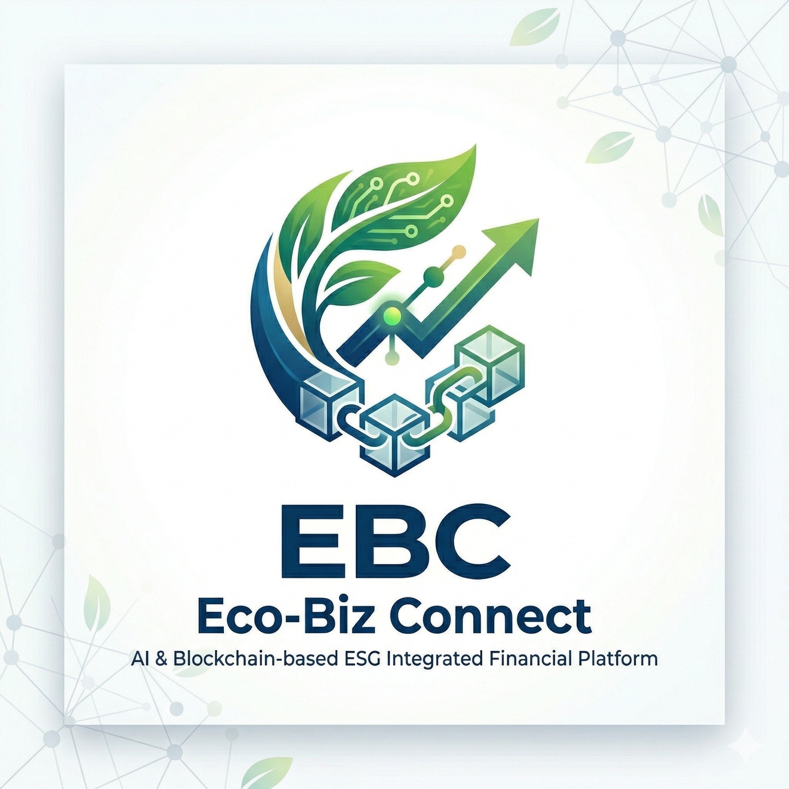
> *AI 경영 분석과 블록체인 탄소 투자의 결합*

 

### **[ Author Information ]**

  

| 구분 (Category) | 상세 정보 (Details) |
| :--- | :--- |
| **Student No** | 22311898 |
| **Name** | 김주형 (Ju) |
| **E-mail** | curie01@yu.ac.kr |

---

### **[ Revision history ]**

| Revision date | Version # | Description | Author |
| :--- | :--- | :--- | :--- |
| 2026/03/27 | 1.0.0 | 초안 작성 (Eco-Biz Connect 통합 기획) | 김주형 |
| 2026/05/08 | 2.0.0 | Analysis 문서 작성 | 김주형 |
| 2026/06/05 | 3.0.0 | Design 문서 작성 (Class / Sequence / State machine diagram) | 김주형 |

---

### **= Contents =**

| Section | Page |
| :--- | ---: |
| 1. **Introduction** | 1 |
| 2. **Class diagram** | 2 |
| 3. **Sequence diagram** | 3 |
| 4. **State machine diagram** | 4 |
| 5. **Implementation requirements** | 5 |
| 6. **Glossary** | 6 |
| 7. **References** | 7 |

---

## **1. Introduction**

### **1.1 Summary**

본 문서는 Conceptualization 단계와 Analysis 단계의 문서에 이어지는 **Design 단계**의 문서이다. Analysis 단계에서 정의한 Use Case와 Domain Model을 바탕으로, 시스템을 실제로 구현하기 위한 구조적(Structural) 설계와 행위적(Behavioral) 설계를 제시한다.

'Eco-Biz Connect (EBC)'는 소상공인에게 AI 기반 경영 분석과 ESG 연동 우대 금융을 제공하고, 개인 투자자에게는 블록체인 기반 토큰증권(STO)을 통한 탄소중립 자산 조각 투자 채널을 제공하는 **AI·블록체인 ESG 통합 금융 웹 플랫폼**이다. 본 Design 문서에서는 이 시스템이 어떤 클래스로 구성되고(Class diagram), 각 Use Case가 객체 간 상호작용을 통해 어떻게 동작하며(Sequence diagram), 핵심 객체와 시스템이 생애 주기 동안 어떤 상태를 거치는지(State machine diagram)를 UML 2.5 표준 표기법에 따라 기술한다.

### **1.2 Goal**

본 Design 보고서의 목표는 다음과 같다.

- Analysis 단계의 13개 Domain 클래스를 UML 표준 **Class diagram**으로 정련하여, 속성(Attribute)·연산(Operation)의 가시성(Visibility)과 자료형, 그리고 클래스 간의 상속(Generalization)·합성(Composition)·집약(Aggregation)·연관(Association)·의존(Dependency) 관계와 다중성(Multiplicity)을 명확히 정의한다.
- Analysis 단계에서 도출한 **13개 Use Case 전체**에 대해 **Sequence diagram**을 작성하여, 객체 간 메시지 흐름과 대안 흐름(Combined Fragment: `alt` / `opt` / `loop`)을 시간 순으로 표현한다.
- 시스템의 핵심 상태 객체(BusinessData, LoanApplication, STOAsset)와 사용자 세션 전체에 대한 **State machine diagram**을 작성하여, 객체가 가질 수 있는 모든 상태와 전이(Transition) 조건을 정의한다.
- 구현에 필요한 H/W·S/W 플랫폼 요구사항을 명시한다.

본 보고서를 읽고 나면 'Eco-Biz Connect'가 어떤 클래스 구조로 설계되었고, 각 기능이 어떤 방식으로 동작하도록 디자인되었는지 알 수 있다.

### **1.3 Design Principles**

본 시스템의 설계는 다음 원칙을 따른다.

- **계층 분리 (Layered Separation):** 화면을 담당하는 **Boundary** 클래스, 비즈니스 로직을 제어하는 **Control** 클래스, 데이터를 표현하는 **Entity** 클래스를 분리하여 책임을 명확히 한다. (Boundary–Control–Entity 패턴)
- **단일 책임 (Single Responsibility):** 각 클래스는 하나의 명확한 책임만 가진다. 예를 들어 AI 분석, ESG 점수 산출, 블록체인 앵커링은 각각 독립된 클래스/모듈로 분리된다.
- **외부 시스템 격리 (External System Isolation):** Bank API와 Blockchain Network는 외부 Actor로 취급되며, 시스템은 전용 Controller를 통해서만 이들과 통신한다. 외부 장애가 핵심 로직에 직접 전파되지 않도록 캐시·재시도 큐로 격리한다.
- **불변 감사성 (Immutable Auditability):** ESG 점수, 토큰 거래, 배당 등 중요한 레코드는 SHA-256 해시 형태로 블록체인에 앵커링되어 사후 위변조를 방지한다.

---

## **2. Class diagram**

본 프로젝트는 Analysis 단계의 Domain Analysis에서 도출한 13개 핵심 클래스를 기반으로 설계한다. 시스템은 웹 기반 SPA(Single-Page Application) 클라이언트와 서버 사이드 로직으로 구성되며, 본 Class diagram은 서버 사이드의 핵심 도메인 모델을 표현한다. UI를 구성하는 Boundary 성격의 화면 클래스(다수의 View 컴포넌트)는 그 수가 많고 도메인 구조 이해에 직접 기여하지 않으므로, 본 Class diagram에서는 제외하고 Sequence diagram에서 Boundary/Control 객체로 표현한다.

대부분의 도메인 클래스는 **User** 추상 클래스를 정점으로 하는 상속 구조와, 비즈니스 엔티티 간의 합성(Composition)·연관(Association) 관계로 구성된다. 모든 속성은 캡슐화 원칙에 따라 `private(–)`로 선언하고, 외부에서 호출되는 연산은 `public(+)`으로 구현하였다.

> **그림 2.1** — EBC 시스템 Class Diagram

### **2.1 표기법 (Notation)**

본 Class diagram은 UML 2.5 표기법을 따른다.

| 표기 | 의미 |
| :--- | :--- |
| `+` / `–` / `#` | 가시성(Visibility): public / private / protected |
| `name : Type` | 속성 이름과 자료형 |
| `op(params) : ReturnType` | 연산(메서드)의 이름, 매개변수, 반환형 |
| 빈 삼각형 화살표 (△) | 일반화(Generalization, 상속) — 자식 → 부모 방향 |
| 채운 마름모 (◆) | 합성(Composition) — 전체(whole) 쪽에 표기, 강한 생명주기 종속 |
| 빈 마름모 (◇) | 집약(Aggregation) — 전체 쪽에 표기, 약한 종속 |
| 실선 화살표 (→) | 연관(Association) |
| 점선 화살표 (⤍) | 의존(Dependency) |
| `1`, `0..*`, `*` | 다중성(Multiplicity) |

### **2.2 클래스 설명 (Class Description)**

#### **2.2.1 User 계층 (상속 구조)**

- **User `{abstract}`** — 시스템 내 모든 인간 Actor의 추상 기반 클래스이다. 공통 신원 속성(`userId`, `email`, `passwordHash`, `role`, `verificationStatus`)과 공통 인증 연산(`register()`, `login()`, `logout()`, `refreshToken()`)을 보유한다. 추상 클래스이므로 직접 인스턴스화되지 않으며, `role` 속성이 인증 후 접근 가능한 서브클래스별 동작을 결정한다. 모든 비밀번호는 bcrypt 해시로 저장된다.
- **Merchant** — User를 일반화 상속한다. 소상공인을 나타내며 `businessRegNo`(가입 시 정부 등록부 대조 검증), `storeName`, `storeAddress`, `businessCategory`, `esgScore`(최근 산출 점수 캐시)를 보유한다. 주요 연산: `uploadData()`, `viewAnalysisReport()`, `viewMatchedProducts()`, `applyForLoan()`.
- **Investor** — User를 일반화 상속한다. 개인 투자자를 나타내며 `walletAddress`, `kycStatus`(구매 전 VERIFIED 필수), `totalInvested`를 보유한다. 주요 연산: `browseProducts()`, `purchaseToken()`, `viewPortfolio()`, `checkDividends()`.
- **Administrator** — User를 일반화 상속한다. 상승된 권한을 가진 운영자로 `issueSTO()`, `manageUsers()`, `monitorSystem()`, `viewAuditLog()` 연산을 가진다. 모든 관리자 작업은 불변 감사 로그에 기록된다.

#### **2.2.2 소상공인 도메인 (Merchant Domain)**

- **BusinessData** — 소상공인의 단일 데이터 업로드 이벤트를 캡슐화한다. `processingStatus`가 `Uploaded → Parsing → Parsed → AIQueued → AICompleted → ESGCompleted` 파이프라인 상태를 추적한다. Merchant와는 **합성(◆)** 관계로, 소상공인 1명이 0개 이상의 BusinessData를 소유한다(`1 ◆— 0..*`).
- **AIAnalysisReport** — BusinessData 업로드에 대한 AI 분석 엔진의 출력이다. `salesForecastJson`, `costOptimizationTips`, `districtComparisonJson` 등을 보유하며 `generatePDF()`로 PDF 렌더링을 수행한다. BusinessData와 `1 → 1` 연관 관계이다.
- **ESGScore** — 단일 EBC 상생 지수 레코드이다. `envScore`, `socialScore`, `governanceScore`, `compositeScore`, `scoreGrade`를 보유하고, `onChainTxHash`를 통해 블록체인 앵커링 레코드와 연결되어 위변조를 방지한다. Merchant가 최신 점수를 **집약(◇)** 으로 참조한다.
- **FinancialProduct** — Bank API에서 조회된 대출 상품을 나타내는 임시 캐시 클래스이다. 최대 24시간 로컬 캐시되며 `refreshFromBankAPI()`, `isCacheValid()` 연산을 가진다.
- **LoanApplication** — 대출 신청의 전체 생명주기를 추적한다. `status`가 `제출됨 → 심사 중 → 승인됨/거절됨`으로 전이된다. Merchant와 **합성(◆)** 관계(`1 ◆— 0..*`), FinancialProduct와 `* → 1` 연관 관계를 가진다.

#### **2.2.3 투자자 도메인 (Investor Domain)**

- **STOAsset** — 토큰화된 환경 자산이다. `assetType`(태양광/풍력/숲/수력), `totalTokenSupply`, `remainingTokens`(스마트 컨트랙트와 동기화), `contractAddress`, `contractABI` 등을 보유하며 `deployContract()`, `purchase()`, `distributeDividend()` 연산을 가진다. Administrator가 **합성(◆)** 으로 발행·소유한다.
- **TokenTransaction** — 개별 STO 토큰 구매 거래를 기록한다. `quantityPurchased`, `totalAmountPaid`, `onChainTxHash`, `blockNumber`를 보유한다. STOAsset과 **합성(◆)**, Investor와 `1 → 0..*` 연관 관계이다.
- **Dividend** — STOAsset에 대한 스마트 컨트랙트 트리거 배당 분배 이벤트이다. `perTokenAmount`, `distributionDate`, `onChainTxHash`를 보유하며 STOAsset과 **합성(◆)** 관계이다.

#### **2.2.4 블록체인 인프라 (Infrastructure)**

- **BlockchainRecord** — 모든 아웃바운드 블록체인 상호작용의 내부 원장이다. `recordType`(ESG_앵커/토큰_구매/배당/STO_배포), `txHash`, `blockNumber`를 보유하고 `verify()`로 저장 해시를 라이브 체인 상태와 교차 확인한다. ESGScore, TokenTransaction, Dividend, STOAsset이 이 클래스에 **의존(⤍ «anchor»)** 한다.

---

## **3. Sequence diagram**

본 장에서는 Analysis 단계에서 정의한 **13개 Use Case 전체**에 대해 Sequence diagram을 작성하고 동작 과정을 기술한다. 각 다이어그램은 UML 2.5 표기법을 따르며, 다음 요소를 사용한다.

| 표기 | 의미 |
| :--- | :--- |
| 점선 수직선 (Lifeline) | 객체의 생존 기간 |
| 얇은 직사각형 (Activation bar) | 객체가 제어를 보유하고 활성화된 구간 |
| 실선 + 채운 화살촉 (→▶) | 동기 메시지(Synchronous message) |
| 실선 + 열린 화살촉 (→) | 비동기 메시지(Asynchronous message) |
| 점선 + 열린 화살촉 (⤍) | 반환 메시지(Return message) |
| 자기 자신으로의 화살표 | 자기 호출(Self-message) |
| `alt` / `opt` / `loop` | 조합 프래그먼트(Combined Fragment) |
| `«boundary»` / `«control»` / `«entity»` / `«system»` | 객체의 스테레오타입 |

각 객체는 Boundary–Control–Entity 패턴에 따라 화면(Boundary), 로직(Control), 데이터(Entity), 외부 시스템(«system»)으로 구분하여 표현하였다.

### **3.1 Register & Authenticate (UC #1)**

신규 사용자(소상공인/투자자)가 회원가입과 KYC 인증을 수행한다. 사용자가 계정 유형을 선택(`selectAccountType`)하면 역할별 폼이 표시된다. 폼 제출 시 `AuthController`가 비밀번호 강도를 검증(self-message)하고, 소상공인의 경우 `Bank API`로 사업자 등록번호를 검증하며 `UserDB`에서 이메일 중복을 확인한다. 이 검증 단계는 `opt` 프래그먼트로 표현되어, 사업자 번호가 유효하지 않거나 이메일이 중복된 경우 가입을 차단한다. 검증을 통과하면 bcrypt 해시로 사용자 레코드를 생성하고 인증 이메일을 비동기로 발송한다.

> **그림 3.1** — Register & Authenticate Sequence Diagram

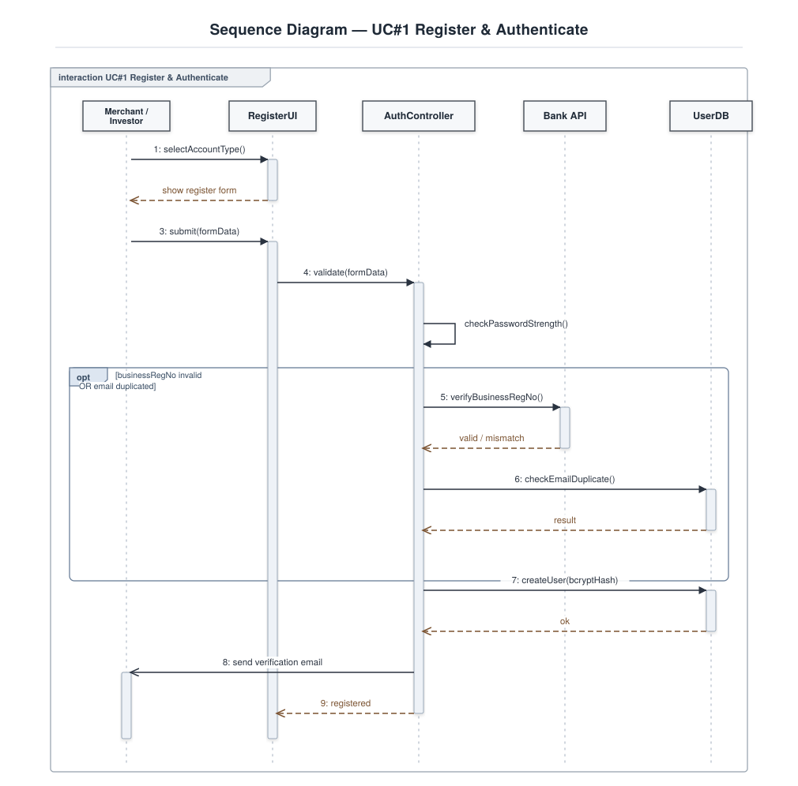

### **3.2 Login (UC #2)**

등록된 사용자가 이메일·비밀번호로 인증하여 JWT 토큰을 발급받는다. `AuthController`가 `UserDB`에서 사용자를 조회하고 bcrypt 해시를 비교한다. `alt` 프래그먼트로 분기하여, 자격 증명이 유효하면 `JWT Server`가 액세스 토큰과 리프레시 토큰을 발급하고 역할에 따라 대시보드로 리다이렉트한다. 유효하지 않거나 미인증 상태이거나 5회 연속 실패한 경우, 일반화된 오류 메시지를 표시하고 계정을 15분간 잠근다.

> **그림 3.2** — Login Sequence Diagram

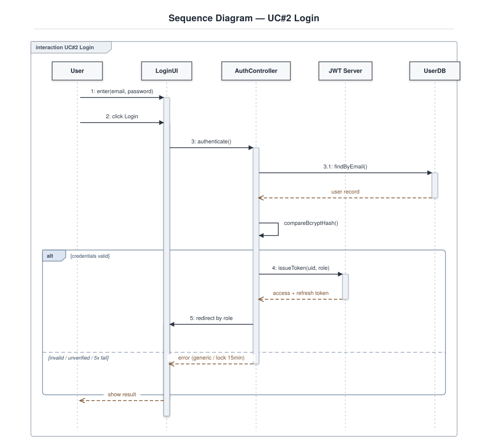

### **3.3 Upload Business Data (UC #3)**

소상공인이 매출/지출 데이터를 CSV·Excel로 업로드한다. `UploadUI`가 확장자와 파일 크기(≤50MB)를 사전 검증하고, `UploadController`가 인코딩과 스키마를 검증한 뒤 `ObjectStorage`에 저장한다. `alt` 프래그먼트로 형식·스키마가 유효한 경우에만 `AnalysisQueue`에 분석 작업을 큐잉하며, 그렇지 않으면 지원하지 않는 형식·용량 초과·스키마 불일치 오류를 표시한다. 업로드 성공 시 AI 분석 파이프라인이 비동기로 트리거된다.

> **그림 3.3** — Upload Business Data Sequence Diagram

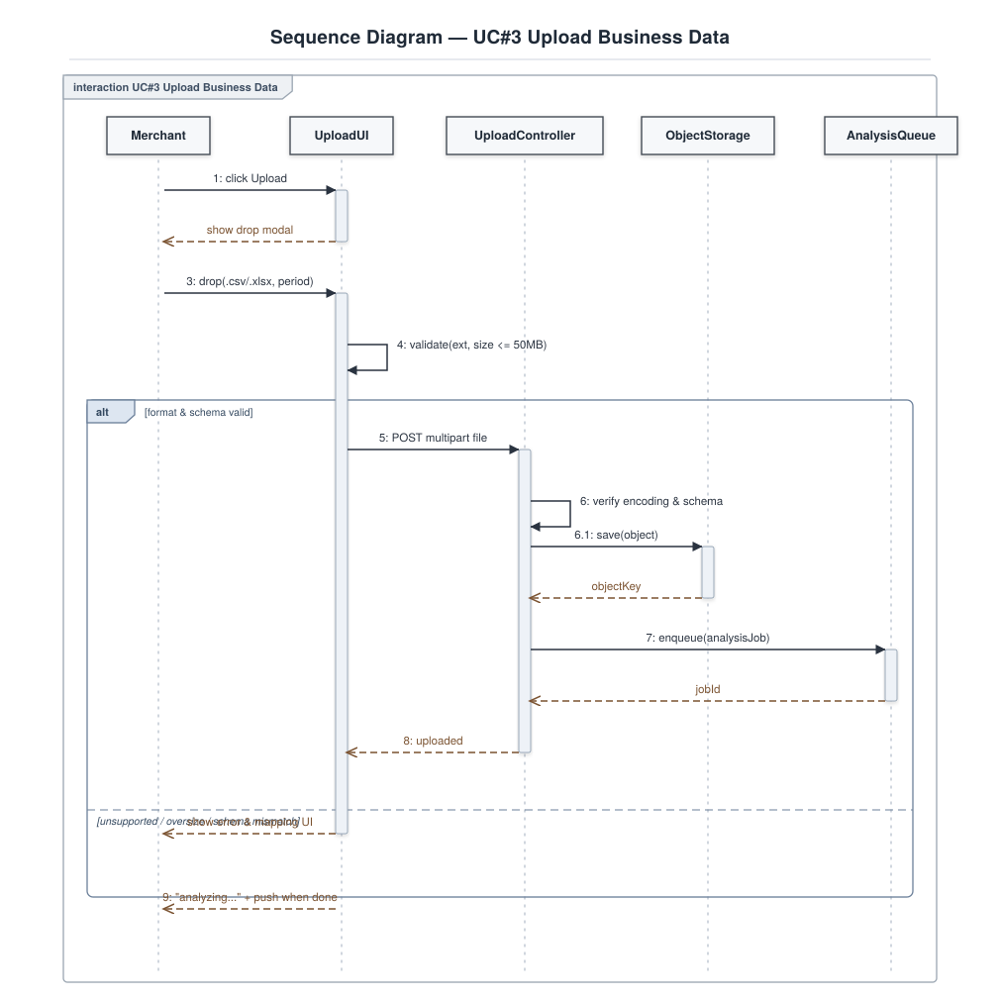

### **3.4 View AI Analysis Report (UC #4)**

소상공인이 AI 분석 리포트를 조회한다. `ReportController`가 JWT 인증과 함께 `ReportDB`에서 최신 리포트를 조회하고, `DashboardUI`가 매출 예측 라인 차트·비용 막대 차트·상권 비교 레이더 차트·ESG 점수 카드를 렌더링한다. `alt` 프래그먼트로 리포트가 존재할 때와, 리포트가 없거나(업로드 유도) 서버 오류(캐시 표시)이거나 분석이 진행 중(스켈레톤 로딩)인 경우를 구분한다.

> **그림 3.4** — View AI Analysis Report Sequence Diagram

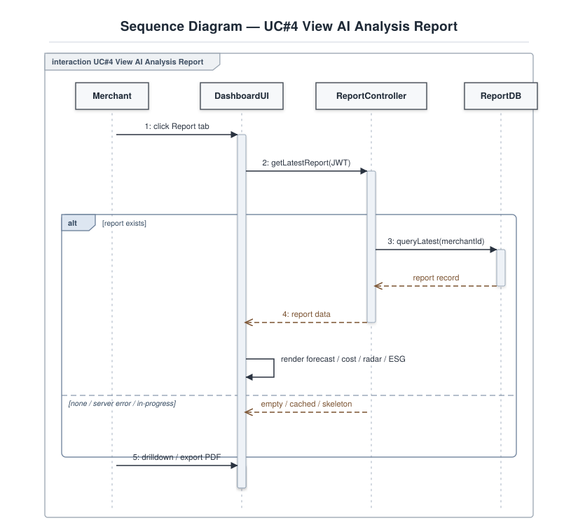

### **3.5 Calculate ESG Score (UC #5)**

AI 파이프라인이 `DataProcessed` 이벤트를 비동기로 발행하면 `ESGEngine`이 이를 구독하여 활성화된다. 엔진은 점수 산출 입력값을 추출하고 `환경×0.40 + 사회×0.35 + 지배구조×0.25`의 가중 평균으로 종합 점수를 산출한다. `alt` 프래그먼트로 블록체인이 가용한 경우 SHA-256 해시를 앵커링하고, 불가능한 경우 대기 큐에 저장하여 10분마다 재시도한다. 점수는 WebSocket으로 대시보드에 실시간 푸시된다.

> **그림 3.5** — Calculate ESG Score Sequence Diagram

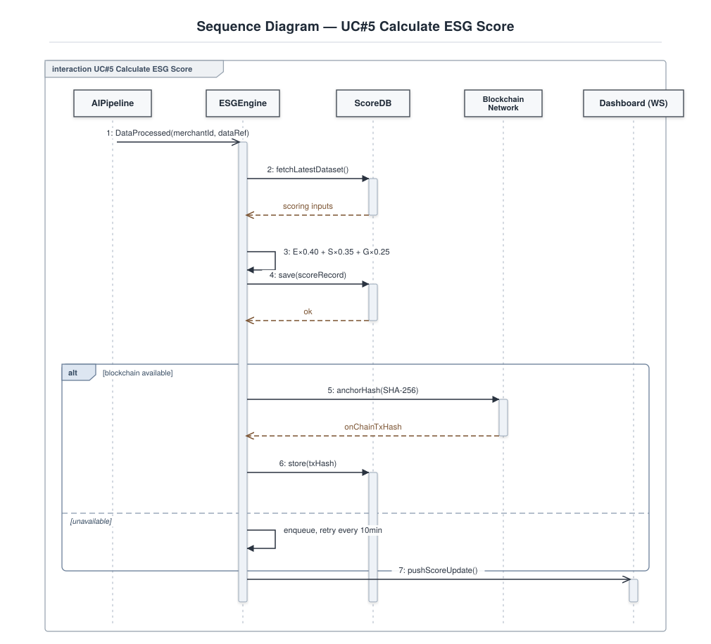

### **3.6 Match Financial Product (UC #6)**

소상공인의 ESG 점수와 신용 지표를 기반으로 Bank API에서 우대 대출 상품을 조회한다. `MatchController`가 익명화된 점수 프로필(개인정보 미전송)을 `Bank API`로 전송한다. `alt` 프래그먼트로 Bank API가 5초 이내 응답하면 실시간 목록을, 타임아웃 시 24시간 이내 캐시 목록을 사용한다. 결과는 실효 연이자율 기준으로 정렬되어 카드 형태로 렌더링된다.

> **그림 3.6** — Match Financial Product Sequence Diagram

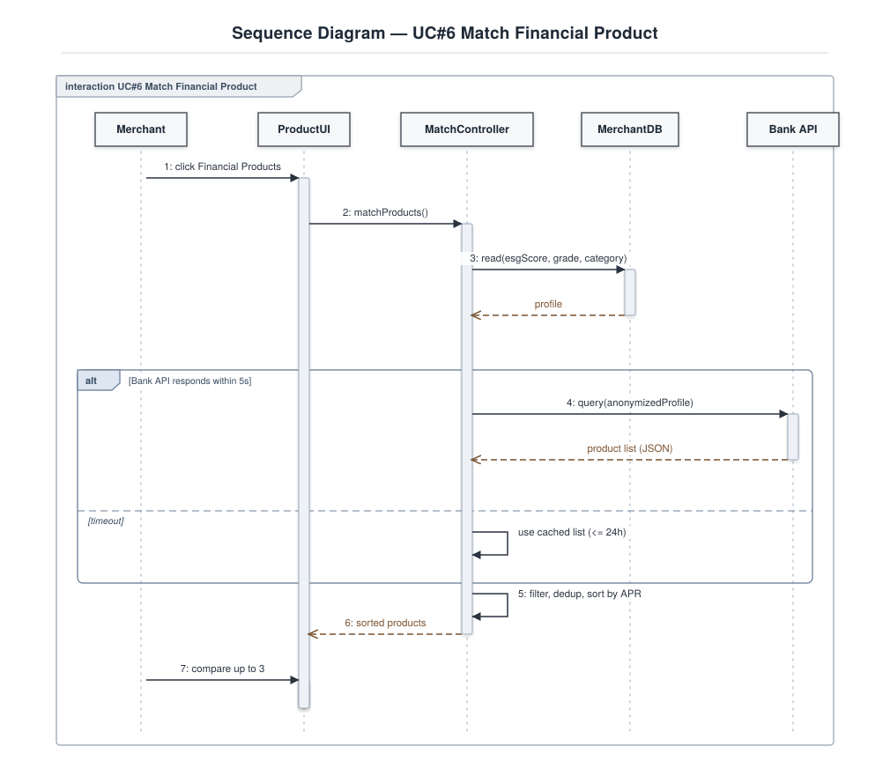

### **3.7 Apply for Preferential Loan (UC #7)**

소상공인이 매칭된 상품에 대해 완전 비대면으로 대출을 신청한다. `LoanController`가 ESG 상생 지수 증명서를 포함한 신청 페이로드를 `Bank API`로 제출한다. `alt` 프래그먼트로 Bank API 도달 및 유효성 검증 성공 시 신청 레코드를 `REVIEW` 상태로 저장하고, 도달 불가 시 재시도 큐에 저장하거나 유효성 오류를 표시한다. 심사 결과는 Bank API의 비동기 웹훅으로 수신되어 사용자에게 푸시·이메일로 전달된다.

> **그림 3.7** — Apply for Preferential Loan Sequence Diagram

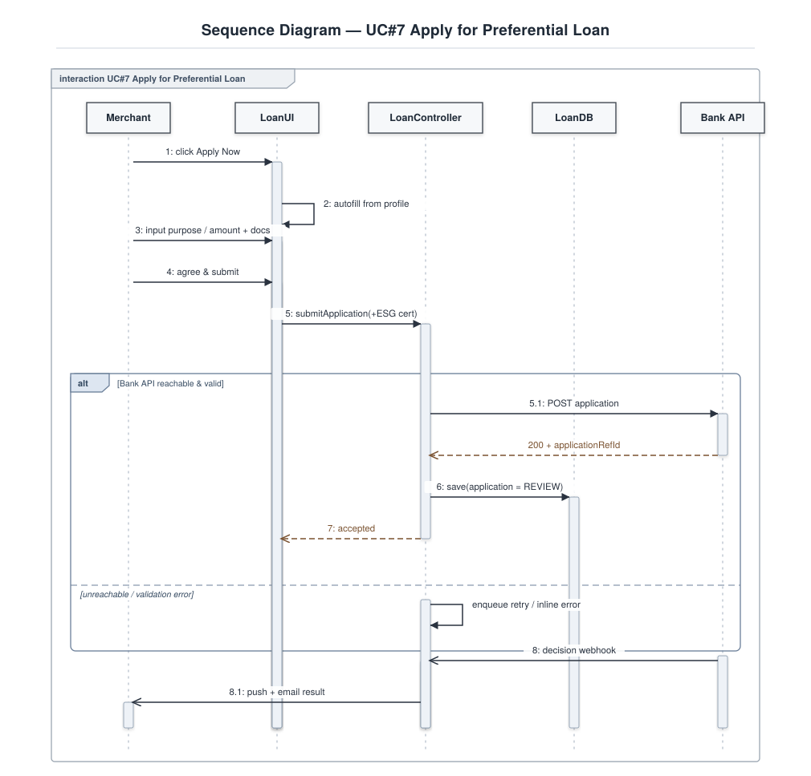

### **3.8 Issue Carbon STO (UC #8)**

관리자가 검증된 환경 자산을 토큰증권(STO)으로 발행한다. 자산 정보·법적 문서 입력 후 `STOController`가 ERC-1400 기반 Solidity 컨트랙트를 생성하여 미리보기를 제공한다. `alt` 프래그먼트로 컴파일·배포가 성공하면 `Blockchain Network`에 컨트랙트를 배포하고 주소·ABI·메타데이터를 저장하여 마켓플레이스에 공개하며, 컴파일 오류·네트워크 오류 시 재시도 큐에 등록한다. 발행 완료 시 전체 투자자에게 비동기 알림이 발송된다.

> **그림 3.8** — Issue Carbon STO Sequence Diagram

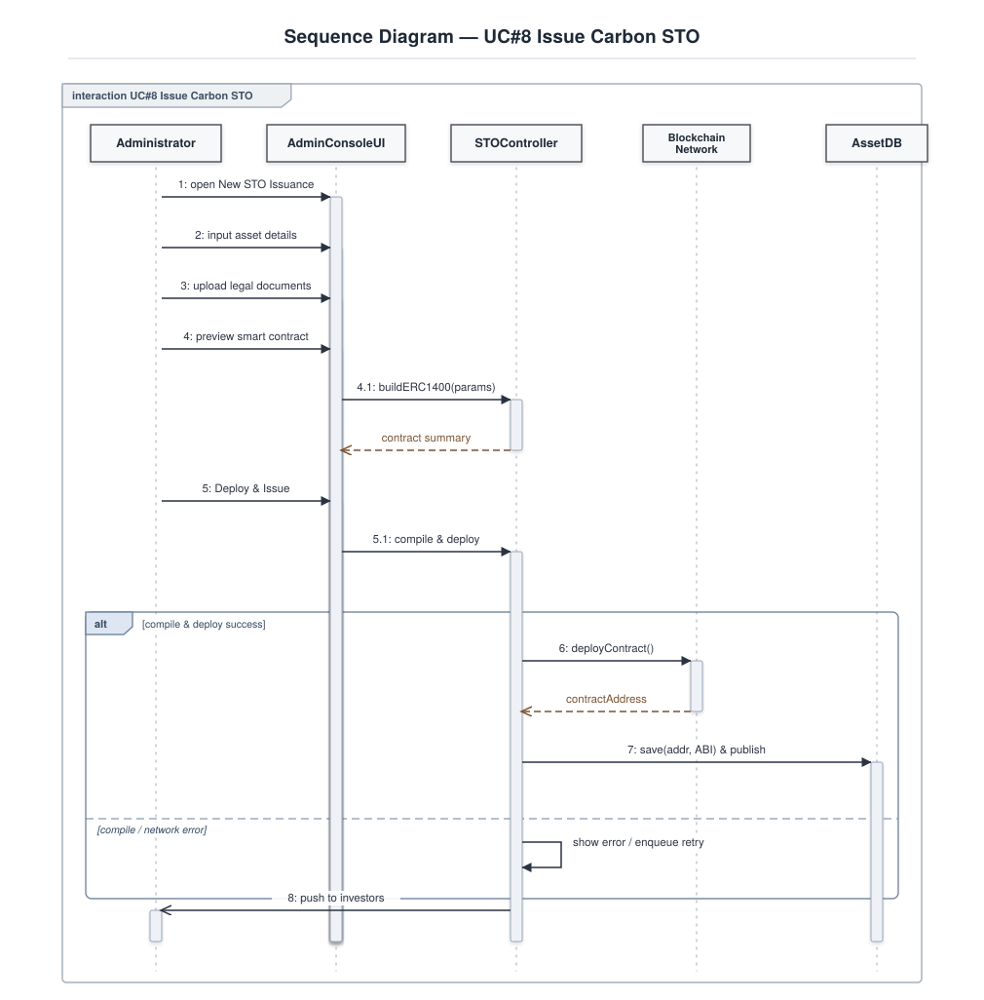

### **3.9 Browse Investment Products (UC #9)**

투자자가 마켓플레이스에서 STO 상품을 탐색한다. `CatalogController`가 `AssetDB`에서 상품 메타데이터를 조회하고, `Blockchain Network`에서 실시간 잔여 토큰 수를 조회한다. `opt` 프래그먼트로 특정 상품의 컨트랙트 조회가 타임아웃되어도 나머지 페이지는 정상 렌더링되며, 해당 상품만 "로딩 중"으로 표시된다. 투자자는 필터·정렬 후 상품 상세 페이지로 진입한다.

> **그림 3.9** — Browse Investment Products Sequence Diagram

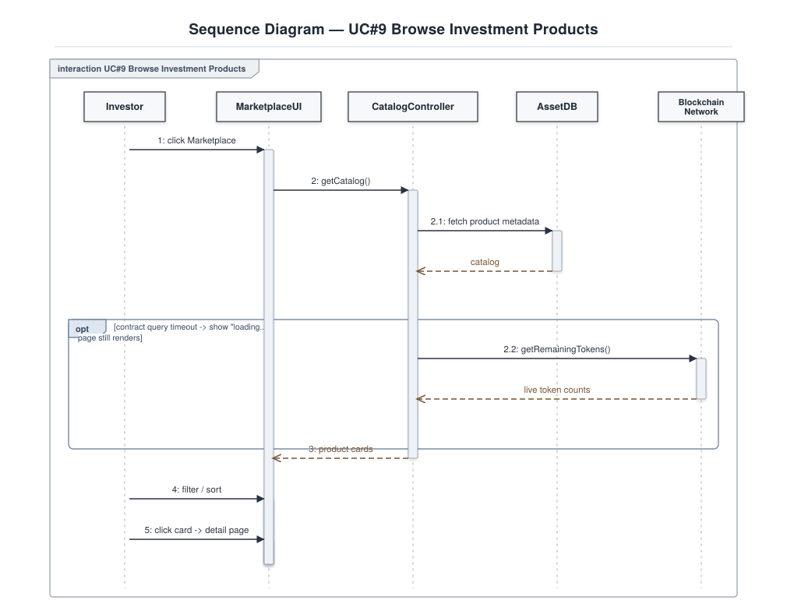

### **3.10 Purchase STO Token (UC #10)**

투자자가 선택한 STO 토큰을 구매한다. 수량 입력 시 총액·예상 수익·탄소 저감 환산이 동적으로 계산되고, 위험 고지 모달 동의 후 결제가 진행된다. `PurchaseController`가 `Bank API`로 결제를 처리한 뒤 `Blockchain Network`의 `purchase` 함수를 호출하여 잔여 공급량을 차감하고 `TokenTransfer` 이벤트를 발생시킨다. `alt` 프래그먼트로 결제 성공 및 컨트랙트 미회귀 시 포트폴리오를 갱신하고, 결제 실패 또는 경쟁 조건으로 인한 회귀 시 즉시 환불한다.

> **그림 3.10** — Purchase STO Token Sequence Diagram

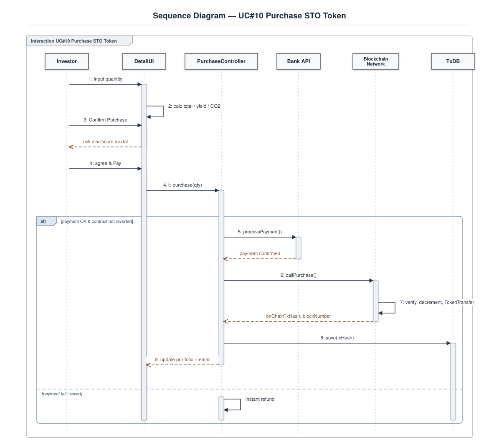

### **3.11 Check Revenue & Dividend (UC #11)**

투자자가 포트폴리오 성과를 조회한다. `PortfolioController`가 `HoldingsDB`에서 보유 현황을, `Blockchain Network`에서 온체인 배당 지급 이벤트를 조회한다. `opt` 프래그먼트로 RPC 노드 접근 불가 시 마지막 동기화 스냅샷(타임스탬프 표시)을 제공한다. 요약 카드·보유 테이블·배당 타임라인·예정 배당이 렌더링되며, 배당 항목 클릭 시 블록체인 익스플로러로 연결된다.

> **그림 3.11** — Check Revenue & Dividend Sequence Diagram

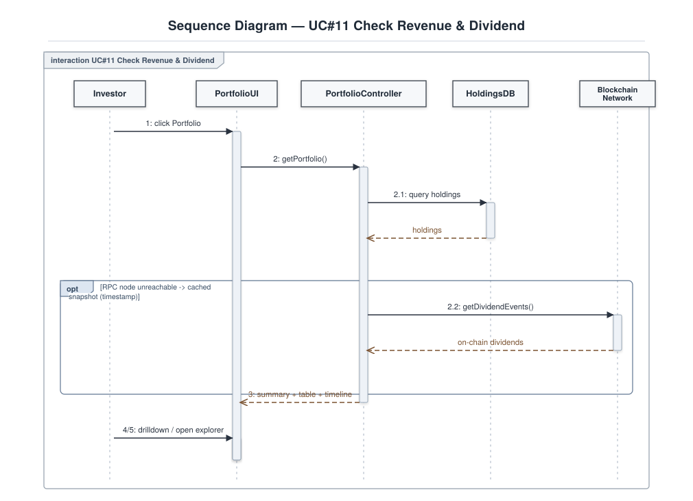

### **3.12 View Transaction History (UC #12)**

소상공인 또는 투자자가 자신의 거래 내역을 조회한다. `HistoryController`가 사용자 ID로 필터링된 거래를 타임스탬프 내림차순·페이지당 20건으로 조회한다. `opt` 프래그먼트로 거래 레코드가 없으면 빈 상태 안내를 표시한다. 필터·검색·행 펼침이 가능하며, CSV 내보내기 시 10,000행을 초과하면 비동기로 생성하여 이메일 링크를 발송한다.

> **그림 3.12** — View Transaction History Sequence Diagram

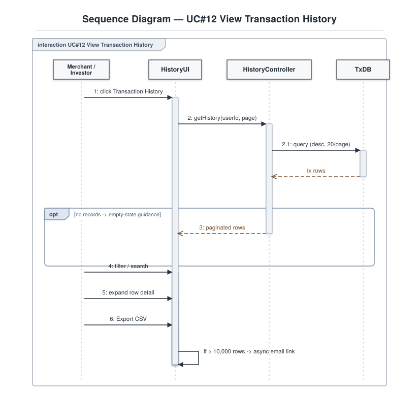

### **3.13 Manage System & Monitor (UC #13)**

관리자가 전체 시스템을 실시간으로 모니터링한다. 관리자 로그인 시 콘솔이 자동 로드되고, `MonitorController`가 `loop` 프래그먼트 안에서 각 서브시스템(`AI Engine`, `Blockchain Network`, `Bank API`)의 지표를 비동기로 폴링한다. 다중 패널 대시보드와 알림이 표시되며, 관리자는 계정 정지·복원·역할 변경(불변 감사 로그 기록)과 감사 로그 조회를 수행할 수 있다. `opt` 프래그먼트로 특정 텔레메트리 피드 사용 불가 시 "연결 불가" 상태와 자동 알림을 처리한다.

> **그림 3.13** — Manage System & Monitor Sequence Diagram

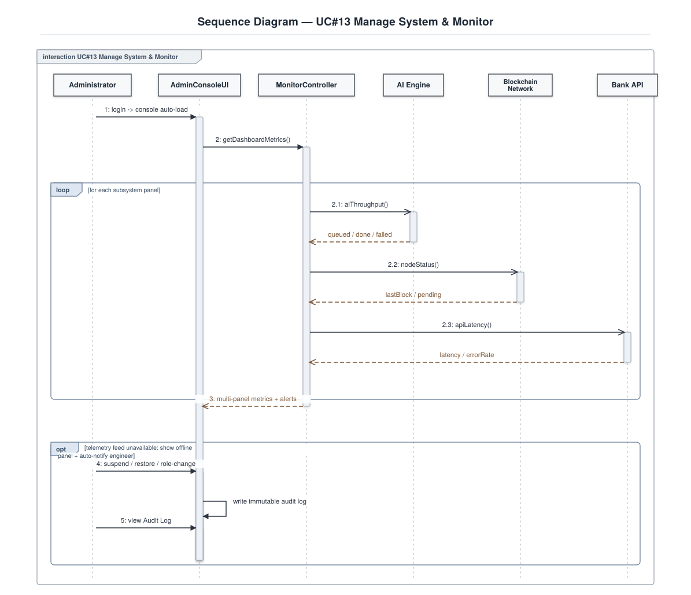

---

## **4. State machine diagram**

본 장에서는 시스템의 핵심 상태 객체와 사용자 세션 전체에 대한 State machine diagram을 작성한다. 객체가 생애 주기(LifeTime) 동안 가질 수 있는 모든 상태와, 상태 간 전이를 유발하는 트리거(Trigger)·가드(Guard)·동작(Action)을 UML 2.5 표기법으로 표현한다.

| 표기 | 의미 |
| :--- | :--- |
| 채운 원 (●) | 시작 의사 상태(Initial pseudostate) |
| 이중 원 (◉) | 종료 상태(Final state) |
| 둥근 사각형 | 상태(State). 내부에 `entry / do / exit` 활동 표기 |
| 화살표 + `trigger [guard] / action` | 전이(Transition) |
| 자기 자신으로의 화살표 | 자기 전이(Self-transition) |
| 큰 둥근 사각형으로 묶음 | 복합 상태(Composite state) |
| 점선 칸막이 | 직교 영역(Orthogonal region) |

### **4.1 BusinessData Processing Lifecycle**

소상공인이 업로드한 경영 데이터(BusinessData)가 처리 파이프라인을 통과하는 동안의 상태 변화를 나타낸다. `Uploaded` 상태에서 시작하여 `Parsing → Parsed`로 진행하며, 파싱 오류 시 자기 전이로 플래그 후 재시도한다. `Parsed` 상태에 도달하면 AI 분석 파이프라인(`AIQueued → AICompleted`)과 ESG 점수 산출(`ESGCompleted`)이 병렬로 트리거된다. 모든 처리가 완료되면 종료 상태로 전이한다.

> **그림 4.1** — BusinessData Processing State Machine Diagram

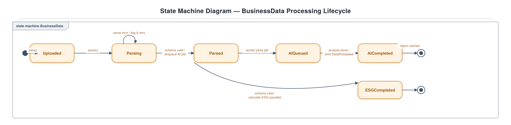

### **4.2 LoanApplication Lifecycle**

대출 신청(LoanApplication) 객체의 생애 주기를 나타낸다. `Draft`(진입 시 프로필 자동 완성) 상태에서 시작하여, 서류가 완비되면(`[docs complete]`) `Submitting`으로 전이하여 Bank API로 신청을 전송한다. Bank API가 도달 불가하면 자기 전이로 재시도 큐에 등록하고, 유효성 오류 시 `Draft`로 되돌아간다. 접수가 확인되면 `UnderReview` 상태에서 웹훅을 기다리며, 가드 조건(`[approved]` / `[rejected]`)에 따라 `Approved` 또는 `Rejected`로 전이한 뒤 각각 종료 상태에 도달한다.

> **그림 4.2** — LoanApplication State Machine Diagram

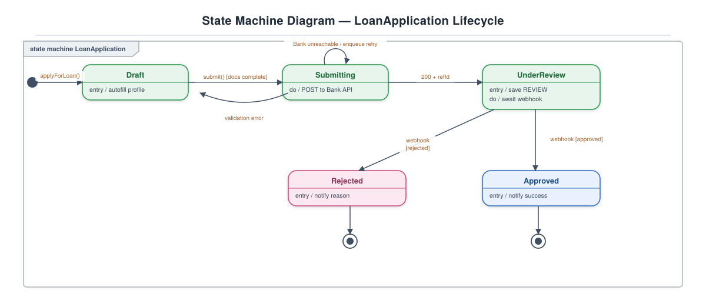

### **4.3 STOAsset Lifecycle**

토큰증권 자산(STOAsset)의 생애 주기를 나타낸다. `Drafting → Compiling → Deploying`을 거쳐 블록체인에 컨트랙트가 배포되면 `Listed` 상태가 되어 마켓플레이스에 공개된다. `Listed` 상태에서는 투자자 구매 시 자기 전이로 `remainingTokens`를 차감하고, 배당 주기가 도래하면 `Dividend Distributing` 상태로 전이하여 배당을 분배한다. 잔여 토큰이 0이 되면(`[remaining = 0]`) `SoldOut`으로 전이하며, 자산 만기 시 종료 상태에 도달한다.

> **그림 4.3** — STOAsset State Machine Diagram

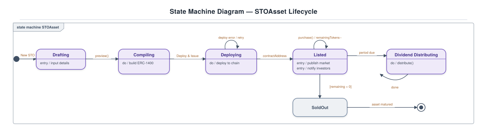

### **4.4 EBC Overall System (User Session)**

시스템 전체의 사용자 세션 흐름을 복합 상태(Composite state)로 나타낸다. `AppLaunched`에서 시작하여 `Authenticating` 상태에서 인증을 수행하며, 자격 증명이 유효하지 않으면(`[invalid]`) 오류를 표시하고 유효하면(`[valid]`) JWT를 발급하여 `Authenticated Session` 복합 상태로 진입한다.

`Authenticated Session`은 사용자의 `role`에 따라 세 개의 직교 영역(Orthogonal region)으로 분기된다.
- **`[role = Merchant]`**: `MerchantDash → Uploading → ViewingReport → MatchingProduct → ApplyingLoan`
- **`[role = Investor]`**: `Marketplace → ProductDetail → Purchasing → Portfolio` (배당 발생 시 자기 전이로 갱신)
- **`[role = Administrator]`**: `AdminConsole → Monitoring → IssuingSTO → ManagingUsers`

모든 역할은 공통으로 `ViewingHistory` 상태에 접근할 수 있다. 로그아웃 또는 토큰 만료 시 세션이 종료된다.

> **그림 4.4** — EBC Overall System State Machine Diagram

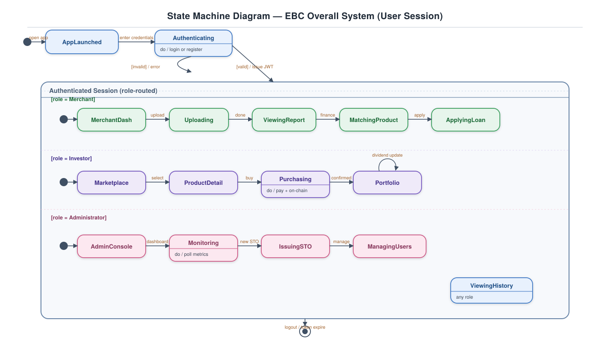

---

## **5. Implementation requirements**

### **5.1 H/W platform requirements**

EBC는 서버 사이드 처리(AI 분석, 블록체인 연동)와 웹 클라이언트로 구성되므로, 요구사항을 서버와 클라이언트로 구분한다.

| 구분 | 항목 | 요구사항 |
| :--- | :--- | :--- |
| **Server** | CPU | Intel Xeon 또는 AMD EPYC 8-core 이상 |
| **Server** | Memory | 16GB RAM 이상 |
| **Server** | Storage | 100GB 이상 SSD (오브젝트 스토리지 별도) |
| **Server** | Network | 고정 IP, 100Mbps 이상 대역폭 |
| **Client** | CPU | Intel i3 이상 또는 동급 |
| **Client** | Memory | 4GB RAM 이상 |
| **Client** | Display | 최소 해상도 1024×768 (반응형 최소 뷰포트 1024px) |

### **5.2 S/W platform requirements**

| 구분 | 항목 | 요구사항 |
| :--- | :--- | :--- |
| **Server** | OS | Ubuntu 22.04 LTS 이상 / Docker 24.0 이상 |
| **Server** | Runtime | Python 3.11+ (AI 엔진), Node.js 20 LTS (API 서버) |
| **Server** | Framework | FastAPI (비동기 ASGI), Web3.py / ethers.js |
| **Server** | DB | PostgreSQL 15+ (관계형), Redis (캐시·큐) |
| **Server** | AI | LSTM 기반 시계열 예측 (PyTorch / TensorFlow) |
| **Server** | Blockchain | ERC-1400 보안 토큰 표준, Solidity, Layer 2 하이브리드 |
| **Client** | Browser | Chrome / Edge / Firefox 최신 2개 버전 |
| **Client** | Implement Language | TypeScript (SPA, React 등), WCAG 2.1 AA 준수 |

---

## **6. Glossary**

| 용어 (Terms) | 설명 (Description) |
| :--- | :--- |
| **Eco-Biz Connect (EBC)** | 본 프로젝트의 공식 명칭. AI 경영 분석과 블록체인 탄소 투자를 결합한 통합 ESG 금융 웹 플랫폼. |
| **Class Diagram** | 시스템을 구성하는 클래스와 그 속성·연산, 그리고 클래스 간의 정적 관계(상속·합성·연관 등)를 표현한 구조 다이어그램. |
| **Sequence Diagram** | 객체 간의 동적 상호작용을 시간 순서(time order)로 모델링하여 나타낸 행위 다이어그램. |
| **State Machine Diagram** | 객체가 생애 주기(LifeTime) 동안 가질 수 있는 모든 상태와 상태 간 전이를 정의한 행위 다이어그램. |
| **Boundary–Control–Entity** | 화면(Boundary)·로직(Control)·데이터(Entity)로 책임을 분리하는 분석/설계 패턴. |
| **Generalization (일반화)** | 자식 클래스가 부모 클래스의 속성·연산을 상속받는 관계. UML에서 빈 삼각형 화살표로 표기. |
| **Composition (합성)** | 전체가 부분의 생명주기를 완전히 소유하는 강한 결합 관계. 채운 마름모(◆)로 표기. |
| **Aggregation (집약)** | 전체와 부분이 약하게 결합되어 부분이 독립적으로 존재 가능한 관계. 빈 마름모(◇)로 표기. |
| **Combined Fragment** | Sequence Diagram에서 조건 분기(`alt`)·선택(`opt`)·반복(`loop`) 등 제어 흐름을 표현하는 영역. |
| **Multiplicity (다중성)** | 연관 관계에서 한쪽 객체에 연결될 수 있는 다른 쪽 객체의 수(`1`, `0..*`, `*` 등). |
| **STO (토큰증권)** | 실물 환경 자산을 블록체인 기술로 디지털 토큰화하여 발행한 증권형 투자 자산. |
| **Smart Contract** | 블록체인상에서 조건 충족 시 제3자 개입 없이 자동 이행되는 프로그램 코드. |
| **ERC-1400** | 이더리움 기반 보안 토큰(Security Token) 발행을 위한 표준 인터페이스. |
| **EBC 상생 지수 (ESG Score)** | 소상공인의 환경·사회·지배구조 활동을 수치화한 비재무적 신용 평가 지표(0~100점). |
| **JWT (JSON Web Token)** | 상태 비저장 인증에 사용되는 디지털 서명된 토큰. 사용자 ID·역할·만료 시간을 포함. |
| **KYC (고객 신원 확인)** | 금융 규제에 따라 투자 활동 전 반드시 거쳐야 하는 신원 확인 프로세스. |
| **Anchoring (앵커링)** | 데이터의 SHA-256 해시를 블록체인에 기록하여 위변조를 방지하는 기법. |

---

## **7. References**

- 영남대학교 컴퓨터공학부, "오픈소스SW설계 — Design 표준 템플릿(과제 양식)"
- 영남대학교 컴퓨터공학부, "오픈소스SW설계 — Conceptualization / Analysis 제출 문서" (본 프로젝트 선행 산출물)
- 영남대학교 컴퓨터공학부, Design Example — 강의 제공 예시 (MY LITTLE FPS; 사진첩 정리 및 검색 프로그램 IC)
- 강의자료: Structural Modeling I·II, Behavior Modeling I·II
- OMG, "Unified Modeling Language (UML) Specification, Version 2.5.1", https://www.omg.org/spec/UML/
- Ethereum Foundation — ERC-1400: Security Token Standard, https://eips.ethereum.org/EIPS/eip-1400
- OpenZeppelin — Smart Contract Security Auditing Guidelines, https://docs.openzeppelin.com
- FastAPI Documentation, https://fastapi.tiangolo.com/

---

## **8. Implementation Notes (구현 단계 정직 기록)**

본 장은 위 설계(목표 아키텍처)를 실제 코드로 구현하면서 내린 결정과, 설계와 구현이 다른 부분을 정직하게 기록한다. 외부 시스템(Bank API·Blockchain·정부 등록 API·KYC)은 과제 범위상 **설계서의 입출력 인터페이스를 그대로 따르는 mock**으로 구현했으며, 실제 계정·API 키 연동은 향후 단계로 남긴다.

### 8.1 실제 사용 스택
- **백엔드:** FastAPI + SQLAlchemy 2 + Alembic(마이그레이션 14종) · SQLite(개발)/PostgreSQL(운영) · JWT(python-jose) · bcrypt
- **웹:** Next.js(App Router) + TypeScript · 자체 디자인 시스템(라이트/다크) · 무의존 SVG 차트
- **앱:** Expo SDK 56 + React Native + react-native-svg (브라우저 미리보기 지원)

### 8.2 AI 경영 분석 (UC4) — 실데이터 분석
- 업로드된 CSV를 실제로 파싱하여 분석한다. 매출 예측은 설계의 "LSTM 앙상블"을 목표로 하되, **본 빌드에서는 업로드 데이터에 대한 최소제곱 추세 회귀 + 변동계수 기반 신뢰구간**으로 구현했다(해석 가능하고, 실제 업로드 값에 반응함).
- 추가 구현: **영업이익·영업이익률**(매출−실비용), **비용 구조 분해**(재료비/인건비/임대료/공과금의 매출 대비 비율), 일별 z-score **이상치 탐지**.

### 8.3 ESG 상생지수 (UC5) — 실신호 기반
- 종합 = 환경×0.40 + 사회×0.35 + 지배구조×0.25(설계 3.5 준수). 각 축은 실데이터 신호로 산출: **환경**=공과금(에너지) 비중↓, **사회**=인건비(지역 고용) 비중↑, **지배구조**=매출 변동성↓. ESG 점수 추이 차트로 시계열 제공.

### 8.4 블록체인 (UC5·UC8·UC10·UC11) — 인프로세스 mock
- SHA-256 해시 앵커링과 `verify()` 교차확인을 **인프로세스 mock**으로 구현(가스비·실네트워크 없음). ERC-1400 컨트랙트 주소/ABI/메타데이터는 결정적 mock으로 생성한다. 사용자에게는 온체인 레코드 조회(트랜잭션 해시·블록·네트워크·검증 상태) 화면을 제공한다.

### 8.5 외부 연동 mock
- **Bank API**: 우대 상품 조회·대출 신청·비동기 심사 웹훅·결제 처리를 설계 인터페이스대로 mock. **정부 사업자 등록 API**: 사업자번호+대표자명 검증 mock. **KYC**: 지갑 기반 인증 mock. **오브젝트 스토리지**: 결정적 키 생성 mock.

### 8.6 부가 가치 기능(설계 취지 확장)
- 투자자 **탄소 임팩트**(보유 지분 기준 연 tCO₂e 환산)·관리자 **플랫폼 누적 탄소 임팩트**, 마켓 **CO₂ 저감순 정렬**·상품 비교(최대 3)·검색/필터, 라이트/다크 테마, PDF 리포트(영업이익·비용구조·신뢰구간·상권 백분위 포함).
