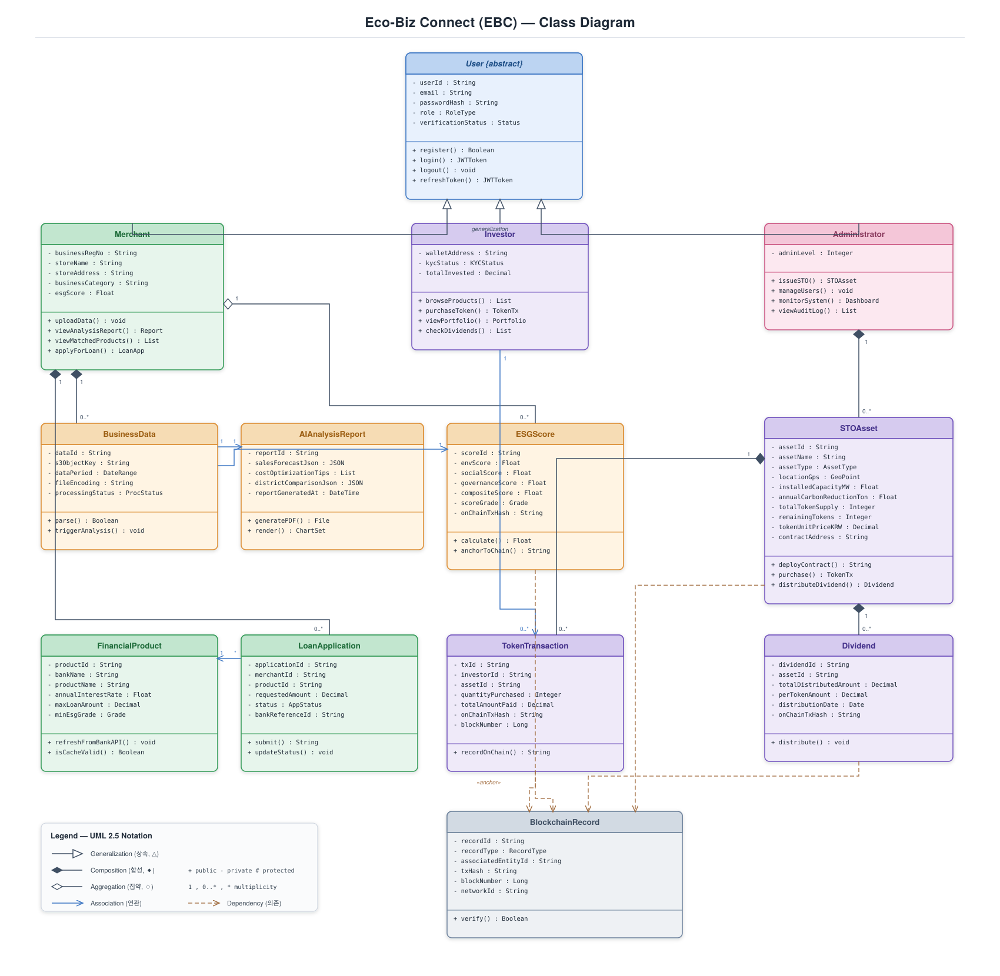

# Eco-Biz Connect (EBC)

> **AI 및 블록체인 기반 ESG 통합 금융 플랫폼**
> AI 경영 분석과 블록체인 탄소중립 투자(STO)를 결합한 소상공인·투자자 대상 ESG 금융 웹 플랫폼

영남대학교 컴퓨터공학부 · 오픈소스SW설계 · 22311898 김주형 (curie01@yu.ac.kr)

---

## 📚 소프트웨어 공학 단계별 산출물

| 단계 | 문서 | 핵심 내용 |
| :--- | :--- | :--- |
| **1. Conceptualization** | [`Conceptualization_[22311898_김주형].md`](./Conceptualization_[22311898_김주형].md) | 기획 배경, 시스템 컨텍스트, Use Case List |
| **2. Analysis** | [`Analysis_[22311898_김주형].md`](./Analysis_[22311898_김주형].md) | Use Case 분석(13), Domain 분석(13), UI 프로토타입(5) |
| **3. Design** | [`Design_[22311898_김주형].md`](./Design_[22311898_김주형].md) | Class · Sequence(13) · State machine(4) diagram |

> Use Case Diagram은 Analysis 단계 산출물이므로 Design 문서에는 포함하지 않습니다 (`usecase_diagram_ebc.svg`는 Analysis 참고용).

> 📌 각 `.md` 문서는 같은 폴더의 SVG 다이어그램을 상대경로로 참조하며, GitHub에서 자동 렌더링됩니다.
> 📎 제출용 PDF: [`Design_[22311898_김주형].pdf`](./Design_[22311898_김주형].pdf) (다이어그램 포함, 20p)

---

## 🏗️ 시스템 개요

- **소상공인 (Merchant)** — POS·상권 데이터 업로드 → AI 경영 분석 리포트 → ESG 상생 지수 산출 → 우대 금융 상품 매칭/신청
- **투자자 (Investor)** — 탄소중립 STO 상품 탐색 → 토큰 조각 구매 → 스마트 컨트랙트 기반 자동 배당
- **관리자 (Administrator)** — STO 발행, 시스템 모니터링, 감사 로그 관리
- **외부 연동** — Bank API(금융 심사·결제), Blockchain Network(STO·ESG 앵커링)

**기술 스택:** `FastAPI` · `PostgreSQL` · `Redis` · `LSTM(PyTorch)` · `Solidity / ERC-1400` · `Layer 2` · `TypeScript SPA`

---

## 📐 Design 단계 다이어그램 (UML 2.5)

### Class Diagram


### Sequence Diagrams — UC #1 ~ #13 (전체)
| UC | 파일 | UC | 파일 |
| :--- | :--- | :--- | :--- |
| #1 Register & Authenticate | [`seq_uc01_register.svg`](./seq_uc01_register.svg) | #8 Issue Carbon STO | [`seq_uc08_issuesto.svg`](./seq_uc08_issuesto.svg) |
| #2 Login | [`seq_uc02_login.svg`](./seq_uc02_login.svg) | #9 Browse Investment Products | [`seq_uc09_browse.svg`](./seq_uc09_browse.svg) |
| #3 Upload Business Data | [`seq_uc03_upload.svg`](./seq_uc03_upload.svg) | #10 Purchase STO Token | [`seq_uc10_purchase.svg`](./seq_uc10_purchase.svg) |
| #4 View AI Analysis Report | [`seq_uc04_viewreport.svg`](./seq_uc04_viewreport.svg) | #11 Check Revenue & Dividend | [`seq_uc11_dividend.svg`](./seq_uc11_dividend.svg) |
| #5 Calculate ESG Score | [`seq_uc05_esgscore.svg`](./seq_uc05_esgscore.svg) | #12 View Transaction History | [`seq_uc12_history.svg`](./seq_uc12_history.svg) |
| #6 Match Financial Product | [`seq_uc06_match.svg`](./seq_uc06_match.svg) | #13 Manage System & Monitor | [`seq_uc13_monitor.svg`](./seq_uc13_monitor.svg) |
| #7 Apply for Preferential Loan | [`seq_uc07_loan.svg`](./seq_uc07_loan.svg) | | |

### State Machine Diagrams
| 대상 | 파일 |
| :--- | :--- |
| BusinessData 처리 생명주기 | [`state_businessdata.svg`](./state_businessdata.svg) |
| LoanApplication 생명주기 | [`state_loanapplication.svg`](./state_loanapplication.svg) |
| STOAsset 생명주기 | [`state_stoasset.svg`](./state_stoasset.svg) |
| 전체 시스템 (User Session, composite) | [`state_overall.svg`](./state_overall.svg) |

---

## 🖼️ Analysis 단계 UI 프로토타입

| 화면 | 파일 |
| :--- | :--- |
| 로그인 페이지 | [`proto_01_login.svg`](./proto_01_login.svg) |
| 소상공인 대시보드 | [`proto_02_merchant_dashboard.svg`](./proto_02_merchant_dashboard.svg) |
| 투자 마켓플레이스 | [`proto_03_marketplace.svg`](./proto_03_marketplace.svg) |
| 투자자 포트폴리오 | [`proto_04_portfolio.svg`](./proto_04_portfolio.svg) |
| 관리자 콘솔 | [`proto_05_admin_console.svg`](./proto_05_admin_console.svg) |

---

## 📁 파일 구조

```
Eco-Biz-Connect/
├── Conceptualization_[22311898_김주형].md   # 1단계
├── Analysis_[22311898_김주형].md            # 2단계
├── Design_[22311898_김주형].md / .pdf        # 3단계 (본문 + 제출 PDF)
├── class_diagram_ebc.svg · seq_uc01~13.svg · state_*.svg · proto_01~05.svg  # UML
│
├── backend/   # ⚙️ FastAPI + SQLAlchemy + Alembic (REST API, UC1~13)
├── web/       # 🌐 Next.js + TypeScript SPA (소상공인·투자자·관리자 화면)
├── app/       # 📱 Expo(React Native) 모바일앱
│
├── render.yaml · DEPLOYMENT.md               # 배포(Render+Vercel) 설정/가이드
├── GAP_ANALYSIS.md · QA_REVIEW.md · ISSUES.md # 설계대비·품질·진단 기록
└── README.md
```

---

## 💻 구현 (Implementation)

설계 문서(위)를 실제로 동작하는 풀스택 애플리케이션으로 구현했다. **UC1~13 전체 흐름**, **13개 도메인 클래스의 모든 필드**, **상태 머신 전이**가 백엔드 API와 웹·앱에서 실제로 동작한다.

### 실제 기술 스택
| 영역 | 스택 |
| :--- | :--- |
| **백엔드** | FastAPI · SQLAlchemy 2 · Alembic · PostgreSQL(운영)/SQLite(개발) · JWT(python-jose) · bcrypt |
| **웹** | Next.js 16 (App Router) · TypeScript · 자체 디자인 시스템(Apple 스타일) · 무의존 SVG 차트 |
| **모바일** | Expo SDK 56 · React Native · TypeScript · react-native-svg |
| **외부연동** | Bank API · AI 엔진(LSTM) · Blockchain(ERC-1400) · KYC — 설계서 입출력 형태를 따른 **mock**(Phase 5에서 실연동 예정) |

### 구현된 기능 (UC1~13)
| UC | 기능 | 구현 |
| :--- | :--- | :---: |
| 1·2 | 회원가입(비밀번호 정책·사업자/대표자 검증)·로그인(JWT·계정잠금) | ✅ |
| 3·4·5 | 경영 데이터 업로드 → AI 분석 리포트(차트·PDF) → ESG 6등급 산출(온체인 앵커) | ✅ |
| 6·7 | ESG 기반 우대 대출 매칭 → 대출 신청(동의·30일 중복차단·웹훅) | ✅ |
| 8·9·10 | STO 발행(컨트랙트 배포) → 마켓 탐색(필터·상세) → 토큰 구매(KYC·동적계산) | ✅ |
| 11·12·13 | 포트폴리오·배당·예정배당 → 통합 거래내역(CSV) → 시스템 모니터·사용자관리·감사로그 | ✅ |

- **검증:** 백엔드 `pytest` 64개 통과 · 웹 `next build` 통과 · 앱 `tsc`+`expo export` 통과 · 3개 역할 브라우저 클릭 점검 완료([`ISSUES.md`](./ISSUES.md))
- **품질 기록:** 설계 대비 갭([`GAP_ANALYSIS.md`](./GAP_ANALYSIS.md)) · 출시 자가진단([`QA_REVIEW.md`](./QA_REVIEW.md))
- **UI:** Analysis 단계 프로토타입(`proto_01~05.svg`)을 시각 기준으로 삼아 실제 제품 수준 화면으로 구현 — Apple 스타일 디자인 시스템(반응형·명확한 대비·접근성(ARIA·키보드)·마이크로 인터랙션), 웹↔앱 디자인 토큰 일치

### 빠른 실행
```bash
# 1) 백엔드 (http://localhost:8000)
cd backend && python3 -m venv .venv && source .venv/bin/activate
pip install -r requirements.txt
export DATABASE_URL="sqlite:///./_e2e.db"
python -m scripts.seed_demo          # 데모 데이터 시드(SQLite)
uvicorn app.main:app --port 8000

# 2) 웹 (http://localhost:3000)
cd web && npm install && npm run dev
```
> 운영 배포(무료 Render + Vercel)는 [`DEPLOYMENT.md`](./DEPLOYMENT.md) 참고. 클릭만으로 공개 링크가 생성된다.

### 데모 계정
| 역할 | 이메일 | 비밀번호 |
| :--- | :--- | :--- |
| 소상공인 | `merchant@ebc.com` | `Merch123!` |
| 투자자 | `investor@ebc.com` | `Invest123!` |
| 관리자 | `admin@ebc.com` | `Admin123!` |
